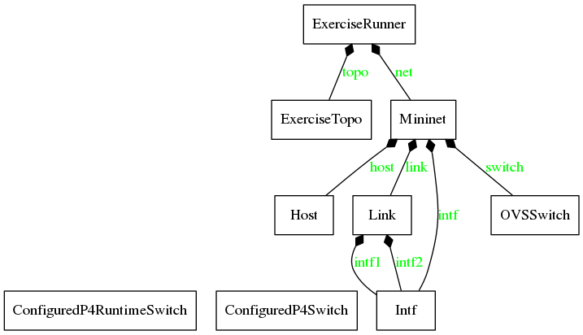
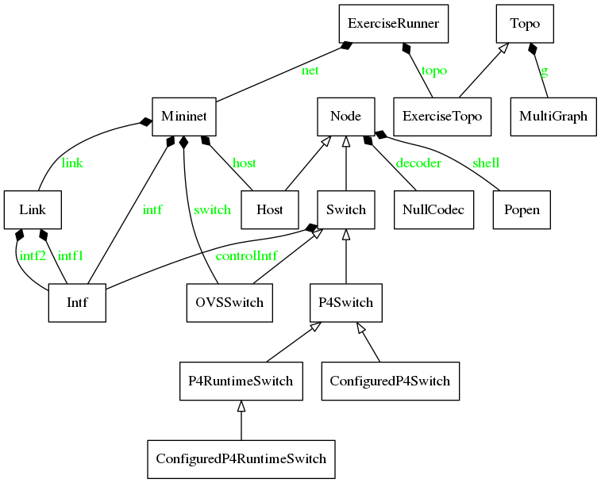

# P4lang-wireless Implementation 

La motivación de esta implementación viene dada para el estudio de los distintos datapaths en entornos wireless. La única plataforma consolidada para la emulación de entornos SDN-wireless es Mininet-Wifi, por ello, se empezó la búsqueda por su repositorio. Por desgracia no se encontró ninguna mención del lenguaje p4 en dicho repositorio. Investigando más, se encontró que el creador de Mininet-Wifi y profesor de la IFBA, [Ramon Fontes](https://github.com/ramonfontes), había hecho un [fork](https://github.com/ramonfontes/tutorials)  de los tutoriales de p4 y los había adaptado a Mininet-Wifi, aunque como según recoge el [aquí](https://github.com/p4lang/tutorials/issues/301) en este issue abierto en p4lang-tutorials, aun le queda mucho desarrollo por delante, es solo un primer paso. 

Viendo la actividad de dicho repositorio se entiende que de momento el desarrollo no ha progresado mucho más, ya que no hay actividad en él desde el 2019. Por tanto, como se tiene la necesidad de procesar paquetes con la cabeceras WiFi, y viendo que en todos los programas desarrollados en p4 por Ramon el BMV2 trabaja sobre Ethernet, nos vamos a aventurar a montar un escenario donde el BMV2 posea interfaces wireless, para así, poder procesar las cabeceras que necesitamos.

Por tanto, se propone el siguiente plan para abordar el desarrollo:

*   Entender y analizar la interfaz creada desde la organización P4Lang, del BMV2 con Mininet.
*   Entender y analizar la integración realizada por Ramon de la interfaz creada por P4Lang y Mininet-Wifi.
*   Una vez entendidas ambas interfaces vez si es posible conseguir que el BMV2 corra en una netns y posea interfaces wireless.   

Si la magnitud de ambas interfaces fuera inaccesible por su gran complejidad, se propone ir directamente al bajo nivel de Mininet-Wifi, hacer uso de ``wmediumd`` y del modulo del kernel ``mac80211_hwsim`` para montar escenarios custom para llevar a cabo nuestros casos de uso.

## P4Switch (BMV2) - Mininet Interface

Desde la organización de P4lang se quiso suministrar un entorno de pruebas donde se pudiera probar los programas p4 desarrollados. El soft-switch donde iban a cargar el programa p4 ya lo tenían, que es el [``BMV2``](https://github.com/p4lang/behavioral-model), pero les faltaba una plataforma donde poder desplegar dicho "switch" e interconectarlo con otras entidades de red. Esta plataforma sería Mininet, una herramienta de emulación de redes. 

Mininet generalmente se utiliza para emular entornos SDN con switches y controladores, por ello, para lograr la integración de su nuevo switch con los switches ya disponibles en Mininet, tuvieron que añadir una nueva clase llamada [``P4Switch``](https://github.com/p4lang/tutorials/blob/master/utils/p4_mininet.py#L57). Esta nueva clase, heredaría de la clase ``Switch`` de Mininet, añadiendo así todos los métodos y atributos necesarios para la orquestación del  [``BMV2``](https://github.com/p4lang/behavioral-model).

Usualmente, cuando se trabaja con Mininet se desarrollan scripts donde se define la topologia de la red a emular. En este caso para brindar de una mayor facilidad a los users de los tutoriales de P4, las topologias se definen en archivos ``*.json``, los cuales definen toda la topología de red y toda la información del plano de control de cada "switch" P4. Un ejemplo de dicho archivo pueden encontrarse [aquí](https://github.com/davidcawork/TFG/blob/master/src/use_cases/p4/case01/scenario/topology.json). 

De esta forma también se consigue abstraer el la definición de la topología del propio script de orquestación de la misma. El script de orquestación de la topología, el cual hará uso de la API de Python de Mininet será el famoso script llamado [``run_exercise.py``](https://github.com/davidcawork/TFG/blob/master/src/use_cases/p4/utils/run_exercise.py). De esta manera tendremos tantos ficheros ``*.json`` como topologías queramos, pero un único script de orquestación.

El script [``run_exercise.py``](https://github.com/davidcawork/TFG/blob/master/src/use_cases/p4/utils/run_exercise.py) inicializa un objeto de la clase ``ExerciseRunner`` el cual parseará el fichero ``*.json``, procesará la topología con la ayuda de la clase ``ExerciseTopo`` y levantará la topologia haciendo uso de la API de Python de Mininet. A continuación, se puede apreciar un diagrama UML donde se indica la relación de clases desde nuestro _entrypoint_ en el levantamiento de los distintos casos de uso.

Como ya se comentaba anteriormente, para logar la integración del [``BMV2``](https://github.com/p4lang/behavioral-model) en Mininet se tuvo que crear la clase [``P4Switch``](https://github.com/p4lang/tutorials/blob/master/utils/p4_mininet.py#L57). Esta nueva clase, heredaría de la clase ``Switch`` de Mininet. A su vez, se crearían nuevas clases hijas de la clase [``P4Switch``](https://github.com/p4lang/tutorials/blob/master/utils/p4_mininet.py#L57), la más importante [``P4RuntimeSwitch``](https://github.com/p4lang/tutorials/blob/master/utils/p4runtime_switch.py#L27) la cual se utilizaría para configurar dicho "switch" via [``P4Runtime``](https://github.com/p4lang/PI) :smile: . Si se desea ver una vista más amplia de este mismo UML, mostrando métodos y atributos, ir [aquí](../../../img/p4-wireless/run_exercise.png).

 

### Ejemplo traza de ejecución - case01

Para una mejor compresión del funcionamiento interno de la interfaz del [``BMV2``](https://github.com/p4lang/behavioral-model) con Mininet, se va analizar exhaustivamente la traza de ejecución del [case01](https://github.com/davidcawork/TFG/tree/master/src/use_cases/p4/case01). Se han obtenido distintas modos de trazas de ejecución con el fin de obtener un mejor entendimiento de cual es el workflow de la interfaz. A continuación, dejamos los enlaces a dichas trazas por si se quisieran consultar:

*   [System trace ](./analysis/p4-Mininet/strace_case01.log) [ traza de llamadas al sistema del [case01](https://github.com/davidcawork/TFG/tree/master/src/use_cases/p4/case01) ]
*   [Mininet debug trace ](./analysis/p4-Mininet/trace_case01_debug.log)[ traza de ejecución del [case01](https://github.com/davidcawork/TFG/tree/master/src/use_cases/p4/case01), con el nivel de log a debug ]
*   [Pyreverse execution trace](./analysis/p4-Mininet/trace_case01_run_exer_raw.log) [ traza de ejecución del [case01](https://github.com/davidcawork/TFG/tree/master/src/use_cases/p4/case01), obtenido con el módulo pyreverse ]
*   [Pyreverse execution trace - cleaned](./analysis/p4-Mininet/trace_case01_run_exer.log) [ traza de ejecución del [case01](https://github.com/davidcawork/TFG/tree/master/src/use_cases/p4/case01), obtenido con el módulo pyreverse ]

*   [Fuctions list](./analysis/p4-Mininet/trace_case01_run_exer_functions.log) [ traza de ejecución del [case01](https://github.com/davidcawork/TFG/tree/master/src/use_cases/p4/case01), se obtiene las funciones impactadas durante el workflow ]

A continuación, se presenta una tabla resumen del workflow ocurrido en el levantamiento del [case01](https://github.com/davidcawork/TFG/tree/master/src/use_cases/p4/case01). Se indican cuatro columnas en las cuales se describe la funcionalidad que está siendo ejecutada, el texto de operación arrojado por la traza, que clase está impactada y por último, en que método está ocurriendo dicho paso. Todos los pasos están linkeados al source por si se quisiera consulta personalmente :cat:.

 

| Descripción        | Operación     | Clase           | Método |
| -------------      |:-------------:| :-------------: | :-------------: |
| Inicializa atributos y lee la topología del json.  |     Reading topology file.            | [`ExerciseRunner`](https://github.com/davidcawork/TFG/blob/master/src/use_cases/p4/utils/run_exercise.py#L122) | [`__init__`](https://github.com/davidcawork/TFG/blob/master/src/use_cases/p4/utils/run_exercise.py#L152) |
| Se asegura de que los dir. (build, logs, pcap) estén creados y los asigna. | - | [`ExerciseRunner`](https://github.com/davidcawork/TFG/blob/master/src/use_cases/p4/utils/run_exercise.py#L122) | [`__init__`](https://github.com/davidcawork/TFG/blob/master/src/use_cases/p4/utils/run_exercise.py#L175) |
| Método principal donde se parsea la topología del JSON, levanta la instancia de Mininet, configura los nodos y por último corre la CLI. | - | [`ExerciseRunner`](https://github.com/davidcawork/TFG/blob/master/src/use_cases/p4/utils/run_exercise.py#L122) |  [`run_exercise`](https://github.com/davidcawork/TFG/blob/master/src/use_cases/p4/utils/run_exercise.py#L187) | 
| Crea el obj Mininet, y lo guarda en `self.net`. | Building mininet topology. | [`ExerciseRunner`](https://github.com/davidcawork/TFG/blob/master/src/use_cases/p4/utils/run_exercise.py#L122) | [`create_network`](https://github.com/davidcawork/TFG/blob/master/src/use_cases/p4/utils/run_exercise.py#L237) |
| Función Aux. para inicializar correctamente la clase del "switch". (Generalmente `ConfiguredP4RuntimeSwitch`) | - | - | [`configureP4Switch`](https://github.com/davidcawork/TFG/blob/master/src/use_cases/p4/utils/run_exercise.py#L35) |
| Se crea un obj de la clase `ExerciseTopo` para así generar el obj `Topo` de Mininet con toda la información necesaria para su posterior generación. Se guardará en `self.topo` | - | [`ExerciseTopo`](https://github.com/davidcawork/TFG/blob/master/src/use_cases/p4/utils/run_exercise.py#L67) |  [`__init__`](https://github.com/davidcawork/TFG/blob/master/src/use_cases/p4/utils/run_exercise.py#L70) |
| Se crea el obj Mininet llamando a su constructor. Se le pasa el obj `Topo`, el tipo de link `TCLink`, el tipo de host `P4Host`, el tipo de switch `ConfiguredP4RuntimeSwitch` | - | [`ExerciseRunner`](https://github.com/davidcawork/TFG/blob/master/src/use_cases/p4/utils/run_exercise.py#L122) | [`create_network`](https://github.com/davidcawork/TFG/blob/master/src/use_cases/p4/utils/run_exercise.py#L254) |
| Se inicializan los atributos del obj `Mininet`, entre ellos obtiene el num. de cores | `grep -c processor /proc/cpuinfo` | [`Mininet`](https://github.com/mininet/mininet/blob/master/mininet/net.py#L113) | [`__init__`](https://github.com/mininet/mininet/blob/master/mininet/net.py#L116) |
| Inicializa Mininet, es decir, se asegura que tiene [permisos de root](https://github.com/mininet/mininet/blob/2b8d254cc0c99f823fdea91c442cf0365761d469/mininet/util.py#L660) y establece unos [límites mínimos](https://github.com/mininet/mininet/blob/2b8d254cc0c99f823fdea91c442cf0365761d469/mininet/util.py#L507) para poder llevar a cabo la emulación. ( Incrementa el num. de archivos abiertos al mismo tiempo, aumenta los buffers del stack red, aumenta el cache arp más tamaño de tabla de rutas, añade más intf PTYs para los nodos). |  *** Setting resource limits | [`Mininet`](https://github.com/mininet/mininet/blob/master/mininet/net.py#L113) | [`init`](https://github.com/mininet/mininet/blob/master/mininet/net.py#L925) |
| Construye la topología a emular. | - | [`Mininet`](https://github.com/mininet/mininet/blob/master/mininet/net.py#L113) | [`build`](https://github.com/mininet/mininet/blob/master/mininet/net.py#L499) |
| Este método es llamado desde el anterior al detectar que existe un obj.  `Topo`. | *** Creating network | [`Mininet`](https://github.com/mininet/mininet/blob/master/mininet/net.py#L113) | [`buildFromTopo`](https://github.com/mininet/mininet/blob/master/mininet/net.py#L446) |
| Añade los host a la topología.  | *** Adding hosts | [`Mininet`](https://github.com/mininet/mininet/blob/master/mininet/net.py#L113) | [`buildFromTopo`](https://github.com/mininet/mininet/blob/master/mininet/net.py#L472) |
| Añade un host a la topología (Este método es llamado repetidamente por el número de host que haya en la topología). Posteriormente, en función de tipo de host que le habíamos pasado al obj `Mininet` inicializa dicha clase con los parámetros dados en el obj. `Topo`, o en su defecto, los toma por defecto. | - | [`Mininet`](https://github.com/mininet/mininet/blob/master/mininet/net.py#L113) | [`addHost`](https://github.com/mininet/mininet/blob/master/mininet/net.py#L206) |
| Como el tipo de host que pasamos era [`P4Host`](https://github.com/davidcawork/TFG/blob/162dfea6a4af544d8f1db64c27553dc4be1e967c/src/use_cases/p4/utils/p4_mininet.py#L30), se debe inicializar. No tiene constructor por lo que hace uso del heredado de su clase padre, [`Host`](https://github.com/mininet/mininet/blob/2b8d254cc0c99f823fdea91c442cf0365761d469/mininet/node.py#L667), que a su vez lo hereda de su clase padre [`Node`](https://github.com/mininet/mininet/blob/2b8d254cc0c99f823fdea91c442cf0365761d469/mininet/node.py#L72). | - | [`Node`](https://github.com/mininet/mininet/blob/2b8d254cc0c99f823fdea91c442cf0365761d469/mininet/node.py#L72) | [`__init__`](https://github.com/mininet/mininet/blob/2b8d254cc0c99f823fdea91c442cf0365761d469/mininet/node.py#L78) |
| Levanta un proceso de bash para el host en cuestión, el cual soportará la Network Namespace de dicho host. Hará uso del programa `mnexec`. | `mnexec -cdn env PS1=\x7f bash --norc --noediting -is mininet:hX` | [`Node`](https://github.com/mininet/mininet/blob/2b8d254cc0c99f823fdea91c442cf0365761d469/mininet/node.py#L72) | [`startShell`](https://github.com/mininet/mininet/blob/2b8d254cc0c99f823fdea91c442cf0365761d469/mininet/node.py#L132) |
| Añade los switches a la topología. | *** Adding switches | [`Mininet`](https://github.com/mininet/mininet/blob/master/mininet/net.py#L113) | [`buildFromTopo`](https://github.com/mininet/mininet/blob/master/mininet/net.py#L477) |
| Añade un switch a la topología. (Este método es llamado repetidamente por el número de switches que haya en la topología). Posteriormente, en función de tipo de switch que le habíamos pasado al obj `Mininet` inicializa dicha clase con los parámetros dados en el obj. `Topo`, o en su defecto, los toma por defecto. | - | [`Mininet`](https://github.com/mininet/mininet/blob/master/mininet/net.py#L113) | [`addSwitch`](https://github.com/mininet/mininet/blob/master/mininet/net.py#L249) |
| Como el tipo de switch que pasamos era [``ConfiguredP4RuntimeSwitch``](https://github.com/davidcawork/TFG/blob/master/src/use_cases/p4/utils/run_exercise.py#L42), se debe inicializar. Este su vez inicializa el obj [`P4RuntimeSwitch`](https://github.com/davidcawork/TFG/blob/162dfea6a4af544d8f1db64c27553dc4be1e967c/src/use_cases/p4/utils/p4runtime_switch.py#L27). | - | [`ConfiguredP4RuntimeSwitch`](https://github.com/davidcawork/TFG/blob/master/src/use_cases/p4/utils/run_exercise.py#L42) | [`__init__`](https://github.com/davidcawork/TFG/blob/master/src/use_cases/p4/utils/run_exercise.py#L43) |
| Se establecen todos los atributos relativos a la puesta en marcha del  [``BMV2``](https://github.com/p4lang/behavioral-model). De forma adicional, se llama al constructor de la clase padre [``Switch``](https://github.com/mininet/mininet/blob/master/mininet/node.py#L881). | - | [`P4RuntimeSwitch`](https://github.com/davidcawork/TFG/blob/162dfea6a4af544d8f1db64c27553dc4be1e967c/src/use_cases/p4/utils/p4runtime_switch.py#L27) | [`__init__`](https://github.com/davidcawork/TFG/blob/162dfea6a4af544d8f1db64c27553dc4be1e967c/src/use_cases/p4/utils/p4runtime_switch.py#L32) |
| Se inicializa la clase [``Switch``](https://github.com/mininet/mininet/blob/master/mininet/node.py#L881), se inicializa el obj `Node` asociado a dicho switch, y este al no encontrarse en una netns se asocia como intf de control: `lo`. | `mnexec -cd env PS1=\x7f bash --norc --noediting -is mininet:sX` **&&** added intf lo (0) to node s1 | [``Switch``](https://github.com/mininet/mininet/blob/master/mininet/node.py#L881) | [`__init__`](https://github.com/mininet/mininet/blob/master/mininet/node.py#L888) |
| Añade los enlaces a la topología. | *** Adding links | [`Mininet`](https://github.com/mininet/mininet/blob/master/mininet/net.py#L113) | [`buildFromTopo`](https://github.com/mininet/mininet/blob/master/mininet/net.py#L486) |
| Añade un enlace a la topología, parsea los nodos que van a componer dicho enlace y establece las características del mismo. En función del tipo de enlace pasado, se llama al constructor de dicha clase ( `TCLink` en nuestro caso).  | - | [`Mininet`](https://github.com/mininet/mininet/blob/master/mininet/net.py#L113) | [`addLink`](https://github.com/mininet/mininet/blob/master/mininet/net.py#L375) |
| Inicializa la clase [`TCLink`](https://github.com/mininet/mininet/blob/master/mininet/link.py#L552), poniendo por defecto que las dos interfaces que componen el enlace son de la clase [`TCIntf`](https://github.com/mininet/mininet/blob/2b8d254cc0c99f823fdea91c442cf0365761d469/mininet/link.py#L226). Por último, inicializa a su vez la clase [`Link`](https://github.com/mininet/mininet/blob/2b8d254cc0c99f823fdea91c442cf0365761d469/mininet/link.py#L401). | - | [`TCLink`](https://github.com/mininet/mininet/blob/master/mininet/link.py#L552) | [`__init__`](https://github.com/mininet/mininet/blob/master/mininet/link.py#L554) |
| Del constructor de la clase [`Link`](https://github.com/mininet/mininet/blob/2b8d254cc0c99f823fdea91c442cf0365761d469/mininet/link.py#L401) se generan el par de veth's y se configuran en función del tipo de interfaz que lleven. En este caso, [`TCIntf`](https://github.com/mininet/mininet/blob/2b8d254cc0c99f823fdea91c442cf0365761d469/mininet/link.py#L226), haciendo uso de las bondades del `TC` se consigue limitar el "enlace". | [`...`](https://github.com/davidcawork/TFG/blob/master/src/use_cases/p4-wireless/analysis/p4-Mininet/trace_case01_debug.log#L32) | [`Link`](https://github.com/mininet/mininet/blob/2b8d254cc0c99f823fdea91c442cf0365761d469/mininet/link.py#L401) | [`__init__`](https://github.com/mininet/mininet/blob/2b8d254cc0c99f823fdea91c442cf0365761d469/mininet/link.py#L407) |
| Se configuran los Host de la topología | *** Configuring hosts | [`Mininet`](https://github.com/mininet/mininet/blob/master/mininet/net.py#L113) | [`build`](https://github.com/mininet/mininet/blob/master/mininet/net.py#L505) |
| Se configura los host, es decir, sus interfaces, con los parámetros proporcionados. | [`...`](https://github.com/davidcawork/TFG/blob/162dfea6a4af544d8f1db64c27553dc4be1e967c/src/use_cases/p4/utils/p4_mininet.py#L32) | [`P4Host`](https://github.com/davidcawork/TFG/blob/162dfea6a4af544d8f1db64c27553dc4be1e967c/src/use_cases/p4/utils/p4_mininet.py#L30) | [`config`](https://github.com/davidcawork/TFG/blob/162dfea6a4af544d8f1db64c27553dc4be1e967c/src/use_cases/p4/utils/p4_mininet.py#L31) |
| Una vez construida la topología, se inicia. | - | [`ExerciseRunner`](https://github.com/davidcawork/TFG/blob/master/src/use_cases/p4/utils/run_exercise.py#L122) | [`run_exercise`](https://github.com/davidcawork/TFG/blob/162dfea6a4af544d8f1db64c27553dc4be1e967c/src/use_cases/p4/utils/run_exercise.py#L194) |
| Se levantan el controlador/es, en este caso no hay, y se levantan los switches. Aquí se lanzarán las instancias del [``BMV2``](https://github.com/p4lang/behavioral-model). |  Starting controller **&&** Starting X switches | [`Mininet`](https://github.com/mininet/mininet/blob/master/mininet/net.py#L113) | [`start`](https://github.com/mininet/mininet/blob/master/mininet/net.py#L537) |
| El método `start` anterior actúa como un envoltorio del siguiente quien es realmente quien levanta la instancia del [``BMV2``](https://github.com/p4lang/behavioral-model)| [`...`](https://github.com/davidcawork/TFG/blob/162dfea6a4af544d8f1db64c27553dc4be1e967c/src/use_cases/p4/utils/p4runtime_switch.py#L100) | [`P4RuntimeSwitch`](https://github.com/davidcawork/TFG/blob/162dfea6a4af544d8f1db64c27553dc4be1e967c/src/use_cases/p4/utils/p4runtime_switch.py#L27) | [`start`](https://github.com/davidcawork/TFG/blob/162dfea6a4af544d8f1db64c27553dc4be1e967c/src/use_cases/p4/utils/p4runtime_switch.py#L100) |
| Se ejecutan los posibles comandos pasados en el json donde se definía la topología. | *** hX: cmd  | [`ExerciseRunner`](https://github.com/davidcawork/TFG/blob/master/src/use_cases/p4/utils/run_exercise.py#L122) | [`run_exercise`](https://github.com/davidcawork/TFG/blob/162dfea6a4af544d8f1db64c27553dc4be1e967c/src/use_cases/p4/utils/run_exercise.py#L198) |
| Este método programará cada instancia del [``BMV2``](https://github.com/p4lang/behavioral-model) usando el CLI ó vía [``P4Runtime``](https://github.com/p4lang/PI). | Configuring switch sX | [`ExerciseRunner`](https://github.com/davidcawork/TFG/blob/master/src/use_cases/p4/utils/run_exercise.py#L122) | [`run_exercise`](https://github.com/davidcawork/TFG/blob/162dfea6a4af544d8f1db64c27553dc4be1e967c/src/use_cases/p4/utils/run_exercise.py#L199) |
| Inicia la CLI de Mininet y retorna el control al usuario. | Starting mininet CLI | [`ExerciseRunner`](https://github.com/davidcawork/TFG/blob/master/src/use_cases/p4/utils/run_exercise.py#L122) | [`run_exercise`](https://github.com/davidcawork/TFG/blob/162dfea6a4af544d8f1db64c27553dc4be1e967c/src/use_cases/p4/utils/run_exercise.py#L204) |

La motivación de crear esta tabla ha sido doble, primero documentar de forma detallada el funcionamiento interno de la interfaz de Mininet con el enviroment P4, para así brindar a otras personas de un entrypoint a la hora de desarrollar con Mininet. El segundo ha sido el de aprender a modo personal el funcionamiento interno, para así, a posteriori poder lograr la integración con Mininet-Wifi :monkey:.

## Mininet-Wifi Internals

Una vez que se revisó el funcionamiento interno de la API de Mininet-P4 env se da paso a analizar Mininet-Wifi. Mininet-Wifi es una herramienta de emulación de redes wireless que ha nacido de Mininet, es decir es un fork de este. Al ser un fork comparte gran parte de la jerarquía de clases así como su capacidad para simular ciertos elementos de la red. Además, con la herramienta de Mininet-Wifi se puede correr una topología de Mininet sin problemas, ya que el el añadido de Wifi es un complemento sobre Mininet!

Con Mininet-Wifi podremos emular estaciones Wifi, puntos de acceso, redes adhoc, mesh y todos los nodos de red disponibles en Mininet. Como ya hemos dicho Mininet-Wifi esta desarrollado a partir de Mininet, pero la capacidad de emulación de interfaces Wireless la toma de subsistema wireless de Linux (Más adelante se entrará en el modulo del Kernel ``mac80211_hwsim ``).

La arquitectura de virtualización empleada en Mininet-Wifi funciona de forma similar a la Mininet, se hace uso de la herramienta [`mnexec`](https://github.com/intrig-unicamp/mininet-wifi/blob/master/mnexec.c) para lanzar distintos procesos de bash en nuevas Network Namespaces, uno por cada nodo independiente de la red. De estos procesos colgarán todos los procesos relativos a los distintos nodos de la red, cuando la emulación haya terminado, se matarán dichos procesos de bash, consiguiendo que no haya ninguna condición de referenciación de las Network Namespaces, y estas sean eliminadas por el Kernel. 

De esta manera, los nodos de la red ya estarían aislados de otros nodos de la red, por lo que lo único que quedaría por virtualizar son las capacidades wireless de los nodos que las requieran. Para ellos se hará uso del subsistema wireless del Kernel de Linux, más concretamente el módulo ``mac80211_hwsim `` el cual creará las interfaces wireless en nuestro equipo. Este módulo se comunicará con framework ``mac80211`` el cual proveerá de las capacidades de gestión de acceso al medio de la interfaz wireless. Además, en el espacio de Kernel aun hay un bloque más llamado `cfg80211` el cual servirá de API para la configuración de las cabeceras 802.11. Esta configuración puede ser realizada por la interfaz netlink de espacio de usuario llamada `nl80211`. 

Para la configuración de los puntos de acceso, se hará uso del programa [``HostApd``](https://github.com/latelee/hostapd) el cual indicándole la configuración del punto de acceso y la interfaz sobre la cual debe correr, emulará el funcionamiento de un punto de acceso estándar. En la siguiente figura se puede ver de manera resumida la arquitectura básica de Mininet-Wifi.

> Imagen de la arquitectura de Mininet-Wifi

En cuanto a la jerarquía de clases unicamente decir que es bastante similar a la de Mininet. Por destacar dos clases claves en la jerarquía de Mininet-Wifi  serían [`Node_Wifi`](https://github.com/intrig-unicamp/mininet-wifi/blob/master/mn_wifi/node.py#L44), de la cual heredan todos los nodos con capacidades wireless que poseé Mininet-Wifi y por último, la clase [`IntfWireless`](https://github.com/intrig-unicamp/mininet-wifi/blob/master/mn_wifi/link.py#L22), de la cual heredan todos los tipos de enlaces disponibles de Mininet-Wifi (Bajo el estándar 802.11). A continuación se dejan los UML referentes a  dichas clases.

> UML node wifi

Como se puede apreciar en los esquemas UML, se ha conseguido aislar la funcionalidad común en las clases padres con la finalidad de optimizar la cantidad de código de las clases hijas. De esta forma añadir nuevos tipos de enlaces por ejemplo en Mininet-Wifi resulta bastante asequible ya que, tenemos multitud de tipos de enlaces con una estructura muy clara y organizada.

> UML Intf wireless

### Linux Wireless Subsystem

El subsistema wireless de Linux consiste en un set de varios módulos que se encuentran en el Kernel de Linux. Estos manejan la configuración del hardware bajo el estándar IEEE 802.11 además de la gestión de la transmisión y la escucha de los paquetes de datos. Yendo de desde abajo hacia arriba del subsistema, el primer módulo que nos encontramos es el módulo ``mac80211_hwsim``. Este módulo como ya comentábamos es el responsable de crear las interfaces wireless virtuales en nuestra máquina. 

> Foto del subsistema wireless 

El objetivo principal de  este módulo ``mac80211_hwsim`` es facilitar a los desarrolladores de drivers de tarjetas wireless la prueba de su código e interacción con el siguiente módulo llamado ``mac80211``. Las interfaces virtualizadas no tienen las limitaciones, es decir, a diferencia del hardware real,  resulta más sencillo la creación de distintas pruebas con distintas configuraciones sin estar cohibidos por falta de recursos materiales. Este módulo generalmente recibe un único parámetro, que es el número de "radios" , interfaces virtuales, a virtualizar. Dado que las posibilidades que ofrece este módulo eran un poco reducidas, muchos wrappers han sido creados para ofrecer más funcionalidad a parte de la dada por el propio módulo. La mayoría de herramientas creadas hacen uso de la librería Netlink para comunicarse directamente con el subsistema en el Kernel y así conseguir configuraciones extra, como pueden ser añadir un RSSI, darle nombre a la interfaz. Un ejemplo de dichas herramientas sería la herramienta [``mac80211_hwsim_mgmt``](https://github.com/patgrosse/mac80211_hwsim_mgmt), la cual es usada por Mininet-Wifi para gestionar la creación de las interfaces wireless en cada nodo que las requiera. 

Es importante mencionar el cambio de paradigma que existe en el subsistema wireless de Linux con el concepto de interfaz. Generalmente estamos acostumbrados a pensar en el concepto de interfaz como un elemento que gestiona el acceso al medio, capa dos, y el propio hardware, capa física, un ejemplo de ello sería una interfaz de Ethernet. Bien, pues en el subsistema wireless se desglosa la interfaz **dos capas**, una de ellas es la capa física (PHY) donde se puede gestionar por ejemplo en que canal está escuchando la tarjeta wireless emulada. La otra capa es el acceso al medio, representado por las interfaces virtuales que "cuelgan" de una tarjeta wireless. 

La idea detrás de esto es que puede tener *N* interfaces virtuales asociadas a la misma tarjeta wifi emulada, lo que me sorprendió es que las interfaces virtuales funcionan principalmente con Ethernet (dejando de lado las que están en modo monitor).

#### Limitaciones encontradas 

Como ya se ha comentado la mayoría de interfaces virtuales asociadas a una tarjeta wireless emulada son del tipo de Ethernet, por ello todos los paquetes que nos llegan vienen con cabeceras Ethernet. Esto supone una limitación ya que en nuestros casos de uso queríamos gestionar las cabeceras Wifi, pero si todas las interfaces virtuales son generalmente del de tipo Ethernet no sería viable la idea.

Pero, ¿Qué sentido tiene tener convertir las cabeceras Wifi a cabeceras Ethernet? De momento la única razón que he encontrado de esta decisión de diseño, es hacer un diseño más sencillo de todos los drivers que operan bajo el módulo `mac80211`, convierten a Ethernet y se lo entregan al stack de red para que lo gestione como un paquete más de una red cableada. 

> foto rX y TX 

A mi parecer, esto supone un gasto de recursos bastante grande, ya que el paquete es encolado hasta tres veces (driver, ethernet queue, qdisc queue) y se tiene que invertir tiempo y recursos en el proceso de casting de las cabeceras, [aquí](https://elixir.bootlin.com/linux/latest/source/net/mac80211/rx.c#L2376) se puede ver la función en el kernel donde se lleva a cabo ese proceso.  

Digo generalmente ya que en el único modo que una interfaz puede llegar a escuchar los paquetes wifi es en el modo **monitor**. Pero el modo monitor está pensado unicamente para escuchar paquetes, no para transmitir. Este modo puede ser llevado al limite haciendo una inyección de paquetes (*packet injection*) por la interfaz, esto significa que la construcción de las cabeceras Wifi debe ser hecha por nosotros, abrir un socket raw con dicha interfaz y transmitir el paquete. Se realizó un test generando un ping Wifi, se puede consultar la herramienta [aquí](https://github.com/davidcawork/TFG/blob/master/src/use_cases/p4-wireless/analysis/Mininet-wifi/wtools/wping.py). Para conseguir el ping Wifi se hizo uso de [``Scapy``](https://scapy.readthedocs.io/en/latest/api/scapy.layers.dot11.html) para el conformado de las cabeceras necesarias para transmitir el mensaje, y del módulo socket para generar un socket raw con la interfaz en modo monitor.

 De esta forma conseguiríamos nuestro objetivo de manejar las cabeceras Wifi, pero después de hablarlo con mis tutores del TFG este desarrollo se escapa completamente de las competencias de un TFG ya que ni si quiera Mininet-Wifi contempla el manejo de cabeceras Wifi. Por ello, este objetivo se plantea como un desarrollo a futuro, se mencionará en future work. El desarrollo pues sobre Mininet-Wifi consistirá en la integración del BMV2 en Mininet-Wifi, y probar los casos de uso desarrollados para P4, bajo Mininet-Wifi. Las cabeceras que nos llegaran serán las de Ethernet, pero como ya se ha explicado, es el propio Kernel quien se encarga de hacer un casting de las cabeceras Wifi hacia cabeceras Ethernet, por lo que se escapa de nuestro control.

### Ejemplo traza de ejecución Mininet-Wifi

Para entender un poco mejor el funcionamiento de Mininet-Wifi se han propuesto dos scripts donde se emulan la misma topología, pero haciendo uso de enlaces TCLink y de enlaces gestionados por ``wmediumd``. La herramienta ``wmediumd`` es una herramienta que funciona sobre el mismo módulo del Kernel ``mac80211_hwsim``, esta herramienta lleva implementado modelos de perdidas y de retardos de los paquetes por lo que permiten que la emulación de la topología tengo un factor más realista y cercano con la realidad.

Los scripts que estudiaremos son los siguientes, tambien indicamos las trazas obtenidas de la ejecución de cada uno de ellos (Las cuales se analizarán para comprender mejor su funcionamiento interno).

*   [Topología con enlaces TCLink](https://github.com/davidcawork/TFG/blob/master/src/use_cases/p4-wireless/analysis/Mininet-wifi/examples/topo_TC.py)

    * [System trace](https://github.com/davidcawork/TFG/blob/master/src/use_cases/p4-wireless/analysis/Mininet-wifi/traces/strace_topo_TC.log)
    * [Mininet-Wifi debug trace](https://github.com/davidcawork/TFG/blob/master/src/use_cases/p4-wireless/analysis/Mininet-wifi/traces/trace_topo_TC_debug.log)

*   [Topología con enlaces gestionados por ``wmediumd``](https://github.com/davidcawork/TFG/blob/master/src/use_cases/p4-wireless/analysis/Mininet-wifi/examples/topo_wmediumd.py)

    * [System trace](https://github.com/davidcawork/TFG/blob/master/src/use_cases/p4-wireless/analysis/Mininet-wifi/traces/strace_topo_wmediumd.log)
    * [Mininet-Wifi debug trace](https://github.com/davidcawork/TFG/blob/master/src/use_cases/p4-wireless/analysis/Mininet-wifi/traces/trace_topo_wmediumd_debug.log)

A continuación, se presenta una tabla resumen del workflow ocurrido en el levantamiento de ambas topologías. Se indican cuatro columnas en las cuales se describe la funcionalidad que está siendo ejecutada, el texto de operación arrojado por la traza, que clase está impactada y por último, en que método está ocurriendo dicho paso. Todos los pasos están linkeados al source por si se quisiera consulta personalmente.

## Fuentes 

*   [Mininet-Wifi](https://github.com/intrig-unicamp/mininet-wifi)
*   [P4 tutorials - Mininet-Wifi fork](https://github.com/ramonfontes/tutorials)
*   [BMV2](https://github.com/p4lang/behavioral-model)
*   [Medium and mobility behaviour insertion for 802.11 emulated networks -  wmediumd](https://core.ac.uk/download/pdf/41810121.pdf)
*   [Design and implementation of a wireless network tap device for IEEE 802.11 wireless network emulation](https://ieeexplore.ieee.org/abstract/document/8330098)
