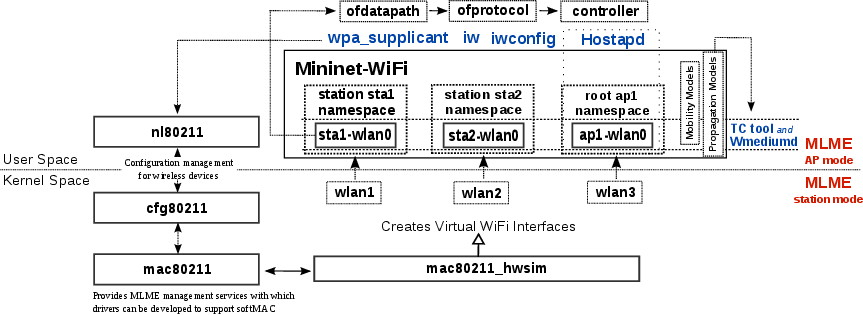
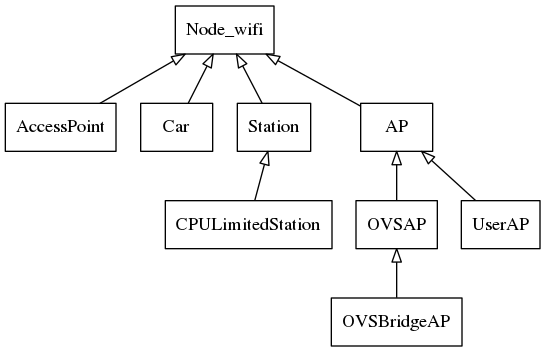
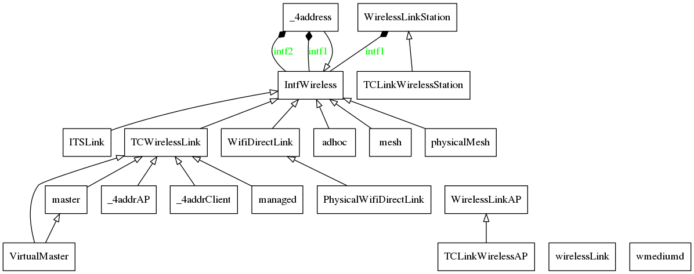
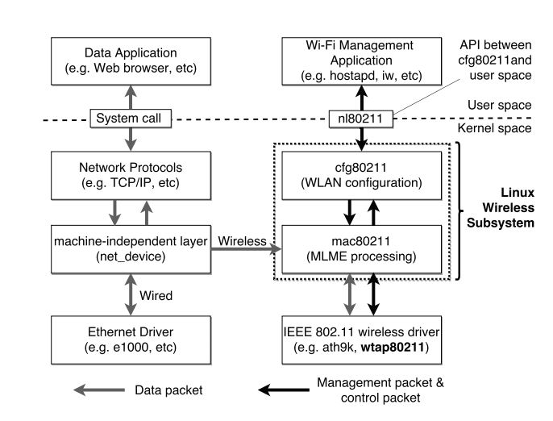
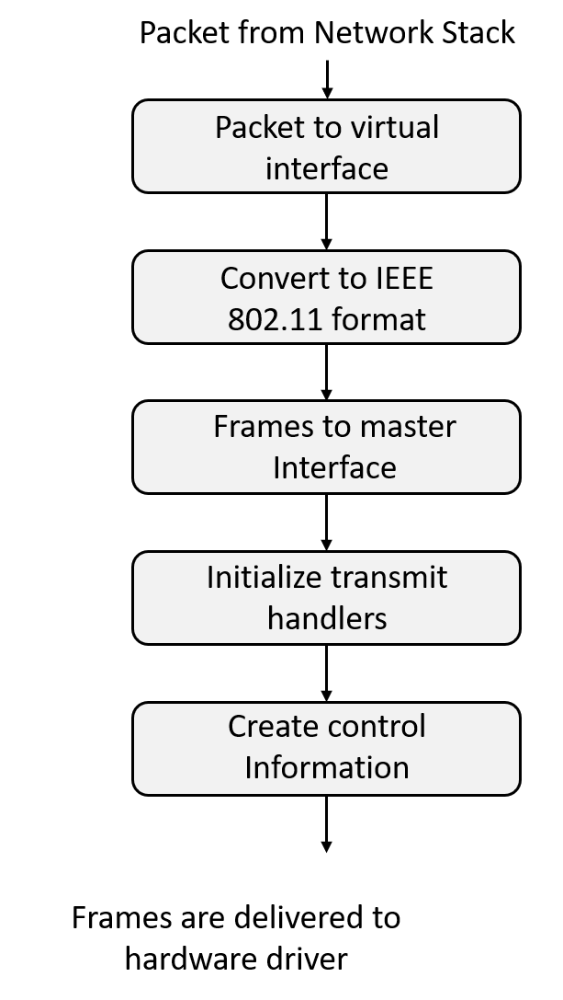
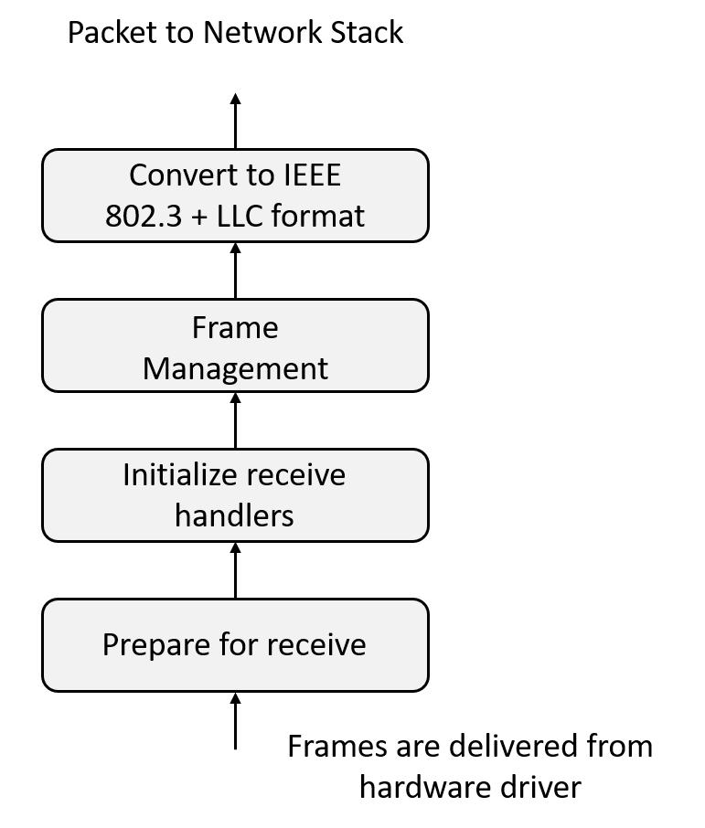
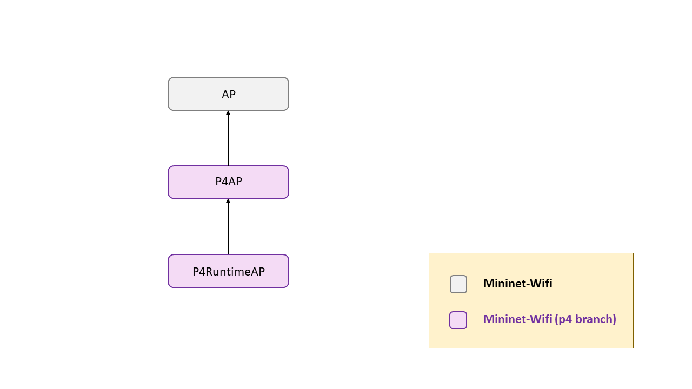

# P4lang-wireless Implementation 

The motivation for this implementation comes from the study of the different datapaths in wireless environments. The only consolidated platform for the emulation of SDN-wireless environments is Mininet-Wifi, so the search for its repository was started. Unfortunately no mention of the p4 language was found in that repository. Upon further investigation, it was found that the creator of Mininet-Wifi and IFBA professor, [Ramon Fontes](https://github.com/ramonfontes), had made a [fork](https://github.com/ramonfontes/tutorials) of the p4 tutorials and had adapted them to Mininet-Wifi, although as stated in the [here](https://github.com/p4lang/tutorials/issues/301) in this open issue on p4lang-tutorials, there is still much development to be done, it is only a first step. 

Seeing the activity of this repository, it is understood that for the moment the development has not progressed much further, since there is no activity in it since 2019. Therefore, as we have the need to process packets with the WiFi headers, and seeing that in all the programs developed on p4 by Ramon the BMV2 works over Ethernet, we are going to venture to set up a scenario where the BMV2 has wireless interfaces, so that we can process the headers we need.

The following plan is therefore proposed to address development:

* Understand and analyze the interface created from the P4Lang organization, the BMV2 with Mininet.
* Understand and analyze the integration made by Ramon of the interface created by P4Lang and Mininet-Wifi.
* Once both interfaces are understood, it is possible to get BMV2 to run in a netns and have wireless interfaces.   

If the magnitude of both interfaces were inaccessible due to their great complexity, we propose to go directly to the low level of Mininet-Wifi, make use of ``wmediumd`` and the kernel module ``mac80211_hwsim`` to mount custom scenarios to carry out our use cases.


## P4Switch (BMV2) - Mininet Interface

The P4lang organization wanted to provide a test environment where the developed p4 programs could be tested. They already had the software-switch where they were going to load the p4 program, which is the [``BMV2``](https://github.com/p4lang/behavioral-model), but they lacked a platform where they could deploy this switch and interconnect it with other network entities. This platform would be Mininet, a network emulation tool. 

Mininet is generally used to emulate SDN environments with switches and controllers, so to achieve the integration of their new switch with the switches already available in Mininet, they had to add a new class called [``P4Switch``](https://github.com/p4lang/tutorials/blob/master/utils/p4_mininet.py#L57). This new class would inherit from Mininet's ``Switch`` class, adding all the methods and attributes needed for the orchestration of the [``BMV2``](https://github.com/p4lang/behavioral-model).

Usually, when working with Mininet, scripts are developed where the topology of the network to be emulated is defined. In this case, to make it easier for the users of P4 tutorials, the topologies are defined in ``.json`` files, which define all the network topology and all the information of the control plane of each P4 switch. An example of such a file can be found [here](https://github.com/davidcawork/TFG/blob/master/src/use_cases/p4/case01/scenario/topology.json). 


This way you can also abstract the definition of the topology from the orchestration script itself. The topology orchestration script, which will make use of the Mininet Python API, will be the famous script called [``run_exercise.py``](https://github.com/davidcawork/TFG/blob/master/src/use_cases/p4/utils/run_exercise.py). This way we'll have as many ``*.json`` files as we want, but only one orchestration script.

The script [``run_exercise.py``](https://github.com/davidcawork/TFG/blob/master/src/use_cases/p4/utils/run_exercise.py) initializes an object of the ``ExerciseRunner`` class which will parse the ``*.json`` file, process the topology with the help of the ``ExerciseTopo`` class and raise the topology by making use of Mininet's Python API. Below is a UML diagram showing the class relationship from our _entrypoint_ in the survey of the various use cases.


As mentioned above, to achieve the integration of [``BMV2``](https://github.com/p4lang/behavioral-model) into Mininet, the class [``P4Switch``](https://github.com/p4lang/tutorials/blob/master/utils/p4_mininet.py#L57) had to be created. This new class would inherit from the Mininet ``Switch`` class. In turn, new child classes would be created from the class [``P4Switch``](https://github.com/p4lang/tutorials/blob/master/utils/p4_mininet.py#L57), the most important one [``P4RuntimeSwitch``](https://github.com/p4lang/tutorials/blob/master/utils/p4runtime_switch.py#L27) which would be used to configure the switch via [``P4Runtime``](https://github.com/p4lang/PI) :smile: . If you want to see a larger view of this same UML, showing methods and attributes, go [here](../../../img/p4-wireless/run_exercise.png).


<br/>

### Example execution trace - case01

For a better understanding of the internal functioning of the interface of [``BMV2``](https://github.com/p4lang/behavioral-model) with Mininet, the execution trace of [case01](https://github.com/davidcawork/TFG/tree/master/src/use_cases/p4/case01) will be thoroughly analyzed. Different execution trace modes have been obtained in order to obtain a better understanding of what the interface's workflow is. Below are the links to these traces in case you want to consult them:

*   [System trace ](./analysis/p4-Mininet/strace_case01.log) [ trace of syscalls of the [case01](https://github.com/davidcawork/TFG/tree/master/src/use_cases/p4/case01) ]
*   [Mininet debug trace ](./analysis/p4-Mininet/trace_case01_debug.log)[ execution trace of the  [case01](https://github.com/davidcawork/TFG/tree/master/src/use_cases/p4/case01)]
*   [Pyreverse execution trace](./analysis/p4-Mininet/trace_case01_run_exer_raw.log) [ execution trace of the [case01](https://github.com/davidcawork/TFG/tree/master/src/use_cases/p4/case01), obtained using pyreverse module ]
*   [Pyreverse execution trace - cleaned](./analysis/p4-Mininet/trace_case01_run_exer.log) [ execution trace of the [case01](https://github.com/davidcawork/TFG/tree/master/src/use_cases/p4/case01), obtained using pyreverse module ]

*   [Fuctions list](./analysis/p4-Mininet/trace_case01_run_exer_functions.log) [ execution trace of the [case01](https://github.com/davidcawork/TFG/tree/master/src/use_cases/p4/case01)]

Below is a summary table of the workflow that occurred in the lifting of [case01](https://github.com/davidcawork/TFG/tree/master/src/use_cases/p4/case01). Four columns are indicated in which the functionality being executed is described, the operation text thrown by the trace, which class is impacted and finally, in which method this step is occurring. All the steps are linked to the source in case you want to consult it personally :cat:.

<br/>


The motivation to create this table was twofold, first to document in detail the inner workings of the Mininet interface with the P4 environment, in order to provide others with an entrypoint to develop with Mininet. The second one has been to learn in a personal way the internal functioning, so that, later on, we could achieve the integration with Mininet-Wifi :monkey:.


## Mininet-Wifi Internals

Once the internal workings of the Mininet-P4 env API have been reviewed, the next step is to analyze Mininet-Wifi. Mininet-Wifi is a wireless network emulation tool that was born from Mininet, that is, it is a fork of it. Being a fork, it shares much of the class hierarchy as well as its ability to simulate certain network elements. Moreover, with the Mininet-Wifi tool you can run a Mininet topology without problems, since the addition of Wifi is a complement to Mininet!

With Mininet-Wifi we can emulate Wifi stations, access points, ad hoc networks, mesh and all network nodes available in Mininet. As we said before, Mininet-Wifi is developed from Mininet, but the wireless interface emulation capability is taken from the Linux wireless subsystem (Later on we will enter the ``mac80211_hwsim`` Kernel module).


The virtualization architecture used in Mininet-Wifi works in a similar way to Mininet, the tool [`mnexec`](https://github.com/intrig-unicamp/mininet-wifi/blob/master/mnexec.c) is used to launch different bash processes in new Network Namespaces, one for each independent node of the network. From these processes all the processes related to the different network nodes will hang, when the emulation is finished, these bash processes will be killed, so there will be no referencing conditions in the Network Namespaces, and these will be removed by the Kernel. 

In this way, the network nodes would already be isolated from other network nodes, so the only thing left to virtualize are the wireless capabilities of the nodes that require them. For them we will use the wireless subsystem of the Linux Kernel, more specifically the ``mac80211_hwsim`` module which will create the wireless interfaces in our equipment. This module will communicate with the ``mac80211`` framework which will provide the access management capabilities to the wireless interface medium. In addition, in the Kernel space there is a further block called ``cfg80211`` which will serve as an API for the configuration of 802.11 headers. This configuration can be done by the userspace netlink interface called `nl80211`. 


For the configuration of the access points, the program [``HostApd``](https://github.com/latelee/hostapd) will be used. By indicating the configuration of the access point and the interface on which it should run, it will emulate the operation of a standard access point. The following figure summarizes the basic architecture of Mininet-Wifi.





As for the class hierarchy, it is quite similar to Mininet's. To highlight two key classes in the Mininet-Wifi hierarchy would be [`Node_Wifi`](https://github.com/intrig-unicamp/mininet-wifi/blob/master/mn_wifi/node.py#L44), from which they inherit all the nodes with wireless capabilities that Mininet-Wifi has and finally, the class [`IntfWireless`](https://github.com/intrig-unicamp/mininet-wifi/blob/master/mn_wifi/link.py#L22), from which they inherit all the available Mininet-Wifi link types (under the 802.11 standard). The UMLs for these classes are left below.


<p align="center">
 
</p>

As can be seen in the UML schemas, it has been possible to isolate the common functionality in the parent classes in order to optimize the amount of code in the child classes. In this way, adding new link types in Mininet-Wifi, for example, is quite affordable, as we have a lot of link types with a very clear and organized structure.




### Linux Wireless Subsystem

The Linux wireless subsystem consists of a set of several modules found in the Linux Kernel. These handle the hardware configuration under the IEEE 802.11 standard as well as the management of the transmission and listening of the data packages. Going from the bottom to the top of the subsystem, the first module we find is the ``mac80211_hwsim`` module. This module, as we mentioned before, is responsible for creating the virtual wireless interfaces in our machine. 

<p align="center">
 
</p>


The main objective of this module ``mac80211_hwsim`` is to make it easier for developers of wireless card drivers to test their code and interaction with the following module called ``mac80211``. Virtualized interfaces do not have the limitations, that is, unlike real hardware, it is easier to create different tests with different configurations without being inhibited by lack of material resources. This module usually receives only one parameter, which is the number of "radii virtual interfaces, to be virtualized. Since the possibilities offered by this module were a bit reduced, many wrappers have been created to offer more functionality than the one given by the module itself. Most of the tools created make use of the Netlink library to communicate directly with the subsystem in the Kernel to get extra configurations, like adding an RSSI, giving name to the interface. An example of such tools would be the tool [``mac80211_hwsim_mgmt``](https://github.com/patgrosse/mac80211_hwsim_mgmt), which is used by Mininet-Wifi to manage the creation of the wireless interfaces in each node that requires them. 

It is important to mention the paradigm change that exists in the wireless subsystem of Linux with the concept of interface. Generally we are used to think about the concept of interface as an element that manages the access to the media, layer two, and the hardware itself, physical layer, an example of this would be an Ethernet interface. Well, in the wireless subsystem the interface is broken down into **two layers**, one of them is the physical layer (PHY) where you can manage for example in which channel the emulated wireless card is listening. The other layer is the access to the medium, represented by the virtual interfaces that "hang" on a wireless card. 

The idea behind this is that you can have *N* virtual interfaces associated to the same emulated wifi card, what surprised me is that the virtual interfaces work mainly with Ethernet (leaving aside the ones in monitor mode).


#### Limitations found 

As already mentioned, most of the virtual interfaces associated with an emulated wireless card are Ethernet type, so all the packets that arrive to us come with Ethernet headers. This is a limitation because in our case of use we wanted to manage the Wifi headers, but if all the virtual interfaces are generally of the Ethernet type, the idea would not be viable.

<p align="center">
 
</p>


But what's the point of converting Wifi headers to Ethernet headers? At the moment the only reason I have found for this design decision, is to make a simpler design of all the drivers that operate under the `mac80211` module, convert to Ethernet and deliver it to the network stack to be managed as one more packet of a wired network. 


<p align="center">
 
</p>


In my opinion, this is quite a waste of resources, since the package is glued up to three times (driver, ethernet queue, qdisc queue) and you have to invest time and resources in the process of casting the headers, [here](https://elixir.bootlin.com/linux/latest/source/net/mac80211/rx.c#L2376) you can see the function in the kernel where this process takes place.  


I say generally because the only way an interface can get to listen to wifi packets is in **monitor** mode. But the monitor mode is intended only to listen to packets, not to transmit. This mode can be taken to the limit by doing a packet injection by the interface, this means that the construction of the wifi headers must be done by us, open a raw socket with that interface and transmit the packet. A test was made generating a Wifi ping, you can consult the tool [here](https://github.com/davidcawork/TFG/blob/master/src/use_cases/p4-wireless/analysis/Mininet-wifi/wtools/wping.py). To get the ping Wifi, we used [``Scapy``](https://scapy.readthedocs.io/en/latest/api/scapy.layers.dot11.html) to conform the headers needed to transmit the message, and the socket module to generate a raw socket with the interface in monitor mode.

 In this way we would achieve our goal of handling Wifi headers, but after discussing it with my TFG tutors this development completely escapes the competence of a TFG since not even Mininet-Wifi contemplates the handling of Wifi headers. Therefore, this objective is considered as a future development, it will be mentioned in future work. The development on Mininet-Wifi will therefore consist of integrating the BMV2 into Mininet-Wifi, and testing the use cases developed for P4, under Mininet-Wifi. The headers that will arrive to us will be those of Ethernet, but as already explained, it is the own Kernel who is in charge to make a casting of the Wifi headers towards Ethernet headers, reason why it escapes of our control.


### Example Mininet-Wifi execution trace

To better understand how Mininet-Wifi works, two scripts have been proposed that emulate the same topology, but make use of TCLink links and ``wmediumd`` managed links. The ``wmediumd`` tool is a tool that works on the same module of the ``mac80211_hwsim`` Kernel, this tool has implemented models of losses and delays of the packages so that the emulation of the topology has a more realistic factor and closer to reality.

The scripts that we will study are the following ones, also we indicate the traces obtained from the execution of each one of them (which will be analyzed to understand better its internal operation).

*   [Topology with TCLink links](https://github.com/davidcawork/TFG/blob/master/src/use_cases/p4-wireless/analysis/Mininet-wifi/examples/topo_TC.py)

    * [System trace](https://github.com/davidcawork/TFG/blob/master/src/use_cases/p4-wireless/analysis/Mininet-wifi/traces/strace_topo_TC.log)
    * [Mininet-Wifi debug trace](https://github.com/davidcawork/TFG/blob/master/src/use_cases/p4-wireless/analysis/Mininet-wifi/traces/trace_topo_TC_debug.log)

*   [Topology using``wmediumd``](https://github.com/davidcawork/TFG/blob/master/src/use_cases/p4-wireless/analysis/Mininet-wifi/examples/topo_wmediumd.py)

    * [System trace](https://github.com/davidcawork/TFG/blob/master/src/use_cases/p4-wireless/analysis/Mininet-wifi/traces/strace_topo_wmediumd.log)
    * [Mininet-Wifi debug trace](https://github.com/davidcawork/TFG/blob/master/src/use_cases/p4-wireless/analysis/Mininet-wifi/traces/trace_topo_wmediumd_debug.log)


We have come to the conclusion that the big difference between a topology with `TCLink` links and `wmediumd` links is that the links contoured by the Linux `TC' are always one-to-one links, where the restrictions in the `TC' are applied to each end of the link. However, when the environment is managed by `wmediumd` it is not necessary to indicate the links, as the tool itself will manage the ranges of each network node. 

Additionally, it is important to mention that the two analyses have been done with two different commits due to the fact that the `module` class was updated while the analysis was being done. It was thought that it would be useful to analyze the new version to see what changes had been introduced, it was seen that only code was reorganized to enable the creation of radios in flight when the links are managed by `wmediumd`, in addition to changing the name of the class `module` by `Mac80211Hwsim` being this last one much more identifying, since always in last instance it is this module that is inserted in the Kernel.

## Integration of BMV2 in Mininet-Wifi

Now that we have an idea about the internal functioning of both tools, let's proceed with their integration. As mentioned before, we will start from the base developed by [Ramon Fontes](https://github.com/ramonfontes), who had made a [fork](https://github.com/ramonfontes/tutorials) of the p4 tutorials and had adapted them to Mininet-Wifi.

While working on the development of the integration of BMV2 in Mininet-Wifi [Ramon Fontes](https://github.com/ramonfontes) opened an [issue](https://github.com/intrig-unicamp/mininet-wifi/issues/295) where the intention of the created in this integration was exposed. In this [issue](https://github.com/intrig-unicamp/mininet-wifi/issues/295) it was possible to discuss with [Ramon Fontes](https://github.com/ramonfontes) how this development should be done. 

It has been decided to make a generic class hierarchy for the BMv2 so that from these you can create custum classes with new additions, so to speak these classes will be the basis for classes that control the BMV2 in a more particular way. A class [`P4AP`](https://github.com/davidcawork/mininet-wifi/blob/p4/mn_wifi/bmv2.py#L447), which contains all the tributes and methods common to BMV2 such as the execution path of BMv2, the json of the p4 program, the thrift-port, log configuration and basic identifier of BMV2. From this class we want to inherit a class called [`P4RuntimeAP`](https://github.com/davidcawork/mininet-wifi/blob/p4/mn_wifi/bmv2.py#L616), which will provide all the elements necessary to support the configuration via P4Runtime via gRPC-port of the BMV2.





Also talking with [Ramon Fontes](https://github.com/ramonfontes) about the implementation of these classes, he indicated me that it would be very useful that these classes have execution support in Network Namespaces, so in a parallel way it was necessary to create a class called [`Netns_mgmt`](https://github.com/davidcawork/TFG/tree/master/src/netns_mgmt). This class helps us to manage the execution of python code in runtime of a Network namespace indicated by using the `setns` call which associates the process over which this call is made to the system to a indicated Namespace.

With the help of this class, [`Netns_mgmt`](https://github.com/davidcawork/TFG/tree/master/src/netns_mgmt), it was possible to configure each BMV2 in its own Network Namespace, so the integration was finished. Additionally, two examples were added to Mininet-Wifi in order to help people who will be using the class. These examples can be found [here](https://github.com/davidcawork/mininet-wifi/tree/p4/examples/p4).


All this development was carried out in a Mininet-Wifi fork, and within this in a particular branch, in which all P4 developments are carried out. Once the integration was completed, the development was offered to the official Mininet-Wifi repository via [`pull-request`](https://github.com/intrig-unicamp/mininet-wifi/pull/302). Currently we are waiting to upgrade the dependencies where the integration was done, since Mininet-Wifi is working with the latest versions! For the development of the p4-wireless use cases, we will use the stable versions of the P4 environment dependencies.

## Implementation of the modified Mininet-Wifi

In order to test the development carried out with Mininet-Wifi, we must first carry out the following steps. Download the repository from my fork, not the official one:

```bash
    git clone https://github.com/davidcawork/mininet-wifi
```

We will make a checkout to switch from the master branch of the repository to the P4 element development branch. Previously we will have to download the references from the remote.

```bash

cd mininet-wifi && git fetch
git checkout p4

```


As the development branch adds new modules to Mininet-Wifi you must "recompile" them again by doing a `make install` from the `/mininet-wifi` directory. For the added modules to work properly you must have the p4 environment dependencies, in the following table you can check which versions are required.


|    Dependency   | Version required |
|:---------------:|:-------------------:|
|  [`BMV2`](https://github.com/p4lang/behavioral-model)  |  `b447ac4c0cfd83e5e72a3cc6120251c1e91128ab` |
|  [`PI`](https://github.com/p4lang/PI) |     `41358da0ff32c94fa13179b9cee0ab597c9ccbcc`  |
|  [`P4C`](https://github.com/p4lang/p4c)  |    `69e132d0d663e3408d740aaf8ed534ecefc88810`     |
|  [`PROTOBUF`](https://github.com/protocolbuffers/protobuf) |   `v3.2.0`  |
|  [`GRPC`](https://github.com/grpc) |    `v1.3.2` |


## References 

*   [Mininet-Wifi](https://github.com/intrig-unicamp/mininet-wifi)
*   [P4 tutorials - Mininet-Wifi fork](https://github.com/ramonfontes/tutorials)
*   [BMV2](https://github.com/p4lang/behavioral-model)
*   [Medium and mobility behaviour insertion for 802.11 emulated networks -  wmediumd](https://core.ac.uk/download/pdf/41810121.pdf)
*   [Design and implementation of a wireless network tap device for IEEE 802.11 wireless network emulation](https://ieeexplore.ieee.org/abstract/document/8330098)
*   [Analysis of Open Source Drivers for IEEE 802.11 WLANs](http://www.au-kbc.org/comm/Docs/papers/Vipin_Analysis_of_open_source_WLAN_driver_paper.pdf)
*   [Figura componentes Mininet-Wifi](https://github.com/ramonfontes/mn-wifi-book-pt)
*   [Diapositivas de la universidad de trento sobre el subsistema wireless de Linux](http://disi.unitn.it/locigno/didattica/NC/14-15/Laboratory_1.pdf)

 
 ---
 
 # P4lang-wireless Implementation 

La motivación de esta implementación viene dada para el estudio de los distintos datapaths en entornos wireless. La única plataforma consolidada para la emulación de entornos SDN-wireless es Mininet-Wifi, por ello, se empezó la búsqueda por su repositorio. Por desgracia no se encontró ninguna mención del lenguaje p4 en dicho repositorio. Investigando más, se encontró que el creador de Mininet-Wifi y profesor de la IFBA, [Ramon Fontes](https://github.com/ramonfontes), había hecho un [fork](https://github.com/ramonfontes/tutorials)  de los tutoriales de p4 y los había adaptado a Mininet-Wifi, aunque como según recoge el [aquí](https://github.com/p4lang/tutorials/issues/301) en este issue abierto en p4lang-tutorials, aun le queda mucho desarrollo por delante, es solo un primer paso. 

Viendo la actividad de dicho repositorio se entiende que de momento el desarrollo no ha progresado mucho más, ya que no hay actividad en él desde el 2019. Por tanto, como se tiene la necesidad de procesar paquetes con la cabeceras WiFi, y viendo que en todos los programas desarrollados en p4 por Ramon el BMV2 trabaja sobre Ethernet, nos vamos a aventurar a montar un escenario donde el BMV2 posea interfaces wireless, para así, poder procesar las cabeceras que necesitamos.

Por tanto, se propone el siguiente plan para abordar el desarrollo:

*   Entender y analizar la interfaz creada desde la organización P4Lang, del BMV2 con Mininet.
*   Entender y analizar la integración realizada por Ramon de la interfaz creada por P4Lang y Mininet-Wifi.
*   Una vez entendidas ambas interfaces vez si es posible conseguir que el BMV2 corra en una netns y posea interfaces wireless.   

Si la magnitud de ambas interfaces fuera inaccesible por su gran complejidad, se propone ir directamente al bajo nivel de Mininet-Wifi, hacer uso de ``wmediumd`` y del modulo del kernel ``mac80211_hwsim`` para montar escenarios custom para llevar a cabo nuestros casos de uso.


## P4Switch (BMV2) - Mininet Interface

Desde la organización de P4lang se quiso suministrar un entorno de pruebas donde se pudiera probar los programas p4 desarrollados. El soft-switch donde iban a cargar el programa p4 ya lo tenían, que es el [``BMV2``](https://github.com/p4lang/behavioral-model), pero les faltaba una plataforma donde poder desplegar dicho "switch" e interconectarlo con otras entidades de red. Esta plataforma sería Mininet, una herramienta de emulación de redes. 

Mininet generalmente se utiliza para emular entornos SDN con switches y controladores, por ello, para lograr la integración de su nuevo switch con los switches ya disponibles en Mininet, tuvieron que añadir una nueva clase llamada [``P4Switch``](https://github.com/p4lang/tutorials/blob/master/utils/p4_mininet.py#L57). Esta nueva clase, heredaría de la clase ``Switch`` de Mininet, añadiendo así todos los métodos y atributos necesarios para la orquestación del  [``BMV2``](https://github.com/p4lang/behavioral-model).

Usualmente, cuando se trabaja con Mininet se desarrollan scripts donde se define la topologia de la red a emular. En este caso para brindar de una mayor facilidad a los users de los tutoriales de P4, las topologias se definen en archivos ``*.json``, los cuales definen toda la topología de red y toda la información del plano de control de cada "switch" P4. Un ejemplo de dicho archivo pueden encontrarse [aquí](https://github.com/davidcawork/TFG/blob/master/src/use_cases/p4/case01/scenario/topology.json). 


De esta forma también se consigue abstraer el la definición de la topología del propio script de orquestación de la misma. El script de orquestación de la topología, el cual hará uso de la API de Python de Mininet será el famoso script llamado [``run_exercise.py``](https://github.com/davidcawork/TFG/blob/master/src/use_cases/p4/utils/run_exercise.py). De esta manera tendremos tantos ficheros ``*.json`` como topologías queramos, pero un único script de orquestación.

El script [``run_exercise.py``](https://github.com/davidcawork/TFG/blob/master/src/use_cases/p4/utils/run_exercise.py) inicializa un objeto de la clase ``ExerciseRunner`` el cual parseará el fichero ``*.json``, procesará la topología con la ayuda de la clase ``ExerciseTopo`` y levantará la topologia haciendo uso de la API de Python de Mininet. A continuación, se puede apreciar un diagrama UML donde se indica la relación de clases desde nuestro _entrypoint_ en el levantamiento de los distintos casos de uso.


Como ya se comentaba anteriormente, para logar la integración del [``BMV2``](https://github.com/p4lang/behavioral-model) en Mininet se tuvo que crear la clase [``P4Switch``](https://github.com/p4lang/tutorials/blob/master/utils/p4_mininet.py#L57). Esta nueva clase, heredaría de la clase ``Switch`` de Mininet. A su vez, se crearían nuevas clases hijas de la clase [``P4Switch``](https://github.com/p4lang/tutorials/blob/master/utils/p4_mininet.py#L57), la más importante [``P4RuntimeSwitch``](https://github.com/p4lang/tutorials/blob/master/utils/p4runtime_switch.py#L27) la cual se utilizaría para configurar dicho "switch" via [``P4Runtime``](https://github.com/p4lang/PI) :smile: . Si se desea ver una vista más amplia de este mismo UML, mostrando métodos y atributos, ir [aquí](../../../img/p4-wireless/run_exercise.png).


<br/>

### Ejemplo traza de ejecución - case01

Para una mejor compresión del funcionamiento interno de la interfaz del [``BMV2``](https://github.com/p4lang/behavioral-model) con Mininet, se va analizar exhaustivamente la traza de ejecución del [case01](https://github.com/davidcawork/TFG/tree/master/src/use_cases/p4/case01). Se han obtenido distintas modos de trazas de ejecución con el fin de obtener un mejor entendimiento de cual es el workflow de la interfaz. A continuación, dejamos los enlaces a dichas trazas por si se quisieran consultar:

*   [System trace ](./analysis/p4-Mininet/strace_case01.log) [ traza de llamadas al sistema del [case01](https://github.com/davidcawork/TFG/tree/master/src/use_cases/p4/case01) ]
*   [Mininet debug trace ](./analysis/p4-Mininet/trace_case01_debug.log)[ traza de ejecución del [case01](https://github.com/davidcawork/TFG/tree/master/src/use_cases/p4/case01), con el nivel de log a debug ]
*   [Pyreverse execution trace](./analysis/p4-Mininet/trace_case01_run_exer_raw.log) [ traza de ejecución del [case01](https://github.com/davidcawork/TFG/tree/master/src/use_cases/p4/case01), obtenido con el módulo pyreverse ]
*   [Pyreverse execution trace - cleaned](./analysis/p4-Mininet/trace_case01_run_exer.log) [ traza de ejecución del [case01](https://github.com/davidcawork/TFG/tree/master/src/use_cases/p4/case01), obtenido con el módulo pyreverse ]

*   [Fuctions list](./analysis/p4-Mininet/trace_case01_run_exer_functions.log) [ traza de ejecución del [case01](https://github.com/davidcawork/TFG/tree/master/src/use_cases/p4/case01), se obtiene las funciones impactadas durante el workflow ]

A continuación, se presenta una tabla resumen del workflow ocurrido en el levantamiento del [case01](https://github.com/davidcawork/TFG/tree/master/src/use_cases/p4/case01). Se indican cuatro columnas en las cuales se describe la funcionalidad que está siendo ejecutada, el texto de operación arrojado por la traza, que clase está impactada y por último, en que método está ocurriendo dicho paso. Todos los pasos están linkeados al source por si se quisiera consulta personalmente :cat:.

<br/>


| Descripción        | Operación     | Clase           | Método |
| -------------      |:-------------:| :-------------: | :-------------: |
| Inicializa atributos y lee la topología del json.  |     Reading topology file.            | [`ExerciseRunner`](https://github.com/davidcawork/TFG/blob/master/src/use_cases/p4/utils/run_exercise.py#L122) | [`__init__`](https://github.com/davidcawork/TFG/blob/master/src/use_cases/p4/utils/run_exercise.py#L152) |
| Se asegura de que los dir. (build, logs, pcap) estén creados y los asigna. | - | [`ExerciseRunner`](https://github.com/davidcawork/TFG/blob/master/src/use_cases/p4/utils/run_exercise.py#L122) | [`__init__`](https://github.com/davidcawork/TFG/blob/master/src/use_cases/p4/utils/run_exercise.py#L175) |
| Método principal donde se parsea la topología del JSON, levanta la instancia de Mininet, configura los nodos y por último corre la CLI. | - | [`ExerciseRunner`](https://github.com/davidcawork/TFG/blob/master/src/use_cases/p4/utils/run_exercise.py#L122) |  [`run_exercise`](https://github.com/davidcawork/TFG/blob/master/src/use_cases/p4/utils/run_exercise.py#L187) | 
| Crea el obj Mininet, y lo guarda en `self.net`. | Building mininet topology. | [`ExerciseRunner`](https://github.com/davidcawork/TFG/blob/master/src/use_cases/p4/utils/run_exercise.py#L122) | [`create_network`](https://github.com/davidcawork/TFG/blob/master/src/use_cases/p4/utils/run_exercise.py#L237) |
| Función Aux. para inicializar correctamente la clase del "switch". (Generalmente `ConfiguredP4RuntimeSwitch`) | - | - | [`configureP4Switch`](https://github.com/davidcawork/TFG/blob/master/src/use_cases/p4/utils/run_exercise.py#L35) |
| Se crea un obj de la clase `ExerciseTopo` para así generar el obj `Topo` de Mininet con toda la información necesaria para su posterior generación. Se guardará en `self.topo` | - | [`ExerciseTopo`](https://github.com/davidcawork/TFG/blob/master/src/use_cases/p4/utils/run_exercise.py#L67) |  [`__init__`](https://github.com/davidcawork/TFG/blob/master/src/use_cases/p4/utils/run_exercise.py#L70) |
| Se crea el obj Mininet llamando a su constructor. Se le pasa el obj `Topo`, el tipo de link `TCLink`, el tipo de host `P4Host`, el tipo de switch `ConfiguredP4RuntimeSwitch` | - | [`ExerciseRunner`](https://github.com/davidcawork/TFG/blob/master/src/use_cases/p4/utils/run_exercise.py#L122) | [`create_network`](https://github.com/davidcawork/TFG/blob/master/src/use_cases/p4/utils/run_exercise.py#L254) |
| Se inicializan los atributos del obj `Mininet`, entre ellos obtiene el num. de cores | `grep -c processor /proc/cpuinfo` | [`Mininet`](https://github.com/mininet/mininet/blob/master/mininet/net.py#L113) | [`__init__`](https://github.com/mininet/mininet/blob/master/mininet/net.py#L116) |
| Inicializa Mininet, es decir, se asegura que tiene [permisos de root](https://github.com/mininet/mininet/blob/2b8d254cc0c99f823fdea91c442cf0365761d469/mininet/util.py#L660) y establece unos [límites mínimos](https://github.com/mininet/mininet/blob/2b8d254cc0c99f823fdea91c442cf0365761d469/mininet/util.py#L507) para poder llevar a cabo la emulación. ( Incrementa el num. de archivos abiertos al mismo tiempo, aumenta los buffers del stack red, aumenta el cache arp más tamaño de tabla de rutas, añade más intf PTYs para los nodos). |  *** Setting resource limits | [`Mininet`](https://github.com/mininet/mininet/blob/master/mininet/net.py#L113) | [`init`](https://github.com/mininet/mininet/blob/master/mininet/net.py#L925) |
| Construye la topología a emular. | - | [`Mininet`](https://github.com/mininet/mininet/blob/master/mininet/net.py#L113) | [`build`](https://github.com/mininet/mininet/blob/master/mininet/net.py#L499) |
| Este método es llamado desde el anterior al detectar que existe un obj.  `Topo`. | *** Creating network | [`Mininet`](https://github.com/mininet/mininet/blob/master/mininet/net.py#L113) | [`buildFromTopo`](https://github.com/mininet/mininet/blob/master/mininet/net.py#L446) |
| Añade los host a la topología.  | *** Adding hosts | [`Mininet`](https://github.com/mininet/mininet/blob/master/mininet/net.py#L113) | [`buildFromTopo`](https://github.com/mininet/mininet/blob/master/mininet/net.py#L472) |
| Añade un host a la topología (Este método es llamado repetidamente por el número de host que haya en la topología). Posteriormente, en función de tipo de host que le habíamos pasado al obj `Mininet` inicializa dicha clase con los parámetros dados en el obj. `Topo`, o en su defecto, los toma por defecto. | - | [`Mininet`](https://github.com/mininet/mininet/blob/master/mininet/net.py#L113) | [`addHost`](https://github.com/mininet/mininet/blob/master/mininet/net.py#L206) |
| Como el tipo de host que pasamos era [`P4Host`](https://github.com/davidcawork/TFG/blob/162dfea6a4af544d8f1db64c27553dc4be1e967c/src/use_cases/p4/utils/p4_mininet.py#L30), se debe inicializar. No tiene constructor por lo que hace uso del heredado de su clase padre, [`Host`](https://github.com/mininet/mininet/blob/2b8d254cc0c99f823fdea91c442cf0365761d469/mininet/node.py#L667), que a su vez lo hereda de su clase padre [`Node`](https://github.com/mininet/mininet/blob/2b8d254cc0c99f823fdea91c442cf0365761d469/mininet/node.py#L72). | - | [`Node`](https://github.com/mininet/mininet/blob/2b8d254cc0c99f823fdea91c442cf0365761d469/mininet/node.py#L72) | [`__init__`](https://github.com/mininet/mininet/blob/2b8d254cc0c99f823fdea91c442cf0365761d469/mininet/node.py#L78) |
| Levanta un proceso de bash para el host en cuestión, el cual soportará la Network Namespace de dicho host. Hará uso del programa `mnexec`. | `mnexec -cdn env PS1=\x7f bash --norc --noediting -is mininet:hX` | [`Node`](https://github.com/mininet/mininet/blob/2b8d254cc0c99f823fdea91c442cf0365761d469/mininet/node.py#L72) | [`startShell`](https://github.com/mininet/mininet/blob/2b8d254cc0c99f823fdea91c442cf0365761d469/mininet/node.py#L132) |
| Añade los switches a la topología. | *** Adding switches | [`Mininet`](https://github.com/mininet/mininet/blob/master/mininet/net.py#L113) | [`buildFromTopo`](https://github.com/mininet/mininet/blob/master/mininet/net.py#L477) |
| Añade un switch a la topología. (Este método es llamado repetidamente por el número de switches que haya en la topología). Posteriormente, en función de tipo de switch que le habíamos pasado al obj `Mininet` inicializa dicha clase con los parámetros dados en el obj. `Topo`, o en su defecto, los toma por defecto. | - | [`Mininet`](https://github.com/mininet/mininet/blob/master/mininet/net.py#L113) | [`addSwitch`](https://github.com/mininet/mininet/blob/master/mininet/net.py#L249) |
| Como el tipo de switch que pasamos era [``ConfiguredP4RuntimeSwitch``](https://github.com/davidcawork/TFG/blob/master/src/use_cases/p4/utils/run_exercise.py#L42), se debe inicializar. Este su vez inicializa el obj [`P4RuntimeSwitch`](https://github.com/davidcawork/TFG/blob/162dfea6a4af544d8f1db64c27553dc4be1e967c/src/use_cases/p4/utils/p4runtime_switch.py#L27). | - | [`ConfiguredP4RuntimeSwitch`](https://github.com/davidcawork/TFG/blob/master/src/use_cases/p4/utils/run_exercise.py#L42) | [`__init__`](https://github.com/davidcawork/TFG/blob/master/src/use_cases/p4/utils/run_exercise.py#L43) |
| Se establecen todos los atributos relativos a la puesta en marcha del  [``BMV2``](https://github.com/p4lang/behavioral-model). De forma adicional, se llama al constructor de la clase padre [``Switch``](https://github.com/mininet/mininet/blob/master/mininet/node.py#L881). | - | [`P4RuntimeSwitch`](https://github.com/davidcawork/TFG/blob/162dfea6a4af544d8f1db64c27553dc4be1e967c/src/use_cases/p4/utils/p4runtime_switch.py#L27) | [`__init__`](https://github.com/davidcawork/TFG/blob/162dfea6a4af544d8f1db64c27553dc4be1e967c/src/use_cases/p4/utils/p4runtime_switch.py#L32) |
| Se inicializa la clase [``Switch``](https://github.com/mininet/mininet/blob/master/mininet/node.py#L881), se inicializa el obj `Node` asociado a dicho switch, y este al no encontrarse en una netns se asocia como intf de control: `lo`. | `mnexec -cd env PS1=\x7f bash --norc --noediting -is mininet:sX` **&&** added intf lo (0) to node s1 | [``Switch``](https://github.com/mininet/mininet/blob/master/mininet/node.py#L881) | [`__init__`](https://github.com/mininet/mininet/blob/master/mininet/node.py#L888) |
| Añade los enlaces a la topología. | *** Adding links | [`Mininet`](https://github.com/mininet/mininet/blob/master/mininet/net.py#L113) | [`buildFromTopo`](https://github.com/mininet/mininet/blob/master/mininet/net.py#L486) |
| Añade un enlace a la topología, parsea los nodos que van a componer dicho enlace y establece las características del mismo. En función del tipo de enlace pasado, se llama al constructor de dicha clase ( `TCLink` en nuestro caso).  | - | [`Mininet`](https://github.com/mininet/mininet/blob/master/mininet/net.py#L113) | [`addLink`](https://github.com/mininet/mininet/blob/master/mininet/net.py#L375) |
| Inicializa la clase [`TCLink`](https://github.com/mininet/mininet/blob/master/mininet/link.py#L552), poniendo por defecto que las dos interfaces que componen el enlace son de la clase [`TCIntf`](https://github.com/mininet/mininet/blob/2b8d254cc0c99f823fdea91c442cf0365761d469/mininet/link.py#L226). Por último, inicializa a su vez la clase [`Link`](https://github.com/mininet/mininet/blob/2b8d254cc0c99f823fdea91c442cf0365761d469/mininet/link.py#L401). | - | [`TCLink`](https://github.com/mininet/mininet/blob/master/mininet/link.py#L552) | [`__init__`](https://github.com/mininet/mininet/blob/master/mininet/link.py#L554) |
| Del constructor de la clase [`Link`](https://github.com/mininet/mininet/blob/2b8d254cc0c99f823fdea91c442cf0365761d469/mininet/link.py#L401) se generan el par de veth's y se configuran en función del tipo de interfaz que lleven. En este caso, [`TCIntf`](https://github.com/mininet/mininet/blob/2b8d254cc0c99f823fdea91c442cf0365761d469/mininet/link.py#L226), haciendo uso de las bondades del `TC` se consigue limitar el "enlace". | [`...`](https://github.com/davidcawork/TFG/blob/master/src/use_cases/p4-wireless/analysis/p4-Mininet/trace_case01_debug.log#L32) | [`Link`](https://github.com/mininet/mininet/blob/2b8d254cc0c99f823fdea91c442cf0365761d469/mininet/link.py#L401) | [`__init__`](https://github.com/mininet/mininet/blob/2b8d254cc0c99f823fdea91c442cf0365761d469/mininet/link.py#L407) |
| Se configuran los Host de la topología | *** Configuring hosts | [`Mininet`](https://github.com/mininet/mininet/blob/master/mininet/net.py#L113) | [`build`](https://github.com/mininet/mininet/blob/master/mininet/net.py#L505) |
| Se configura los host, es decir, sus interfaces, con los parámetros proporcionados. | [`...`](https://github.com/davidcawork/TFG/blob/162dfea6a4af544d8f1db64c27553dc4be1e967c/src/use_cases/p4/utils/p4_mininet.py#L32) | [`P4Host`](https://github.com/davidcawork/TFG/blob/162dfea6a4af544d8f1db64c27553dc4be1e967c/src/use_cases/p4/utils/p4_mininet.py#L30) | [`config`](https://github.com/davidcawork/TFG/blob/162dfea6a4af544d8f1db64c27553dc4be1e967c/src/use_cases/p4/utils/p4_mininet.py#L31) |
| Una vez construida la topología, se inicia. | - | [`ExerciseRunner`](https://github.com/davidcawork/TFG/blob/master/src/use_cases/p4/utils/run_exercise.py#L122) | [`run_exercise`](https://github.com/davidcawork/TFG/blob/162dfea6a4af544d8f1db64c27553dc4be1e967c/src/use_cases/p4/utils/run_exercise.py#L194) |
| Se levantan el controlador/es, en este caso no hay, y se levantan los switches. Aquí se lanzarán las instancias del [``BMV2``](https://github.com/p4lang/behavioral-model). |  Starting controller **&&** Starting X switches | [`Mininet`](https://github.com/mininet/mininet/blob/master/mininet/net.py#L113) | [`start`](https://github.com/mininet/mininet/blob/master/mininet/net.py#L537) |
| El método `start` anterior actúa como un envoltorio del siguiente quien es realmente quien levanta la instancia del [``BMV2``](https://github.com/p4lang/behavioral-model)| [`...`](https://github.com/davidcawork/TFG/blob/162dfea6a4af544d8f1db64c27553dc4be1e967c/src/use_cases/p4/utils/p4runtime_switch.py#L100) | [`P4RuntimeSwitch`](https://github.com/davidcawork/TFG/blob/162dfea6a4af544d8f1db64c27553dc4be1e967c/src/use_cases/p4/utils/p4runtime_switch.py#L27) | [`start`](https://github.com/davidcawork/TFG/blob/162dfea6a4af544d8f1db64c27553dc4be1e967c/src/use_cases/p4/utils/p4runtime_switch.py#L100) |
| Se ejecutan los posibles comandos pasados en el json donde se definía la topología. | *** hX: cmd  | [`ExerciseRunner`](https://github.com/davidcawork/TFG/blob/master/src/use_cases/p4/utils/run_exercise.py#L122) | [`run_exercise`](https://github.com/davidcawork/TFG/blob/162dfea6a4af544d8f1db64c27553dc4be1e967c/src/use_cases/p4/utils/run_exercise.py#L198) |
| Este método programará cada instancia del [``BMV2``](https://github.com/p4lang/behavioral-model) usando el CLI ó vía [``P4Runtime``](https://github.com/p4lang/PI). | Configuring switch sX | [`ExerciseRunner`](https://github.com/davidcawork/TFG/blob/master/src/use_cases/p4/utils/run_exercise.py#L122) | [`run_exercise`](https://github.com/davidcawork/TFG/blob/162dfea6a4af544d8f1db64c27553dc4be1e967c/src/use_cases/p4/utils/run_exercise.py#L199) |
| Inicia la CLI de Mininet y retorna el control al usuario. | Starting mininet CLI | [`ExerciseRunner`](https://github.com/davidcawork/TFG/blob/master/src/use_cases/p4/utils/run_exercise.py#L122) | [`run_exercise`](https://github.com/davidcawork/TFG/blob/162dfea6a4af544d8f1db64c27553dc4be1e967c/src/use_cases/p4/utils/run_exercise.py#L204) |

La motivación de crear esta tabla ha sido doble, primero documentar de forma detallada el funcionamiento interno de la interfaz de Mininet con el enviroment P4, para así brindar a otras personas de un entrypoint a la hora de desarrollar con Mininet. El segundo ha sido el de aprender a modo personal el funcionamiento interno, para así, a posteriori poder lograr la integración con Mininet-Wifi :monkey:.


## Mininet-Wifi Internals

Una vez que se revisó el funcionamiento interno de la API de Mininet-P4 env se da paso a analizar Mininet-Wifi. Mininet-Wifi es una herramienta de emulación de redes wireless que ha nacido de Mininet, es decir es un fork de este. Al ser un fork comparte gran parte de la jerarquía de clases así como su capacidad para simular ciertos elementos de la red. Además, con la herramienta de Mininet-Wifi se puede correr una topología de Mininet sin problemas, ya que el el añadido de Wifi es un complemento sobre Mininet!

Con Mininet-Wifi podremos emular estaciones Wifi, puntos de acceso, redes adhoc, mesh y todos los nodos de red disponibles en Mininet. Como ya hemos dicho Mininet-Wifi esta desarrollado a partir de Mininet, pero la capacidad de emulación de interfaces Wireless la toma de subsistema wireless de Linux (Más adelante se entrará en el modulo del Kernel ``mac80211_hwsim ``).

La arquitectura de virtualización empleada en Mininet-Wifi funciona de forma similar a la Mininet, se hace uso de la herramienta [`mnexec`](https://github.com/intrig-unicamp/mininet-wifi/blob/master/mnexec.c) para lanzar distintos procesos de bash en nuevas Network Namespaces, uno por cada nodo independiente de la red. De estos procesos colgarán todos los procesos relativos a los distintos nodos de la red, cuando la emulación haya terminado, se matarán dichos procesos de bash, consiguiendo que no haya ninguna condición de referenciación de las Network Namespaces, y estas sean eliminadas por el Kernel. 

De esta manera, los nodos de la red ya estarían aislados de otros nodos de la red, por lo que lo único que quedaría por virtualizar son las capacidades wireless de los nodos que las requieran. Para ellos se hará uso del subsistema wireless del Kernel de Linux, más concretamente el módulo ``mac80211_hwsim `` el cual creará las interfaces wireless en nuestro equipo. Este módulo se comunicará con framework ``mac80211`` el cual proveerá de las capacidades de gestión de acceso al medio de la interfaz wireless. Además, en el espacio de Kernel aun hay un bloque más llamado `cfg80211` el cual servirá de API para la configuración de las cabeceras 802.11. Esta configuración puede ser realizada por la interfaz netlink de espacio de usuario llamada `nl80211`. 

Para la configuración de los puntos de acceso, se hará uso del programa [``HostApd``](https://github.com/latelee/hostapd) el cual indicándole la configuración del punto de acceso y la interfaz sobre la cual debe correr, emulará el funcionamiento de un punto de acceso estándar. En la siguiente figura se puede ver de manera resumida la arquitectura básica de Mininet-Wifi.


En cuanto a la jerarquía de clases unicamente decir que es bastante similar a la de Mininet. Por destacar dos clases claves en la jerarquía de Mininet-Wifi  serían [`Node_Wifi`](https://github.com/intrig-unicamp/mininet-wifi/blob/master/mn_wifi/node.py#L44), de la cual heredan todos los nodos con capacidades wireless que poseé Mininet-Wifi y por último, la clase [`IntfWireless`](https://github.com/intrig-unicamp/mininet-wifi/blob/master/mn_wifi/link.py#L22), de la cual heredan todos los tipos de enlaces disponibles de Mininet-Wifi (Bajo el estándar 802.11). A continuación se dejan los UML referentes a  dichas clases.


<p align="center">
 
</p>

Como se puede apreciar en los esquemas UML, se ha conseguido aislar la funcionalidad común en las clases padres con la finalidad de optimizar la cantidad de código de las clases hijas. De esta forma añadir nuevos tipos de enlaces por ejemplo en Mininet-Wifi resulta bastante asequible ya que, tenemos multitud de tipos de enlaces con una estructura muy clara y organizada.


### Linux Wireless Subsystem

El subsistema wireless de Linux consiste en un set de varios módulos que se encuentran en el Kernel de Linux. Estos manejan la configuración del hardware bajo el estándar IEEE 802.11 además de la gestión de la transmisión y la escucha de los paquetes de datos. Yendo de desde abajo hacia arriba del subsistema, el primer módulo que nos encontramos es el módulo ``mac80211_hwsim``. Este módulo como ya comentábamos es el responsable de crear las interfaces wireless virtuales en nuestra máquina. 

<p align="center">
 
</p>


El objetivo principal de  este módulo ``mac80211_hwsim`` es facilitar a los desarrolladores de drivers de tarjetas wireless la prueba de su código e interacción con el siguiente módulo llamado ``mac80211``. Las interfaces virtualizadas no tienen las limitaciones, es decir, a diferencia del hardware real,  resulta más sencillo la creación de distintas pruebas con distintas configuraciones sin estar cohibidos por falta de recursos materiales. Este módulo generalmente recibe un único parámetro, que es el número de "radios" , interfaces virtuales, a virtualizar. Dado que las posibilidades que ofrece este módulo eran un poco reducidas, muchos wrappers han sido creados para ofrecer más funcionalidad a parte de la dada por el propio módulo. La mayoría de herramientas creadas hacen uso de la librería Netlink para comunicarse directamente con el subsistema en el Kernel y así conseguir configuraciones extra, como pueden ser añadir un RSSI, darle nombre a la interfaz. Un ejemplo de dichas herramientas sería la herramienta [``mac80211_hwsim_mgmt``](https://github.com/patgrosse/mac80211_hwsim_mgmt), la cual es usada por Mininet-Wifi para gestionar la creación de las interfaces wireless en cada nodo que las requiera. 

Es importante mencionar el cambio de paradigma que existe en el subsistema wireless de Linux con el concepto de interfaz. Generalmente estamos acostumbrados a pensar en el concepto de interfaz como un elemento que gestiona el acceso al medio, capa dos, y el propio hardware, capa física, un ejemplo de ello sería una interfaz de Ethernet. Bien, pues en el subsistema wireless se desglosa la interfaz **dos capas**, una de ellas es la capa física (PHY) donde se puede gestionar por ejemplo en que canal está escuchando la tarjeta wireless emulada. La otra capa es el acceso al medio, representado por las interfaces virtuales que "cuelgan" de una tarjeta wireless. 

La idea detrás de esto es que puede tener *N* interfaces virtuales asociadas a la misma tarjeta wifi emulada, lo que me sorprendió es que las interfaces virtuales funcionan principalmente con Ethernet (dejando de lado las que están en modo monitor).


#### Limitaciones encontradas 

Como ya se ha comentado la mayoría de interfaces virtuales asociadas a una tarjeta wireless emulada son del tipo de Ethernet, por ello todos los paquetes que nos llegan vienen con cabeceras Ethernet. Esto supone una limitación ya que en nuestros casos de uso queríamos gestionar las cabeceras Wifi, pero si todas las interfaces virtuales son generalmente del de tipo Ethernet no sería viable la idea.

<p align="center">
 
</p>


Pero, ¿Qué sentido tiene tener convertir las cabeceras Wifi a cabeceras Ethernet? De momento la única razón que he encontrado de esta decisión de diseño, es hacer un diseño más sencillo de todos los drivers que operan bajo el módulo `mac80211`, convierten a Ethernet y se lo entregan al stack de red para que lo gestione como un paquete más de una red cableada. 

<p align="center">
 
</p>


A mi parecer, esto supone un gasto de recursos bastante grande, ya que el paquete es encolado hasta tres veces (driver, ethernet queue, qdisc queue) y se tiene que invertir tiempo y recursos en el proceso de casting de las cabeceras, [aquí](https://elixir.bootlin.com/linux/latest/source/net/mac80211/rx.c#L2376) se puede ver la función en el kernel donde se lleva a cabo ese proceso.  


Digo generalmente ya que en el único modo que una interfaz puede llegar a escuchar los paquetes wifi es en el modo **monitor**. Pero el modo monitor está pensado unicamente para escuchar paquetes, no para transmitir. Este modo puede ser llevado al limite haciendo una inyección de paquetes (*packet injection*) por la interfaz, esto significa que la construcción de las cabeceras Wifi debe ser hecha por nosotros, abrir un socket raw con dicha interfaz y transmitir el paquete. Se realizó un test generando un ping Wifi, se puede consultar la herramienta [aquí](https://github.com/davidcawork/TFG/blob/master/src/use_cases/p4-wireless/analysis/Mininet-wifi/wtools/wping.py). Para conseguir el ping Wifi se hizo uso de [``Scapy``](https://scapy.readthedocs.io/en/latest/api/scapy.layers.dot11.html) para el conformado de las cabeceras necesarias para transmitir el mensaje, y del módulo socket para generar un socket raw con la interfaz en modo monitor.

 De esta forma conseguiríamos nuestro objetivo de manejar las cabeceras Wifi, pero después de hablarlo con mis tutores del TFG este desarrollo se escapa completamente de las competencias de un TFG ya que ni si quiera Mininet-Wifi contempla el manejo de cabeceras Wifi. Por ello, este objetivo se plantea como un desarrollo a futuro, se mencionará en future work. El desarrollo pues sobre Mininet-Wifi consistirá en la integración del BMV2 en Mininet-Wifi, y probar los casos de uso desarrollados para P4, bajo Mininet-Wifi. Las cabeceras que nos llegaran serán las de Ethernet, pero como ya se ha explicado, es el propio Kernel quien se encarga de hacer un casting de las cabeceras Wifi hacia cabeceras Ethernet, por lo que se escapa de nuestro control.


### Ejemplo traza de ejecución Mininet-Wifi

Para entender un poco mejor el funcionamiento de Mininet-Wifi se han propuesto dos scripts donde se emulan la misma topología, pero haciendo uso de enlaces TCLink y de enlaces gestionados por ``wmediumd``. La herramienta ``wmediumd`` es una herramienta que funciona sobre el mismo módulo del Kernel ``mac80211_hwsim``, esta herramienta lleva implementado modelos de perdidas y de retardos de los paquetes por lo que permiten que la emulación de la topología tengo un factor más realista y cercano con la realidad.

Los scripts que estudiaremos son los siguientes, tambien indicamos las trazas obtenidas de la ejecución de cada uno de ellos (Las cuales se analizarán para comprender mejor su funcionamiento interno).

*   [Topología con enlaces TCLink](https://github.com/davidcawork/TFG/blob/master/src/use_cases/p4-wireless/analysis/Mininet-wifi/examples/topo_TC.py)

    * [System trace](https://github.com/davidcawork/TFG/blob/master/src/use_cases/p4-wireless/analysis/Mininet-wifi/traces/strace_topo_TC.log)
    * [Mininet-Wifi debug trace](https://github.com/davidcawork/TFG/blob/master/src/use_cases/p4-wireless/analysis/Mininet-wifi/traces/trace_topo_TC_debug.log)

*   [Topología con enlaces gestionados por ``wmediumd``](https://github.com/davidcawork/TFG/blob/master/src/use_cases/p4-wireless/analysis/Mininet-wifi/examples/topo_wmediumd.py)

    * [System trace](https://github.com/davidcawork/TFG/blob/master/src/use_cases/p4-wireless/analysis/Mininet-wifi/traces/strace_topo_wmediumd.log)
    * [Mininet-Wifi debug trace](https://github.com/davidcawork/TFG/blob/master/src/use_cases/p4-wireless/analysis/Mininet-wifi/traces/trace_topo_wmediumd_debug.log)


A continuación, se presenta una tabla resumen del workflow ocurrido en el levantamiento de ambas topologías. Se indican cuatro columnas en las cuales se describe la funcionalidad que está siendo ejecutada, el texto de operación arrojado por la traza, que clase está impactada y por último, en que método está ocurriendo dicho paso. Todos los pasos están linkeados al source por si se quisiera consulta personalmente.

#### Topología con enlace TCLink

Este analisis del flujo de ejecución se ha llevado a cabo en el commit [`880ba`](https://github.com/intrig-unicamp/mininet-wifi/commit/880ba3fe9f4bc7f415f408a2aa5da98c505b296f#diff-07708c7bc6d27513c519b49f6930b2ad).

| Descripción        | Operación     | Clase           | Método |
| -------------      |:-------------:| :-------------: | :-------------: |
| Se llama al script que define la topología. | - | - | [``topology``](https://github.com/davidcawork/TFG/blob/master/src/use_cases/p4-wireless/analysis/Mininet-wifi/examples/topo_TC.py#L11) |
| Se crea el obj ``Mininet_wifi`` y se almacena en la variable ``net`` | - | - | [``topology``](https://github.com/davidcawork/TFG/blob/master/src/use_cases/p4-wireless/analysis/Mininet-wifi/examples/topo_TC.py#L13) |
| Se inicializan los atributos del obj ``Mininet_wifi``, tambien los atributos de las clases de las cuales hereda, como son `Mininet` y `Mininet_Iot`,  entre ellos obtiene el num. de cores |`grep -c processor /proc/cpuinfo`| [`Mininet_wifi`](https://github.com/intrig-unicamp/mininet-wifi/blob/master/mn_wifi/net.py#L46) | [`__init__`](https://github.com/intrig-unicamp/mininet-wifi/blob/master/mn_wifi/net.py#L48)|
| Inicializa Mininet, es decir, se asegura que tiene [permisos de root](https://github.com/mininet/mininet/blob/2b8d254cc0c99f823fdea91c442cf0365761d469/mininet/util.py#L660) y establece unos [límites mínimos](https://github.com/mininet/mininet/blob/2b8d254cc0c99f823fdea91c442cf0365761d469/mininet/util.py#L507) para poder llevar a cabo la emulación. ( Incrementa el num. de archivos abiertos al mismo tiempo, aumenta los buffers del stack red, aumenta el cache arp más tamaño de tabla de rutas, añade más intf PTYs para los nodos). |  *** Setting resource limits | [`Mininet`](https://github.com/mininet/mininet/blob/master/mininet/net.py#L113) | [`init`](https://github.com/mininet/mininet/blob/master/mininet/net.py#L925) |
| Se inicializa la clase padre `Mininet_Iot`, aunque no se haga uso de ella. | - | [`Mininet_IoT`](https://github.com/intrig-unicamp/mininet-wifi/blob/d3e4da590668aa5bfc9251d8d5518e8be91561e0/mn_wifi/sixLoWPAN/net.py#L18) | [`__init__`](https://github.com/intrig-unicamp/mininet-wifi/blob/d3e4da590668aa5bfc9251d8d5518e8be91561e0/mn_wifi/sixLoWPAN/net.py#L20) |
| Se empiezan a añadir los nodos al obj `Mininet_Wifi` en el script `topo_TC.py` | *** Creating nodes | - | [``topology``](https://github.com/davidcawork/TFG/blob/master/src/use_cases/p4-wireless/analysis/Mininet-wifi/examples/topo_TC.py#L15) |
| Se añaden las estaciones a la red. | - | [`Mininet_wifi`](https://github.com/intrig-unicamp/mininet-wifi/blob/master/mn_wifi/net.py#L46) | [`addStation`](https://github.com/intrig-unicamp/mininet-wifi/blob/master/mn_wifi/net.py#L296) |
| Se parsean los datos pasados para la creación de la estación wifi, se configuran por si no se hubieran pasado con unos por defecto. Acto seguido, se inicializa la clase de la estación wifi (Hay varias, en caso de no pasar ninguna clase por defecto se inicializaría la clase [`Station`](https://github.com/intrig-unicamp/mininet-wifi/blob/f19e46f95283eb7b0d9ed51feaf401a161137c32/mn_wifi/node.py#L520)). | - | [`Mininet_wifi`](https://github.com/intrig-unicamp/mininet-wifi/blob/master/mn_wifi/net.py#L46) | [`addStation`](https://github.com/intrig-unicamp/mininet-wifi/blob/master/mn_wifi/net.py#L329) |
| Se inicializa la clase [`Station`](https://github.com/intrig-unicamp/mininet-wifi/blob/f19e46f95283eb7b0d9ed51feaf401a161137c32/mn_wifi/node.py#L520) que es un simple envoltorio de la clase [`Node_wifi`](https://github.com/intrig-unicamp/mininet-wifi/blob/f19e46f95283eb7b0d9ed51feaf401a161137c32/mn_wifi/node.py#L44), por lo que es esta última clase la que lleva a cabo la puesta en marcha de la estación. | - | [`Node_wifi`](https://github.com/intrig-unicamp/mininet-wifi/blob/f19e46f95283eb7b0d9ed51feaf401a161137c32/mn_wifi/node.py#L44) |  [`__init__`](https://github.com/intrig-unicamp/mininet-wifi/blob/f19e46f95283eb7b0d9ed51feaf401a161137c32/mn_wifi/node.py#L50) |
| Comprueba que los bninarios necesarios para la ejecutar la clase existen. | `*** errRun: ['which', 'mnexec']` **&&** `*** errRun: ['which', 'ip', 'addr']`   | [`Node_wifi`](https://github.com/intrig-unicamp/mininet-wifi/blob/f19e46f95283eb7b0d9ed51feaf401a161137c32/mn_wifi/node.py#L44) | [`checkSetup`](https://github.com/intrig-unicamp/mininet-wifi/blob/f19e46f95283eb7b0d9ed51feaf401a161137c32/mn_wifi/node.py#L57) |
| Se parsean los datos pasados para la creación del Nodo wireless, en este caso la estación wifi. Una vez parseados, se inicializa al igual que en Mininet una bash que "sostendrá" la Network Namespace del nodo en cuestión caso de ser un nodo independiente. Esto se llevará a cabo haciendo uso de la herramienta `mnexec`. | `_popen ['mnexec', '-cdn', 'env', 'PS1=\x7f', 'bash', '--norc', '--noediting', '-is', 'mininet:sta1'] 32384*** sta1 : ('unset HISTFILE; stty -echo; set +m',)` | [`Node_wifi`](https://github.com/intrig-unicamp/mininet-wifi/blob/f19e46f95283eb7b0d9ed51feaf401a161137c32/mn_wifi/node.py#L44) |  [`startShell`](https://github.com/intrig-unicamp/mininet-wifi/blob/f19e46f95283eb7b0d9ed51feaf401a161137c32/mn_wifi/node.py#L89) |
| Se añaden los puntos de acceso a la red. | - | [`Mininet_wifi`](https://github.com/intrig-unicamp/mininet-wifi/blob/master/mn_wifi/net.py#L46) | [`addAccessPoint`](https://github.com/intrig-unicamp/mininet-wifi/blob/master/mn_wifi/net.py#L377) |
| Se parsean los datos pasados para la creación del punto de acceso, se configuran por si no se hubieran pasado con unos por defecto. Acto seguido, se inicializa la clase del punto de acceso. (Por defecto `OVSKernelAP` ). | - | [`Mininet_wifi`](https://github.com/intrig-unicamp/mininet-wifi/blob/master/mn_wifi/net.py#L46) |  [`addAccessPoint`](https://github.com/intrig-unicamp/mininet-wifi/blob/master/mn_wifi/net.py#L406) |
| Se inicializa la clase `OVSKernelAP`, la cual desencadena una serie de inicializaciones de clases padres hasta llegar a la clase `Node_wifi`. | `popen ['mnexec', '-cd', 'env', 'PS1=\x7f', 'bash', '--norc', '--noediting', '-is', 'mininet:ap1'] 32391*** ap1 : ('unset HISTFILE; stty -echo; set +m',)` | [...](https://github.com/intrig-unicamp/mininet-wifi/blob/cd0291b944be6006fb14ed2b37c5772f8f580497/mn_wifi/node.py#L1124) |  [`__init__`](https://github.com/intrig-unicamp/mininet-wifi/blob/cd0291b944be6006fb14ed2b37c5772f8f580497/mn_wifi/node.py#L1041)  |
| Comprueba que la interfaz de control asociada al punto de acceso está levantada.  | added intf lo (0) to node ap1 *** ap1 : ('ifconfig', 'lo', 'up') | [`AP`](https://github.com/intrig-unicamp/mininet-wifi/blob/cd0291b944be6006fb14ed2b37c5772f8f580497/mn_wifi/node.py#L559) | [`__init__`](https://github.com/intrig-unicamp/mininet-wifi/blob/cd0291b944be6006fb14ed2b37c5772f8f580497/mn_wifi/node.py#L574) |
| Se añade el controlador a la red. | - | [`Mininet_wifi`](https://github.com/intrig-unicamp/mininet-wifi/blob/master/mn_wifi/net.py#L46) | [`addController`](https://github.com/mininet/mininet/blob/master/mininet/net.py#L271)  |
| Se configuran los nodos de la red. | *** Configuring wifi nodes | - |  [`topology`](https://github.com/davidcawork/TFG/blob/master/src/use_cases/p4-wireless/analysis/Mininet-wifi/examples/topo_TC.py#L23) |
| Dentro del método de configuración de los nodos Wifi, se obtiene el numero exacto de interfaces wireless a crear, y la lista de nodos. De esta manera se da paso a la inicialización del módulo wifi que creará las interfaces y tarjetas wifi emuladas en el Kernel. | - | [`Mininet_wifi`](https://github.com/intrig-unicamp/mininet-wifi/blob/master/mn_wifi/net.py#L46) | [`configureWifiNodes`](https://github.com/intrig-unicamp/mininet-wifi/blob/master/mn_wifi/net.py#L1285) |
| Se carga el módulo wifi en el Kernel. | Loading 3 virtual wifi interfaces | [`module`](https://github.com/intrig-unicamp/mininet-wifi/blob/cd0291b944be6006fb14ed2b37c5772f8f580497/mn_wifi/module.py#L44) | [`load_module`](https://github.com/intrig-unicamp/mininet-wifi/blob/cd0291b944be6006fb14ed2b37c5772f8f580497/mn_wifi/module.py#L44) |
| Se crean las tarjetas wifi emuladas dinamicamente, previa carga del módulo wifi. | Created mac80211_hwsim device with ID X | [`module`](https://github.com/intrig-unicamp/mininet-wifi/blob/cd0291b944be6006fb14ed2b37c5772f8f580497/mn_wifi/module.py#L44) | [`__create_hwsim_mgmt_devices`](https://github.com/intrig-unicamp/mininet-wifi/blob/cd0291b944be6006fb14ed2b37c5772f8f580497/mn_wifi/module.py#L73)  |
|  Se asigna las interfaces a cada nodo. Para ello se desbloquean con `rfkill`, se cambian el nombre y se asignan a la Network Namespace correspondiente. |  *** Configuring interfaces with appropriated network-namespaces...  | [`module`](https://github.com/intrig-unicamp/mininet-wifi/blob/cd0291b944be6006fb14ed2b37c5772f8f580497/mn_wifi/module.py#L44) | [`assign_iface`](https://github.com/intrig-unicamp/mininet-wifi/blob/cd0291b944be6006fb14ed2b37c5772f8f580497/mn_wifi/module.py#L193) |
| Se configuran los nodos. Se establece la interfaz virtual de cada nodo en modo `managed` y se le asigna una MAC única. | *** added intf X-wlan0 (0) to node X | [`Mininet_wifi`](https://github.com/intrig-unicamp/mininet-wifi/blob/master/mn_wifi/net.py#L46) | [`configNodes`](https://github.com/intrig-unicamp/mininet-wifi/blob/b3ce8eab246d489a74cf4d2af86d672ea5c9726d/mn_wifi/net.py#L1113) |
| Se aplica una configuración por defecto a cada tipo de nodo, en caso de las estaciones wifi, unicamente se aplica la configuración dada en la clase `Node_wifi`. | - | [`Node_wifi`](https://github.com/intrig-unicamp/mininet-wifi/blob/f19e46f95283eb7b0d9ed51feaf401a161137c32/mn_wifi/node.py#L44) | [`configDefault`](https://github.com/intrig-unicamp/mininet-wifi/blob/b3ce8eab246d489a74cf4d2af86d672ea5c9726d/mn_wifi/node.py#L393)   |
| Se crean las interfaces virtuales dadas para cada estación wifi. En caso de no especificar ninguna se omite este paso. | - | [`Mininet_wifi`](https://github.com/intrig-unicamp/mininet-wifi/blob/master/mn_wifi/net.py#L46) | [`createVirtualIfaces`](https://github.com/intrig-unicamp/mininet-wifi/blob/b3ce8eab246d489a74cf4d2af86d672ea5c9726d/mn_wifi/net.py#L1293) |
| Se configura los puntos de acceso haciendo uso de la clase [`AccessPoint`](https://github.com/intrig-unicamp/mininet-wifi/blob/b3ce8eab246d489a74cf4d2af86d672ea5c9726d/mn_wifi/node.py#L516). | [`...`](https://github.com/davidcawork/TFG/blob/master/src/use_cases/p4-wireless/analysis/Mininet-wifi/traces/trace_topo_TC_debug.log#L71) | [`Mininet_wifi`](https://github.com/intrig-unicamp/mininet-wifi/blob/master/mn_wifi/net.py#L46) | [`configureWifiNodes`](https://github.com/intrig-unicamp/mininet-wifi/blob/b3ce8eab246d489a74cf4d2af86d672ea5c9726d/mn_wifi/net.py#L1269) |
| Se establece los rangos de las interfaces virtuales de cada nodo con capacidades wifi. | - | [`Mininet_wifi`](https://github.com/intrig-unicamp/mininet-wifi/blob/master/mn_wifi/net.py#L46) | [`config_range`](https://github.com/intrig-unicamp/mininet-wifi/blob/b3ce8eab246d489a74cf4d2af86d672ea5c9726d/mn_wifi/net.py#L1252) |
| Se configuran las tarjetas las tarjetas emuladas wifi con la ganancia y la pontecia de transmisión requeridas por defecto. | `['mnexec', '-da', '32384', 'iw', 'dev', 'sta1-wlan0', 'set', 'txpower', 'fixed', '100']` | [`Mininet_wifi`](https://github.com/intrig-unicamp/mininet-wifi/blob/master/mn_wifi/net.py#L46) | [`config_antenna`](https://github.com/intrig-unicamp/mininet-wifi/blob/b3ce8eab246d489a74cf4d2af86d672ea5c9726d/mn_wifi/net.py#L1262) |
| Se crean los enlaces de la topología. | *** Creating links | [`Mininet_wifi`](https://github.com/intrig-unicamp/mininet-wifi/blob/master/mn_wifi/net.py#L46) | [`addLink`]() |
| En este caso, se hara uso del TC para crear los enlaces entre las estaciones wifi y el punto de acceso. Como no se ha indicado un bandwidth determinado se coge el propio de la interfaz. | - | [`Mininet_wifi`](https://github.com/intrig-unicamp/mininet-wifi/blob/master/mn_wifi/net.py#L46) | [`infra_tc`](https://github.com/intrig-unicamp/mininet-wifi/blob/b3ce8eab246d489a74cf4d2af86d672ea5c9726d/mn_wifi/net.py#L521) |
| Se inicializa el contructor de la clase `TCLinkWireless`. | [`...`](https://github.com/davidcawork/TFG/blob/master/src/use_cases/p4-wireless/analysis/Mininet-wifi/traces/trace_topo_TC_debug.log#L94) | [`TCLinkWireless`](https://github.com/intrig-unicamp/mininet-wifi/blob/b3ce8eab246d489a74cf4d2af86d672ea5c9726d/mn_wifi/link.py#L834) | [`__init__`](https://github.com/intrig-unicamp/mininet-wifi/blob/b3ce8eab246d489a74cf4d2af86d672ea5c9726d/mn_wifi/link.py#L837) |
| Se inicializa el módulo gráfico de Mininet-Wifi. | - | [`Mininet_wifi`](https://github.com/intrig-unicamp/mininet-wifi/blob/master/mn_wifi/net.py#L46) |  [`plotGraph`](https://github.com/intrig-unicamp/mininet-wifi/blob/master/mn_wifi/net.py#L1128)  |
| Se construye la "red", en el sentido de que se realiza las últimas configuraciones en cada nodo antes de lanzar el controlador y el punto de acceso. | [`...`](https://github.com/davidcawork/TFG/blob/master/src/use_cases/p4-wireless/analysis/Mininet-wifi/traces/trace_topo_TC_debug.log#L130) | [`Mininet_wifi`](https://github.com/intrig-unicamp/mininet-wifi/blob/master/mn_wifi/net.py#L46) | [`build`](https://github.com/intrig-unicamp/mininet-wifi/blob/master/mn_wifi/net.py#L683) |
| Se ponen en marcha, controlador, y a continuación se pone en marcha el punto de acceso indicandole el controlador con el cual debe hablar. | - | - | [`topology`](https://github.com/davidcawork/TFG/blob/master/src/use_cases/p4-wireless/analysis/Mininet-wifi/examples/topo_TC.py#L32) |
| Puesta en marcha de la CLI de Mininet Wifi. | *** Running CLI *** Starting CLI | - |  [`topology`](https://github.com/davidcawork/TFG/blob/master/src/use_cases/p4-wireless/analysis/Mininet-wifi/examples/topo_TC.py#L37) |


#### Topología con enlace Wmediumd

Este analisis del flujo de ejecución se ha llevado a cabo en el commit [`d0bce`](https://github.com/intrig-unicamp/mininet-wifi/commit/d0bce405d415c33a20ab5fd5068788bbd622798c). Se puede ver como el funcionamiento de clase `module` se ha visto afectada, además de cambiarla de nombre por `Mac80211Hwsim`.


| Descripción        | Operación     | Clase           | Método |
| -------------      |:-------------:| :-------------: | :-------------: |
| Se llama al script que define la topología. | - | - | [``topology``](https://github.com/davidcawork/TFG/blob/master/src/use_cases/p4-wireless/analysis/Mininet-wifi/examples/topo_wmediumd.py#L12) |
| Se crea el obj ``Mininet_wifi`` y se almacena en la variable ``net`` | - | - | [``topology``](https://github.com/davidcawork/TFG/blob/master/src/use_cases/p4-wireless/analysis/Mininet-wifi/examples/topo_wmediumd.py#L14) |
| Se inicializan los atributos del obj ``Mininet_wifi``, tambien los atributos de las clases de las cuales hereda, como son `Mininet` y `Mininet_Iot`,  entre ellos obtiene el num. de cores |`grep -c processor /proc/cpuinfo`| [`Mininet_wifi`](https://github.com/intrig-unicamp/mininet-wifi/blob/master/mn_wifi/net.py#L46) | [`__init__`](https://github.com/intrig-unicamp/mininet-wifi/blob/master/mn_wifi/net.py#L48)|
| Inicializa Mininet, es decir, se asegura que tiene [permisos de root](https://github.com/mininet/mininet/blob/2b8d254cc0c99f823fdea91c442cf0365761d469/mininet/util.py#L660) y establece unos [límites mínimos](https://github.com/mininet/mininet/blob/2b8d254cc0c99f823fdea91c442cf0365761d469/mininet/util.py#L507) para poder llevar a cabo la emulación. ( Incrementa el num. de archivos abiertos al mismo tiempo, aumenta los buffers del stack red, aumenta el cache arp más tamaño de tabla de rutas, añade más intf PTYs para los nodos). |  *** Setting resource limits | [`Mininet`](https://github.com/mininet/mininet/blob/master/mininet/net.py#L113) | [`init`](https://github.com/mininet/mininet/blob/master/mininet/net.py#L925) |
| Se inicializa la clase padre `Mininet_Iot`, aunque no se haga uso de ella. | - | [`Mininet_IoT`](https://github.com/intrig-unicamp/mininet-wifi/blob/d3e4da590668aa5bfc9251d8d5518e8be91561e0/mn_wifi/sixLoWPAN/net.py#L18) | [`__init__`](https://github.com/intrig-unicamp/mininet-wifi/blob/d3e4da590668aa5bfc9251d8d5518e8be91561e0/mn_wifi/sixLoWPAN/net.py#L20) |
| Se empiezan a añadir los nodos al obj `Mininet_Wifi` en el script `topo_TC.py` | *** Creating nodes | - | [``topology``](https://github.com/davidcawork/TFG/blob/master/src/use_cases/p4-wireless/analysis/Mininet-wifi/examples/topo_wmediumd.py#L16) |
| Se añaden los puntos de acceso a la red. | - | [`Mininet_wifi`](https://github.com/intrig-unicamp/mininet-wifi/blob/master/mn_wifi/net.py#L46) | [`addAccessPoint`](https://github.com/intrig-unicamp/mininet-wifi/blob/cd0291b944be6006fb14ed2b37c5772f8f580497/mn_wifi/net.py#L377) |
| Como no se ha indicado una clase por defecto para el punto de acceso, se utiliza la clase por defecto `OVSKernelAP`. Acto seguido se inicializa la clase. | - | [`Mininet_wifi`](https://github.com/intrig-unicamp/mininet-wifi/blob/master/mn_wifi/net.py#L46) | [`addAccessPoint`](https://github.com/intrig-unicamp/mininet-wifi/blob/cd0291b944be6006fb14ed2b37c5772f8f580497/mn_wifi/net.py#L406) |
| Como la clase `OVSKernelAP` es la misma que la clase `OVSAP`, se puede comprobar [aquí](https://github.com/intrig-unicamp/mininet-wifi/blob/cd0291b944be6006fb14ed2b37c5772f8f580497/mn_wifi/node.py#L1124), se inicializa la clase `OVSAP`. | - | [`OVSAP`](https://github.com/intrig-unicamp/mininet-wifi/blob/d0bce405d415c33a20ab5fd5068788bbd622798c/mn_wifi/node.py#L591) | [`__init__`](https://github.com/intrig-unicamp/mininet-wifi/blob/d0bce405d415c33a20ab5fd5068788bbd622798c/mn_wifi/node.py#L594) |
| Como la clase `OVSAP` hereda de dos clases, `AP` y `OVSSwitch`, ambas son inicializadas también. Por lo demás, lo único que se lleva a cabo en el constructor de la clase `OVSAP`, es la asignación de los valores por defecto a los atributos de la clase. (Nos centraremos en la clase padre `AP` ya que podremos sacar más información útil sobre el funcionamiento interno de Mininet-Wifi, la clase `OVSSwitch` es propia de Mininet.) | - | [`AP`](https://github.com/intrig-unicamp/mininet-wifi/blob/d0bce405d415c33a20ab5fd5068788bbd622798c/mn_wifi/node.py#L477) | [`__init__`](https://github.com/intrig-unicamp/mininet-wifi/blob/d0bce405d415c33a20ab5fd5068788bbd622798c/mn_wifi/node.py#L483) |
| La clase `AP` hereda directamente de la clase `Node_wifi`. Esta clase unicamente se asegura de que los recursos necesarios para correr el switch Openflow están disponibles.   | [`...`](https://github.com/davidcawork/TFG/blob/master/src/use_cases/p4-wireless/analysis/Mininet-wifi/traces/trace_topo_wmediumd_debug.log#L6) | [`AP`](https://github.com/intrig-unicamp/mininet-wifi/blob/d0bce405d415c33a20ab5fd5068788bbd622798c/mn_wifi/node.py#L477) | [`__init__`](https://github.com/intrig-unicamp/mininet-wifi/blob/d0bce405d415c33a20ab5fd5068788bbd622798c/mn_wifi/node.py#L487) |
| Se asegura de que la interfaz de control `lo` está levatanda para dicho punto de acceso. | `*** ap1 : ('ifconfig', 'lo', 'up')` | [`AP`](https://github.com/intrig-unicamp/mininet-wifi/blob/d0bce405d415c33a20ab5fd5068788bbd622798c/mn_wifi/node.py#L477) | [`__init__`](https://github.com/intrig-unicamp/mininet-wifi/blob/d0bce405d415c33a20ab5fd5068788bbd622798c/mn_wifi/node.py#L492) |
| Se añaden las estaciones wifi a la topología. | - | - | [`topology`](https://github.com/davidcawork/TFG/blob/master/src/use_cases/p4-wireless/analysis/Mininet-wifi/examples/topo_wmediumd.py#L18) |
| Se parsean los parametros pasados al método de añadir estación. En caso de no haber indicado una clase para la estación wifi, se hará uso de la clase por defecto `Station`, como es en este caso. | - | [`Mininet_wifi`](https://github.com/intrig-unicamp/mininet-wifi/blob/master/mn_wifi/net.py#L46) | [`addStation`](https://github.com/intrig-unicamp/mininet-wifi/blob/cd0291b944be6006fb14ed2b37c5772f8f580497/mn_wifi/net.py#L296) |
| Se llama al constructor de clase indica para la estación Wifi, en nuestro caso se trata de clase `Station`. | - | [`Mininet_wifi`](https://github.com/intrig-unicamp/mininet-wifi/blob/master/mn_wifi/net.py#L46) | [`addStation`](https://github.com/intrig-unicamp/mininet-wifi/blob/cd0291b944be6006fb14ed2b37c5772f8f580497/mn_wifi/net.py#L329) |
| La clase `Station`  es un simple wrapper de la clase `Node_wifi`, por lo que al llamar al constructor se inicializa la clase `Node_wifi`. | - | [`Station`](https://github.com/intrig-unicamp/mininet-wifi/blob/d0bce405d415c33a20ab5fd5068788bbd622798c/mn_wifi/node.py#L438) | [`__init__`](https://github.com/intrig-unicamp/mininet-wifi/blob/d0bce405d415c33a20ab5fd5068788bbd622798c/mn_wifi/node.py#L440) |
| Se inicializa la clase `Node_wifi`, comprueba que los bninarios necesarios para la ejecutar la clase existen. | `*** errRun: ['which', 'mnexec']` **&&** `*** errRun: ['which', 'ip', 'addr']`   | [`Node_wifi`](https://github.com/intrig-unicamp/mininet-wifi/blob/f19e46f95283eb7b0d9ed51feaf401a161137c32/mn_wifi/node.py#L44) | [`checkSetup`](https://github.com/intrig-unicamp/mininet-wifi/blob/f19e46f95283eb7b0d9ed51feaf401a161137c32/mn_wifi/node.py#L57) |
| Se parsean los datos pasados para la creación del Nodo wireless, en este caso la estación wifi. Una vez parseados, se inicializa al igual que en Mininet una bash que "sostendrá" la Network Namespace del nodo en cuestión caso de ser un nodo independiente. Esto se llevará a cabo haciendo uso de la herramienta `mnexec`. | `_popen ['mnexec', '-cdn', 'env', 'PS1=\x7f', 'bash', '--norc', '--noediting', '-is', 'mininet:sta1'] 32384*** sta1 : ('unset HISTFILE; stty -echo; set +m',)` | [`Node_wifi`](https://github.com/intrig-unicamp/mininet-wifi/blob/f19e46f95283eb7b0d9ed51feaf401a161137c32/mn_wifi/node.py#L44) |  [`startShell`](https://github.com/intrig-unicamp/mininet-wifi/blob/f19e46f95283eb7b0d9ed51feaf401a161137c32/mn_wifi/node.py#L89) |
| Se añade el controlador a la red. | - | [`Mininet_wifi`](https://github.com/intrig-unicamp/mininet-wifi/blob/master/mn_wifi/net.py#L46) | [`addController`](https://github.com/mininet/mininet/blob/master/mininet/net.py#L271)  |
| Se configuran los nodos de la red. | *** Configuring wifi nodes | - |  [`topology`](https://github.com/davidcawork/TFG/blob/master/src/use_cases/p4-wireless/analysis/Mininet-wifi/examples/topo_wmediumd.py#L22) |
| Dentro del método de configuración de los nodos Wifi, se obtiene el numero exacto de interfaces wireless a crear, y la lista de nodos. De esta manera se da paso a la inicialización del módulo wifi que creará las interfaces y tarjetas wifi emuladas en el Kernel. | - | [`Mininet_wifi`](https://github.com/intrig-unicamp/mininet-wifi/blob/master/mn_wifi/net.py#L46) | [`configureWifiNodes`](https://github.com/intrig-unicamp/mininet-wifi/blob/master/mn_wifi/net.py#L1285) |
| Se inicializa el módulo `Mac80211_Hwsim`, se le indican los nodos, el numero de radios a crear (tarjetas wireless a emular). | - | [`Mininet_wifi`](https://github.com/intrig-unicamp/mininet-wifi/blob/master/mn_wifi/net.py#L46) | [`configureWifiNodes`](https://github.com/intrig-unicamp/mininet-wifi/blob/master/mn_wifi/net.py#L1297) |
| Se carga el enviroment del modulo `mac80211_hwsim`.  | - | [`Mac80211Hwsim`](https://github.com/intrig-unicamp/mininet-wifi/blob/d0bce405d415c33a20ab5fd5068788bbd622798c/mn_wifi/module.py#L11)| [`start`](https://github.com/intrig-unicamp/mininet-wifi/blob/d0bce405d415c33a20ab5fd5068788bbd622798c/mn_wifi/module.py#L41) |
| Carga el módulo wifi sabiendo el numero de interfaces (radios) a crear.  | Loading 3 virtual wifi interfaces. Por lo visto, primero carga el modulo y acto seguido añade las interfaces.  | [`Mac80211Hwsim`](https://github.com/intrig-unicamp/mininet-wifi/blob/d0bce405d415c33a20ab5fd5068788bbd622798c/mn_wifi/module.py#L11)  | [`load_module`](https://github.com/intrig-unicamp/mininet-wifi/blob/d0bce405d415c33a20ab5fd5068788bbd622798c/mn_wifi/module.py#L69)  |
| Se  crean llama al wrapper `__create_hwsim_mgmt_devices`, que llama al método `create_hwsim` para ir creando una a una las interfaces wireless. | Created mac80211_hwsim device with ID X | [`Mac80211Hwsim`](https://github.com/intrig-unicamp/mininet-wifi/blob/d0bce405d415c33a20ab5fd5068788bbd622798c/mn_wifi/module.py#L11) | [`create_hwsim`](https://github.com/intrig-unicamp/mininet-wifi/blob/d0bce405d415c33a20ab5fd5068788bbd622798c/mn_wifi/module.py#L96) |
| Se van asignando las interfaces creadas a cada nodo. Se desbloquean en el caso de que lo estén con `rfkill`, se mueven a su Network Namespace en caso de que sea neceario, y se les cambia el nombre. |  `rfkill unblock 109 *** sta1 : (u'ip link set wlan0 down',) *** sta1 : (u'ip link set wlan0 name sta1-wlan0',)` | [`Mac80211Hwsim`](https://github.com/intrig-unicamp/mininet-wifi/blob/d0bce405d415c33a20ab5fd5068788bbd622798c/mn_wifi/module.py#L11) | [`create_hwsim`](https://github.com/intrig-unicamp/mininet-wifi/blob/d0bce405d415c33a20ab5fd5068788bbd622798c/mn_wifi/module.py#L96) | [`assign_iface`](https://github.com/intrig-unicamp/mininet-wifi/blob/master/mn_wifi/module.py#L210)  |
| Se configuran los enlaces wireless, y se añaden MACs únicas a cada interfaz previamente creada. | `... *** sta1 : ('ip link set', 'sta1-wlan0', 'address', '00:00:00:00:00:02') ...` | [`Mininet_wifi`](https://github.com/intrig-unicamp/mininet-wifi/blob/master/mn_wifi/net.py#L46) |[`configNode`](https://github.com/intrig-unicamp/mininet-wifi/blob/57f05465e539eeab032c1e5b619e48e9ad9b7ce6/mn_wifi/net.py#L1128)|
| Se inicia el servidor que gestiona `wmediumd`. | *** Connecting to wmediumd server /var/run/wmediumd.sock | [`Mininet_wifi`](https://github.com/intrig-unicamp/mininet-wifi/blob/master/mn_wifi/net.py#L46) | [`start_wmediumd`](https://github.com/intrig-unicamp/mininet-wifi/blob/57f05465e539eeab032c1e5b619e48e9ad9b7ce6/mn_wifi/net.py#L1230) |
| Se aplica las configuración de `HostApDaemon` sobre todos los puntos de acceso. | `*** ap1 :("echo 'interface=ap1-wlan1\ndriver=nl80211\nssid=new-ssid ...' > mn579_ap1-wlan1.apconf",)` | [`Mininet_wifi`](https://github.com/intrig-unicamp/mininet-wifi/blob/master/mn_wifi/net.py#L46)  | [`configureWifiNodes`](https://github.com/intrig-unicamp/mininet-wifi/blob/master/mn_wifi/net.py#L1286) |
| Se establece los rangos de las interfaces virtuales de cada nodo con capacidades wifi. | - | [`Mininet_wifi`](https://github.com/intrig-unicamp/mininet-wifi/blob/master/mn_wifi/net.py#L46) | [`config_range`](https://github.com/intrig-unicamp/mininet-wifi/blob/b3ce8eab246d489a74cf4d2af86d672ea5c9726d/mn_wifi/net.py#L1252) |
| Se configuran las tarjetas las tarjetas emuladas wifi con la ganancia y la pontecia de transmisión requeridas por defecto. | `['mnexec', '-da', '32384', 'iw', 'dev', 'sta1-wlan0', 'set', 'txpower', 'fixed', '100']` | [`Mininet_wifi`](https://github.com/intrig-unicamp/mininet-wifi/blob/master/mn_wifi/net.py#L46) | [`config_antenna`](https://github.com/intrig-unicamp/mininet-wifi/blob/b3ce8eab246d489a74cf4d2af86d672ea5c9726d/mn_wifi/net.py#L1262) |
| Se inicializa el módulo gráfico de Mininet-Wifi. | - | [`Mininet_wifi`](https://github.com/intrig-unicamp/mininet-wifi/blob/master/mn_wifi/net.py#L46) |  [`plotGraph`](https://github.com/intrig-unicamp/mininet-wifi/blob/master/mn_wifi/net.py#L1128)  |
| Se construye la "red", en el sentido de que se realiza las últimas configuraciones en cada nodo antes de lanzar el controlador y el punto de acceso. | - | [`Mininet_wifi`](https://github.com/intrig-unicamp/mininet-wifi/blob/master/mn_wifi/net.py#L46) | [`build`](https://github.com/intrig-unicamp/mininet-wifi/blob/master/mn_wifi/net.py#L683) |
| Se ponen en marcha, controlador, y a continuación se pone en marcha el punto de acceso indicandole el controlador con el cual debe hablar. | - | - | [`topology`](https://github.com/davidcawork/TFG/blob/master/src/use_cases/p4-wireless/analysis/Mininet-wifi/examples/topo_wmediumd.py#L28) |
| Puesta en marcha de la CLI de Mininet Wifi. | *** Running CLI *** Starting CLI | - | [`topology`](https://github.com/davidcawork/TFG/blob/master/src/use_cases/p4-wireless/analysis/Mininet-wifi/examples/topo_wmediumd.py#L32) |


Hemos llegado a la conclusión de que la gran diferencia entre una topolgía con enlaces `TCLink` y enlaces de tipo `wmediumd`, es que los enlaces contorlados por el `TC` de Linux siempre son enlaces uno a uno, donde se aplican las restricciones en el `TC` a cada extremo del enlace. En cambio, cuando el entorno es gestionado por  `wmediumd` no es necesario indicar los enlaces ya que es la propia herramienta la que gestionará los rangos de cada nodo de la red. 

De forma adicional, mencionar que los dos analisis han sido hechos con dos commits distintos debido a que mientras se estaba analizando se actualizo la clase `module`. Se pensó que sería de utilidad analizar la nueva versión para ver que cambios se habian introduccido, se vió que unicamnete se re-organizo código para habilitar la creación de radios en vuelo cuando los enlaces están gestionados por `wmediumd`, además de cambiar el nombre de la clase `module` por `Mac80211Hwsim` siendo esta última mucho más identificativa, ya que siempre en última instacia es este módulo el que es insertado en el Kernel.

## Integración del BMV2 en Mininet-Wifi

Ahora que ya tenemos una idea sobre el funcionamiento interno de ambas herramientas, vamos a proceder con su integración. Como ya se comentó anteriormente se partirá de la base desarrollada por [Ramon Fontes](https://github.com/ramonfontes), que había hecho un [fork](https://github.com/ramonfontes/tutorials)  de los tutoriales de p4 y los había adaptado a Mininet-Wifi.

A la par que se estaba trabajando en el desarrollo de la integración del BMV2 en Mininet-Wifi [Ramon Fontes](https://github.com/ramonfontes) abrió un [issue](https://github.com/intrig-unicamp/mininet-wifi/issues/295) donde se exponía la intención del creado en dicha integración. En este [issue](https://github.com/intrig-unicamp/mininet-wifi/issues/295) se pudo debatir con [Ramon Fontes](https://github.com/ramonfontes) como debía hacerse dicho desarrollo. 

Se ha decidido hacer un jerarquía de clases generica para el BMv2 para que de estas se puedan crear clases custum con añadidos nuevos, por así decirlo estas clases serán la base para clases que controlen el BMV2 de uan forma más particular. Una clase [`P4AP`](https://github.com/davidcawork/mininet-wifi/blob/p4/mn_wifi/bmv2.py#L447), la cual continee todos los tributos y metodos comunes al BMV2 como son el path de ejecución del BMv2, el json compialdo del programa p4, el thrift-port, configuración de log y identificador básico del BMV2. De esta clase se quiere que herede una clase llamada [`P4RuntimeAP`](https://github.com/davidcawork/mininet-wifi/blob/p4/mn_wifi/bmv2.py#L616), la cual proporcionará todos los elementos necesarios para dar soporte a la configurarción via P4Runtime via gRPC-port del BMV2.


Además hablando con [Ramon Fontes](https://github.com/ramonfontes) sobre la implementación de estas clases, me indicó que sería de gran utilidad que dichas clases tengan soporte de ejecución en Network Namespaces, por lo que de forma paralela se tuvo que crear una clase llamada [`Netns_mgmt`](https://github.com/davidcawork/TFG/tree/master/src/netns_mgmt). Esta clase nos ayuda a gestionar la ejecución de código python en runtime de un Network namespace indicada haciendo uso de la llamada `setns` la cual asocia el procesos sobre la cual se realiza esta llamada al sistema a una Namespace indicada.

Con la ayuda de esta clase, [`Netns_mgmt`](https://github.com/davidcawork/TFG/tree/master/src/netns_mgmt), se pudo conseguir configurar cada BMV2 en su propia Network Namespace, por tanto la integración se dio por terminada. Adicionalmente se añadieron dos ejemplos a Mininet-Wifi con la finalidad de ayudar a las personas que vayan hacer uso de clase. Dichos ejemplos pueden ser econtrados [aquí](https://github.com/davidcawork/mininet-wifi/tree/p4/examples/p4).


Todo este desarrollo se llevo a cabo en un fork de Mininet-Wifi, y dentro de este en una rama en particular, en la cual se llevan a cabo todos los desarrollos de P4. Una vez finalizada la integración, se ofreció el desarrollo al repositorio oficial de Mininet-Wifi vía [`pull-request`](https://github.com/intrig-unicamp/mininet-wifi/pull/302). Actualmente se ha dejado a la espera de hacer un upgrade a las dependencias donde fue llevada a cabo la integración, ya que Mininet-Wifi está trabajando con las últimas versiones! Nosotros para el desarrollo de los casos de uso p4-wireless, se hará uso de las versiones estables de las dependencias del entorno P4.

## Puesta en marcha del Mininet-Wifi modificado

Para poder probar el desarrollo llevado a cabo con Mininet-Wifi deberemos hacer los siguientes pasos previamente. Bajarnos el repositorio de mi fork, no el oficial:

```bash
    git clone https://github.com/davidcawork/mininet-wifi
```

Haremos un checkout para cambiarnos desde la rama master del repositorio a la rama de desarrollo de elementos P4. Previamente deberemos bajarnos las referencias desde el remoto.

```bash

cd mininet-wifi && git fetch
git checkout p4

```


Como la rama de desarrollo añade modulos nuevos a Mininet-Wifi se deberá "recompilar" de nuevo haciendo un `make install` desde el directorio `/mininet-wifi`. Para que los modulos añadidos funcionen correctamente se deberán tener las dependencias del entorno p4, en la siguiente tabla se puden comprobar que versiones son requeridas.


|    Dependencia   | Versión requerida |
|:---------------:|:-------------------:|
|  [`BMV2`](https://github.com/p4lang/behavioral-model)  |  `b447ac4c0cfd83e5e72a3cc6120251c1e91128ab` |
|  [`PI`](https://github.com/p4lang/PI) |     `41358da0ff32c94fa13179b9cee0ab597c9ccbcc`  |
|  [`P4C`](https://github.com/p4lang/p4c)  |    `69e132d0d663e3408d740aaf8ed534ecefc88810`     |
|  [`PROTOBUF`](https://github.com/protocolbuffers/protobuf) |   `v3.2.0`  |
|  [`GRPC`](https://github.com/grpc) |    `v1.3.2` |


## Fuentes 

*   [Mininet-Wifi](https://github.com/intrig-unicamp/mininet-wifi)
*   [P4 tutorials - Mininet-Wifi fork](https://github.com/ramonfontes/tutorials)
*   [BMV2](https://github.com/p4lang/behavioral-model)
*   [Medium and mobility behaviour insertion for 802.11 emulated networks -  wmediumd](https://core.ac.uk/download/pdf/41810121.pdf)
*   [Design and implementation of a wireless network tap device for IEEE 802.11 wireless network emulation](https://ieeexplore.ieee.org/abstract/document/8330098)
*   [Analysis of Open Source Drivers for IEEE 802.11 WLANs](http://www.au-kbc.org/comm/Docs/papers/Vipin_Analysis_of_open_source_WLAN_driver_paper.pdf)
*   [Figura componentes Mininet-Wifi](https://github.com/ramonfontes/mn-wifi-book-pt)
*   [Diapositivas de la universidad de trento sobre el subsistema wireless de Linux](http://disi.unitn.it/locigno/didattica/NC/14-15/Laboratory_1.pdf)

 

