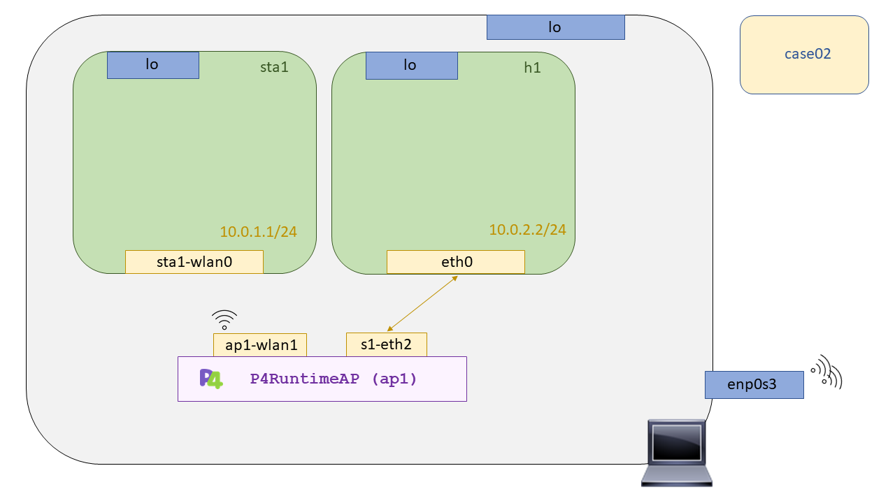

# P4 Wireless - Case03: Echo server

En este caso de uso desarrollaremos un servidor de echo que responda todos los pings que le lleguen. Como tal el programa p4 no es suficiente para probar esta funcionalidad ya que requiere de una plataforma que sea capaz de soportar el lenguaje p4. Nosotros haremos uso de software switch llamado [``behavioral-model``](https://github.com/p4lang/behavioral-model), [``BMV2``](https://github.com/p4lang/behavioral-model) en adelante, para testear nuestros programas p4, y de nuestra integración con [``Mininet-wifi``](https://github.com/davidcawork/mininet-wifi/tree/be2b9977f7c7630cc9d4b0d909cf4f8476c353d6) como escenario para recrear nuestras topologías de Red. 

Como este caso de uso ya se ha explicado anteriormente [aquí](https://github.com/davidcawork/TFG/tree/master/src/use_cases/p4/case01) unicamente se harán indiaciones sobre como poder compilarlo y ejecutarlo. **Importante**, si usted está leyendo esto sin antes haber adecuado las dependencias necesarias de Mininet-Wifi con soporte del BMV2, vuelva a este [punto](https://github.com/davidcawork/TFG/tree/master/src/use_cases/p4-wireless#puesta-en-marcha-del-mininet-wifi-modificado) y siga los pasos indicados. 





## Compilación 

Para la compilación de este caso de uso, se ha dejado preparado un Makefile, por tanto no es necesario que el usuario aprenda a utilizar el compilador `p4c`. Si se quiere saber más sobre como funciona el proceso de compilación, qué etapas hay, como se le "inyecta" el json generado al BMV2, o qué distintos targets hay en función de la arquitectura, le recomendamos que vuelva a leerse es [capitulo](https://github.com/davidcawork/TFG/tree/master/src/use_cases/p4/case01#compilaci%C3%B3n). Para compilarlo solo tendremos que hacer un:

```bash
sudo make
```

Esto nos generará una estructura de directorios que utilizaremos en el lanzamiento del caso de uso. Bajo el directorio `build` podremos encontrar el json generado por el compilador, será este json quien tenga toda la información requerida para conformar el BMV2.


## Puesta en marcha del escenario

Al igual que en la compilación, se ha dejado preparado un script en Python para automatizar la puesta en marcha del escenario. Este script describe la topología que utilizaremos en este caso de uso. Recordemos que es necesario volver hacer un `make install` para instalar los módulos adicionales generados para la integración del BMV2 y Mininet-Wifi, además de tener instaladas las versiones indicadas en el análisis de la integración. Aquí podrá consultar que dependencias son necesarias para llevar ejecutar el escenario sin complicaciones. 

Una vez comprobado que poseé todas la dependencias, simplemente tendremos que ejecutar nuestro script con el interprete de Python:

```bash
sudo python scenario.py
```

Este script como se dijo levantará toda la topología en Mininet-Wifi y acto seguido nos abrirá la CLI de Mininet. Para la comprobación de funcionamiento de este caso de uso siga los pasos indicados en el caso de uso análogo de P4 en un entorno alámbrico