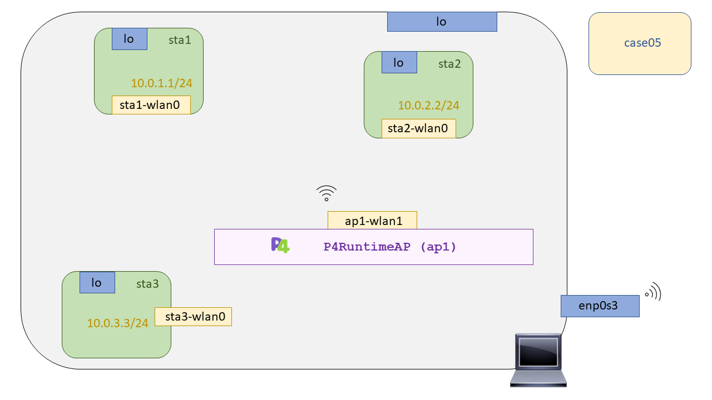

# P4 Wireless - Case05: Broadcast

In this test we will develop a p4 program that will make Broadcast. In this case we will only make a broadcast at the link level, layer 2. The motivation for this use case is to see the difference in difficulty with respect to the XDP environment where we had to anchor an additional eBPF bytecode in the [``TC``](http://man7.org/linux/man-pages/man8/tc.8.html) as well as our own XDP program anchored in the interface to achieve a broadcast. As such the p4 program is not sufficient to test this functionality as it requires a platform that is capable of supporting the p4 language. We will make use of switch software called [``behavioral-model``](https://github.com/p4lang/behavioral-model), [``BMV2``](https://github.com/p4lang/behavioral-model) onwards, to test our p4 programs, and our integration with [``Mininet-wifi``](https://github.com/davidcawork/mininet-wifi/tree/be2b9977f7c7630cc9d4b0d909cf4f8476c353d6) as a scenario to recreate our network topologies. 

As this use case has already been explained above [here](https://github.com/davidcawork/TFG/tree/master/src/use_cases/p4/case01), we will only make some indications on how to compile and run it. **Important**, if you are reading this without first having adapted the necessary dependencies of Mininet-Wifi with BMV2 support, go back to this [point](https://github.com/davidcawork/TFG/tree/master/src/use_cases/p4-wireless#puesta-en-marcha-del-mininet-wifi-modificado) and follow the steps indicated. 





## Compilation 

For the compilation of this use case, a Makefile has been left ready, so it is not necessary for the user to learn how to use the `p4c` compiler. If you want to know more about how the compilation process works, what stages there are, how the generated json is "injected" into the BMV2, or what different targets there are depending on the architecture, we recommend that you read it again at [chapter](https://github.com/davidcawork/TFG/tree/master/src/use_cases/p4/case01#compilaci%C3%B3n). To compile it, we only need to do one:

```bash
sudo make
```

This will generate a directory structure that we will use in the release of the use case. Under the `build` directory we can find the json generated by the compiler, it will be this json who has all the information required to conform the BMV2.


## Setting up the scenario

As in the compilation, a script has been left in Python to automate the implementation of the scenario. This script describes the topology we will use in this use case. Remember that it is necessary to do a `make install` to install the additional modules generated for the integration of BMV2 and Mininet-Wifi, besides having installed the versions indicated in the integration analysis. Here you can consult which dependencies are necessary to run the scenario without complications. 

Once we have checked that we have all the dependencies, we simply have to execute our script with the Python interpreter:

```bash
sudo python scenario.py
```

This script as said will raise all the topology in Mininet-Wifi and then open the Mininet CLI. To check the operation of this use case follow the steps indicated in the case of analogous use of P4 in a wired environment


---


  # P4 Wireless - Case05: Broadcast

En este test desarrollaremos un programa p4 que haga Broadcast. En este caso unicamente haremos Broadcast a nivel de enlace, capa 2. La motivación de este caso de uso es ver la diferencia de dificultad respecto del entorno XDP donde tuvimos que anclar de manera adicional un bytecode eBPF en el [``TC``](http://man7.org/linux/man-pages/man8/tc.8.html) además de propio programa XDP anclado en la interfaz para lograr hacer un broadcast. Como tal el programa p4 no es suficiente para probar esta funcionalidad ya que requiere de una plataforma que sea capaz de soportar el lenguaje p4. Nosotros haremos uso de software switch llamado [``behavioral-model``](https://github.com/p4lang/behavioral-model), [``BMV2``](https://github.com/p4lang/behavioral-model) en adelante, para testear nuestros programas p4, y de nuestra integración con [``Mininet-wifi``](https://github.com/davidcawork/mininet-wifi/tree/be2b9977f7c7630cc9d4b0d909cf4f8476c353d6) como escenario para recrear nuestras topologías de Red. 

Como este caso de uso ya se ha explicado anteriormente [aquí](https://github.com/davidcawork/TFG/tree/master/src/use_cases/p4/case01) unicamente se harán indiaciones sobre como poder compilarlo y ejecutarlo. **Importante**, si usted está leyendo esto sin antes haber adecuado las dependencias necesarias de Mininet-Wifi con soporte del BMV2, vuelva a este [punto](https://github.com/davidcawork/TFG/tree/master/src/use_cases/p4-wireless#puesta-en-marcha-del-mininet-wifi-modificado) y siga los pasos indicados. 


## Compilación 

Para la compilación de este caso de uso, se ha dejado preparado un Makefile, por tanto no es necesario que el usuario aprenda a utilizar el compilador `p4c`. Si se quiere saber más sobre como funciona el proceso de compilación, qué etapas hay, como se le "inyecta" el json generado al BMV2, o qué distintos targets hay en función de la arquitectura, le recomendamos que vuelva a leerse es [capitulo](https://github.com/davidcawork/TFG/tree/master/src/use_cases/p4/case01#compilaci%C3%B3n). Para compilarlo solo tendremos que hacer un:

```bash
sudo make
```

Esto nos generará una estructura de directorios que utilizaremos en el lanzamiento del caso de uso. Bajo el directorio `build` podremos encontrar el json generado por el compilador, será este json quien tenga toda la información requerida para conformar el BMV2.


## Puesta en marcha del escenario

Al igual que en la compilación, se ha dejado preparado un script en Python para automatizar la puesta en marcha del escenario. Este script describe la topología que utilizaremos en este caso de uso. Recordemos que es necesario volver hacer un `make install` para instalar los módulos adicionales generados para la integración del BMV2 y Mininet-Wifi, además de tener instaladas las versiones indicadas en el análisis de la integración. Aquí podrá consultar que dependencias son necesarias para llevar ejecutar el escenario sin complicaciones. 

Una vez comprobado que poseé todas la dependencias, simplemente tendremos que ejecutar nuestro script con el interprete de Python:

```bash
sudo python scenario.py
```

Este script como se dijo levantará toda la topología en Mininet-Wifi y acto seguido nos abrirá la CLI de Mininet. Para la comprobación de funcionamiento de este caso de uso siga los pasos indicados en el caso de uso análogo de P4 en un entorno alámbrico
