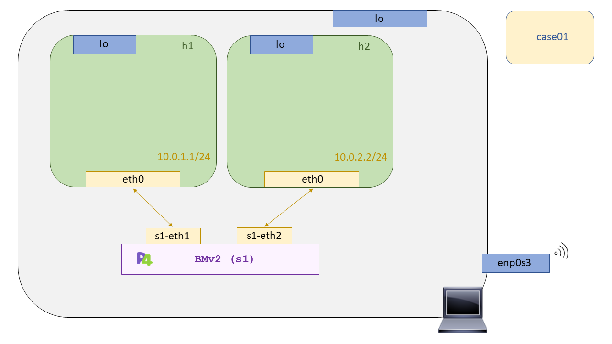

# P4 - Case01: Drop

In this test we will prove that it is possible to discard all the packages received with a p4 program. As such the p4 program is not sufficient to test this functionality since it requires a platform that is capable of supporting the p4 language. We will make use of switch software called [``behavioral-model``](https://github.com/p4lang/behavioral-model), [``BMV2``](https://github.com/p4lang/behavioral-model) onwards, to test our p4 programs, and [``Mininet``](https://github.com/mininet/mininet) as a scenario to recreate our network topologies. 

Before continuing with the use case I want to emphasize one thing. We will continuously refer to [``BMV2``](https://github.com/p4lang/behavioral-model) as a "switch", but we must understand that with the p4 language we are defining the datapath that the entity carrying our p4 program will have, in this case the [``BMV2``](https://github.com/p4lang/behavioral-model). So the switch name may be wrong, since it depends on the p4 program that it carries to behave as a switch. 

Because of this, the [``BMV2``](https://github.com/p4lang/behavioral-model) can act as a hub, like a switch, a router or a firewall. It will depend on the functionality implemented in the p4 program. We will take advantage of the interface implemented in the [``BMV2``](https://github.com/p4lang/behavioral-model) with [``Mininet``](https://github.com/mininet/mininet) developed from the [P4Lang](https://p4.org/) organization in order to integrate these nodes into the network scenario and thus be able to test the operation of the developed p4 program.

## Compilation

For the compilation of our p4 program we will use the compiler [``p4c``](https://github.com/p4lang/p4c). This is the reference compiler for the p4 language, it is modular and allows you to choose different targets to carry out the compilation. Targets? Yes, the compilation of p4 programs is carried out in **two stages**, a frontend compilation stage where a ``*.p4info`` file is generated which contains all the necessary attributes of the p4 program at run time (table identifiers, its structure, actions.. ), and a backend stage in which, the generated ``*.p4info`` file is used to generate the files necessary to attack the target in question.

<p align="center">
    
</p>

For example the backend compiler that attacks the [``BMV2``](https://github.com/p4lang/behavioral-model) generates a ``*.json`` file. This file will be sufficient to establish the entire datapath as programmed in the p4 program. The target of the [``p4c``](https://github.com/p4lang/p4c) compiler we will use is the [``p4c-bm2-ss``](https://github.com/p4lang/p4c/tree/master/backends/bmv2), P4 simple_switch - bmv2 , which supports the ``v1model`` architecture.

## Setting up the scenario

In order to start the scenario, we have written a Makefile which will be compiled by our p4 program, generating the *.p4info and *.json files. Then, the script called [``run_exercise.py``](https://github.com/davidcawork/TFG/blob/master/src/use_cases/p4/utils/run_exercise.py) will be launched, which will raise all the topology described in the file [``scenario/topology.json``](scenario/topology.json) with [``Mininet``](https://github.com/mininet/mininet) . Each topology switch will have all the logic described in our p4 program implemented within one instance of [``BMV2``](https://github.com/p4lang/behavioral-model). Below is a summary image of the survey of a single switch.

<p align="center">
    
</p>


Since people who want to replicate the use cases may not be very familiar with this whole compilation and upload process in the [``BMV2``](https://github.com/p4lang/behavioral-model) process, a Makefile has been provided to automate the compilation and upload tasks, and the cleanup tasks of the use case. Then for the implementation of the use case we must make a:

```bash
sudo make run
```

Once we have finished checking the correct functioning of the use case, we must use another Makefile target to clean the directory. In this case we must use :

```bash
sudo make clean
```

It is important to note that this target will clean up both the auxiliary files for loading the p4 program into the [``BMV2``](https://github.com/p4lang/behavioral-model), and the directories of ``pcaps``, ``log``, and ``build`` generated at the start of the scenario. So if you want to keep the captures of the different interfaces of the different [``BMV2``](https://github.com/p4lang/behavioral-model), copy them or clean the scenario by hand as follows:


```bash

# Clean up Mininet
sudo mn -c

# We clean dynamically generated directories on the stage load
sudo rm -rf build logs

```

## Testing

Once the ``make run`` is done in this directory, we will have the topology described for this use case, which can be seen in the following figure. As we mentioned before, the topology can be found described under the directory [``scenario``](scenario), in a ``json`` file called [``topology.json``](scenario/topology.json). This file also describes the location of the files that describe the control plane of each topology switch. The standard names used by the P4Lang organization, ``sX-runtime.json``, have been respected in all cases of use, where **X** in number that switch occupies in the topology of [``Mininet``](https://github.com/mininet/mininet). 



Going back to the use case check, we will have the CLI of [``Mininet``](https://github.com/mininet/mininet) open, so we will open one terminal for ``host1`` and another for ``host2``.

```bash
mininet>  xterm h1 h2
```

Now with both terminals open, from the h2 we put to listen by its interface. We can use ``wireshark``, the sniffer that the user sees fit. In this case for simplicity I will use ``tcpdump``.


```bash
#  host2 terminal
tcpdump -l

# host1 terminal
ping 10.0.2.2
```

Once we are listening on the host2 interface, we ping from host1 to host2 and we should not have connectivity. If this is the case it means that the p4 program developed is working correctly. To make sure that the action is actually running to throw packages, we can check the logs of the [``BMV2``](https://github.com/p4lang/behavioral-model), which generate a log file for each target instance of the single switch that was raised. These logs can be found in the ``logs`` directory, and each log file belonging to a single switch has the same name as it has in [``Mininet``](https://github.com/mininet/mininet). In this case if we wanted to open the logs from ``s1`` we would do a:

```bash

tail logs/s1.log

```

## References 

* [P4 tutorial](https://github.com/p4lang/tutorials)
* [Mininet](https://github.com/mininet/mininet)


---

# P4 - Case01: Drop

En este test probaremos que es posible descartar todos los paquetes recibidos con un programa p4. Como tal el programa p4 no es suficiente para probar esta funcionalidad ya que requiere de una plataforma que sea capaz de soportar el lenguaje p4. Nosotros haremos uso de software switch llamado [``behavioral-model``](https://github.com/p4lang/behavioral-model), [``BMV2``](https://github.com/p4lang/behavioral-model) en adelante, para testear nuestros programas p4, y de [``Mininet``](https://github.com/mininet/mininet) como escenario para recrear nuestras topologías de Red. 

Antes de continuar con el caso de uso quiero remarcar una cosa. Continuamente nos estaremos refiriendo al [``BMV2``](https://github.com/p4lang/behavioral-model) como un "switch", pero debemos entender que con el lenguaje p4 estamos definiendo el datapath que tendrá la entidad que cargue con nuestro programa p4, en este caso el  [``BMV2``](https://github.com/p4lang/behavioral-model). Por lo que la denominación de switch puede ser un errónea, ya que depende del programa p4 que porte para comportarse como un switch. 

Debido a esto, el [``BMV2``](https://github.com/p4lang/behavioral-model) puede actuar como un hub, como un switch, un router o un firewall.. Dependerá de la funcionalidad implementada en el programa p4. Aprovecharemos la interfaz implementada del [``BMV2``](https://github.com/p4lang/behavioral-model) con [``Mininet``](https://github.com/mininet/mininet) desarrollada desde la organización de [P4Lang](https://p4.org/) para conseguir integrar estos nodos en el escenario de red y así poder comprobar el funcionamiento del programa p4 desarrollado.

## Compilación

Para la compilación de nuestro programa p4 se hará uso del compilador [``p4c``](https://github.com/p4lang/p4c). Este es el compilador de referencia para el lenguaje p4, es modular y permite escoger distintos targets para llevar a cabo la compilación. ¿Targets? Si, la compilación de los programas p4 se lleva a cabo en **dos etapas**, una etapa de compilación de frontend donde se genera un archivo ``*.p4info`` el cual recoge todos los atributos necesarios del programa p4 en tiempo de ejecución ( identificadores de tablas, su estructura, actions.. ), y una etapa de backend en el cual, se hace uso del archivo generado ``*.p4info`` para generar los archivos necesarios para atacar al target en cuestión.

<p align="center">
    
</p>

Por ejemplo el compilador de backend que ataca al [``BMV2``](https://github.com/p4lang/behavioral-model) genera un fichero ``*.json``. Este fichero será suficiente para establecer todo el datapath según lo programado en el programa p4. El target del compilador [``p4c``](https://github.com/p4lang/p4c) que utilizaremos es el [``p4c-bm2-ss``](https://github.com/p4lang/p4c/tree/master/backends/bmv2), P4 simple_switch - bmv2 , el cual soporta la arquitectura ``v1model``.

## Puesta en marcha del escenario 

Con la finalidad de poner en marcha del escenario, se ha dejado escrito un Makefile el cual  compilará nuestro programa p4, generando los ficheros *.p4info y *.json. Acto seguido se lanzará el script llamado [``run_exercise.py``](https://github.com/davidcawork/TFG/blob/master/src/use_cases/p4/utils/run_exercise.py), el cual levantará toda la topología descrita en el fichero [``scenario/topology.json``](scenario/topology.json) con [``Mininet``](https://github.com/mininet/mininet) . Cada "switch" de la topología tendrá implementada toda la lógica descrita en nuestro programa p4 dentro de una instancia del [``BMV2``](https://github.com/p4lang/behavioral-model). A continuación se puede ver una imagen resumen del levantamiento de un único "switch".

<p align="center">
    
</p>


Dado que las personas que quieran replicar los casos de uso puede que no estén muy familiarizadas con todo este proceso de compilación y carga en los procesos de [``BMV2``](https://github.com/p4lang/behavioral-model), se ha dispuesto un de un Makefile para automatizar las tareas de compilación y carga, y las tareas de limpieza del caso de uso. Entonces para la puesta en marcha del caso de uso debemos hacer un:

```bash
sudo make run
```

Una vez hayamos finalizado la comprobación del correcto funcionamiento del caso de uso debemos hacer uso de otro target del Makefile para limpieza del directorio. En este caso debemos hacer uso de:

```bash
sudo make clean
```

Es importante señalar que este target limpiará tanto los ficheros auxiliares para la carga del programa p4 en el [``BMV2``](https://github.com/p4lang/behavioral-model), como los directorios de ``pcaps``, ``log``, y ``build`` generados en la puesta en marcha del escenario. Por lo que si se desea conservar las capturas de las distintas interfaces de los distintos  [``BMV2``](https://github.com/p4lang/behavioral-model), cópielas o haga la limpieza del escenario a mano de la siguiente manera:

```bash

# Limpiamos Mininet
sudo mn -c

# Limpiamos los directorios generados dinámicamente en la carga del escenario
sudo rm -rf build logs

```

## Comprobación del funcionamiento

Una vez realizado el ``make run`` en este directorio, tendremos levantada la topología descrita para este caso de uso, la cual se puede apreciar en la siguiente figura. Como ya comentábamos anteriormente la topología puede encontrarse descrita bajo el directorio [``scenario``](scenario), en un fichero ``json`` llamado [``topology.json``](scenario/topology.json). En este fichero también se describe la localización de los archivos que describen el plano de control de cada "switch" de la topología. En todos los casos de uso se ha respetado los nombres tipo utilizados por la organización de P4Lang, ``sX-runtime.json``, donde **X** en número que ocupa dicho switch en la topología de [``Mininet``](https://github.com/mininet/mininet). 


Volviendo de nuevo a la comprobación del funcionamiento del caso de uso, tendremos la CLI de [``Mininet``](https://github.com/mininet/mininet) abierta, por lo que abriremos una terminal para el ``host1`` y otra para el ``host2``.

```bash
mininet>  xterm h1 h2
```

Ahora con ambas terminales abiertas, desde el h2 ponemos a escuchar por su interfaz. Podemos utilizar ``wireshark``, el sniffer que el usuario crea conveniente. En este caso por simplicidad yo utilizaré ``tcpdump``.

```bash
# En la terminal del host2
tcpdump -l

# En la terminal del host1
ping 10.0.2.2
```

Una vez que estamos escuchando en la interfaz del ``host2``, hacemos ping desde el ``host1`` al ``host2`` y no deberíamos tener conectividad. De ser así significaría que el programa p4 desarrollado funciona correctamente. Para asegurarse de que realmente se está ejecutando el ``action`` para tirar paquetes podemos consultar los logs del  [``BMV2``](https://github.com/p4lang/behavioral-model), los cuales generan un fichero de log por cada instancia target del simple switch que se haya levantado. Estos logs se encuentran en el directorio ``logs``, y cada fichero de log perteneciente a un único "switch", llevando el mismo nombre que este en [``Mininet``](https://github.com/mininet/mininet). En este caso si quisiéramos abrir los logs del `s1` haríamos un:

```bash

tail logs/s1.log

```

## Fuentes 

* [P4 tutorial](https://github.com/p4lang/tutorials)
* [Mininet](https://github.com/mininet/mininet)

