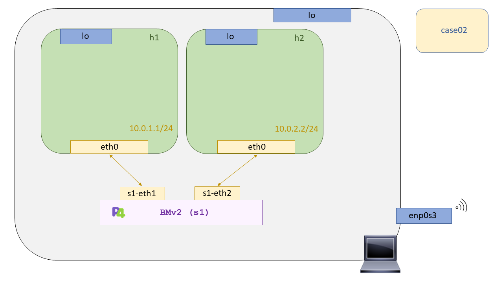

# P4 - Case03: Echo server


En este caso de uso desarrollaremos un servido de echo que responda todos os pings que le lleguen. Como tal el programa p4 no es suficiente para probar esta funcionalidad ya que requiere de una plataforma que sea capaz de soportar el lenguaje p4. Nosotros haremos uso de software switch llamado [``behavioral-model``](https://github.com/p4lang/behavioral-model), [``BMV2``](https://github.com/p4lang/behavioral-model) en adelante, para testear nuestros programas p4, y de [``Mininet``](https://github.com/mininet/mininet) como escenario para recrear nuestras topologías de Red. 

Nuestro programa p4 deberá ser capaz de analizar los paquetes que le lleguen, parsearlos y filtrarlos. Y solo aquellos que filtremos serán los que deberemos responder. ¿Cómo los filtraremos? Añadiendo nuevos estados en nuestro parser que comprueben si las cabeceras ICMP están presentes. Por ello antes de nada debemos declaras las cabeceras ICMP necesarias.

```C

header icmp_t {
	bit<8> type;
	bit<8> code;
	bit<16> checksum;
}

```

 Como se quería que este programa p4 fuera compatible con direccionamiento IPv6 se han añadido también los equivalentes en ICMPv6 y la cabecera de red de IPv6. 

 ```C
header ipv6_t {
	bit<4> version;
	bit<8> trafficClass;
	bit<20> flowLabel;
	bit<16> payloadLen;
	bit<8> nextHdr;
	bit<8> hopLimit;
	ip6Addr_t srcAddr;
	ip6Addr_t dstAddr;	
}


 header icmp6_t {
	bit<8> type;
	bit<8> code;
	bit<16> checksum;
}
 ```

 Ahora que ya tenemos las cabeceras unicamente debemos preocuparnos de definir las macros asociadas a los posibles _ethertypes_ que queremos manejar, IPv4 y IPv6. Y los códigos de protocolo de las cabeceras de red, para asegurarnos que sobre la cabecera de red unicamente procesaremos aquellos paquetes con ICMP. Se tuvo que consultar la RFC asociada a IPv6 para saber que codificación hacían con el campo de ``nextHeader`` y por lo visto utilizan los mismo valores que en IPv4. A continuación, la definición de dichas MACROS y un extracto de la RFC.

 ```C

/*	---	Layer 2 MACROS	     ---	*/
const bit<16> ETHERTYPE_IPV4 = 0x0800;
const bit<16> ETHERTYPE_IPV6 = 0x86dd;

/*	---	Layer 3 MACROS	     ---	*/
const bit<8> IP_PROTOCOL_ICMP = 0x01;
const bit<8> IP_PROTOCOL_ICMPv6 = 0x3a; 
const bit<8> ICMP_ECHO_REQUEST_TYPE = 0x08;
const bit<8> ICMP_ECHO_REQUEST_CODE = 0x00;
const bit<8> ICMP_ECHO_REPLY_TYPE = 0x00;
const bit<8> ICMP_ECHO_REPLY_CODE = 0x00;

/*
 *   According to RFC 2460, the codes of the protocol immediately above,
 *   layer 4, are the same as those used in IPv4. And I quote:
 *
 *   Next Header          8-bit selector.  Identifies the type of header
 *                       immediately following the IPv6 header.  Uses the
 *                       same values as the IPv4 Protocol field [RFC-1700
 *                       et seq.].
 *
 */

 ```

 Como se ha podido ver de forma adicional se han definido MACROS sobre los valores con los que vamos a estar trabajando (REQUEST y REPLY). De esta forma el código resultante de las actions será más interpretable y sostenible. Teniendo ya todas las herramientas necesarias para declarar los nuevos estados del parser, nos podemos poner a trabajar. El código del parser se puede consultar en la siguiente [linea](https://github.com/davidcawork/TFG/blob/master/src/use_cases/p4/case03/case03.p4#L114).

Bien :smile:, ahora que somos capaces de filtrar los paquetes que nso interesan, vamos a ver como hemos implementado la lógica de procesamiento de aquellos paquetes que ya han sido filtrados. Lo que nos interesa es interceptar todos los paquetes ICMP que lleguen a nuestro "switch" para así contestarlos desde el mismo "switch". Por ello haremos uso del **bit de validez** de las cabeceras que han sido parseadas correctamente, es decir, si el paquete contiene dichas cabeceras, de no contenerlas su bit de validez estará a ``false``. A continuación, mostramos la lógica de control del bloque Ingress:

```C


/*  
 *  De esta forma nos aseguramos que unicamente procesamos paquetes ICMP,
 *  o en su defecto ICMPv6.
 *
 */


apply {
	if(hdr.ipv4.isValid() && hdr.icmp.isValid()){
	        echo();
	}else if (hdr.ipv6.isValid() && hdr.icmp6.isValid()){
		echo6();
	}
}

```

Ya tenemos todos los paquetes ICMP a nuestra disposición solo nos quedaría programar la lógica para modificar las cabeceras de dicho paquete para conseguir contestar satisfactoriamente al emisor de dicho ping. Para ello, haremos uso de un action, funciones. El cual _swapeará_ tanto MAC destino-origen, como IP destino-origen, modificará la cabecera ICMP para indicarle que se trata de un reply, y por último mandará el paquete por el puerto de entrada, para que así le llegue al emisor.

```C 


action echo (){
	/*	---	Auxiliary variables	---	*/
        macAddr_t temp_mac = hdr.ethernet.srcAddr;
    	ip4Addr_t temp_ip = hdr.ipv4.srcAddr;

	/*      ---     Swap MACs     ---     */
	hdr.ethernet.srcAddr = hdr.ethernet.dstAddr;
        hdr.ethernet.dstAddr = temp_mac;

	/*      ---     Swap Ips     ---     */
 	hdr.ipv4.srcAddr = hdr.ipv4.dstAddr;
	hdr.ipv4.dstAddr = temp_ip;
  
	/*      ---     Re-Write ICMP's type and code     ---     */
	hdr.icmp.type = ICMP_ECHO_REPLY_TYPE;
	hdr.icmp.code = ICMP_ECHO_REPLY_CODE;

	/*      ---     Forward the packet to the ingress intf     ---     */
	standard_metadata.egress_spec = standard_metadata.ingress_port;

    }  

```

Préstese atención a la ultima sentencia de la función donde le indicamos que saque el paquete por la misma interfaz por la cual ha entrado. Este es el equivalente directo al código de retorno en XDP, ``XDP_TX`` con el cual re-circulábamos el paquete de la misma forma a la interfaz de entrada.

Como curiosidad, comentar que el campo ``checksum`` de la cabecera ICMP debe ser re-calculado de nuevo por lo que se deberá hacer antes del Egress. Esto nos supuso un problema ya que continuamente nos estaba dando error con el disector de Wireshark, en el campo ``checksum``. Finalmente se vio que no había que incluir el campo checksum en la nueva suma del nuevo checksum (Hubiera estado genial que la RFC hubiera estado más clara al respecto :joy: ).

## Compilación y puesta en marcha del escenario

Para la compilación de nuestro programa p4 se hará uso del compilador [``p4c``](https://github.com/p4lang/p4c). Si usted no conoce dicho compilador o desconoce el proceso de compilación de un programa p4 le recomendamos que vuelva al [case01](https://github.com/davidcawork/TFG/tree/master/src/use_cases/p4/case01) donde se explica como se lleva a cabo la compilación y por que etapas transcurre. 

Dado que las personas que quieran replicar los casos de uso puede que no estén muy familiarizadas con todo este proceso de compilación y carga en los procesos de [``BMV2``](https://github.com/p4lang/behavioral-model), se ha dispuesto un de un Makefile para automatizar las tareas de compilación y carga, y las tareas de limpieza del caso de uso. Entonces para la puesta en marcha del caso de uso debemos hacer un:

```bash
sudo make run
```

Una vez hayamos finalizado la comprobación del correcto funcionamiento del caso de uso debemos hacer uso de otro target del Makefile para limpieza del directorio. En este caso debemos hacer uso de:

```bash
sudo make clean
```

Es importante señalar que este target limpiará tanto los ficheros auxiliares para la carga del programa p4 en el [``BMV2``](https://github.com/p4lang/behavioral-model), como los directorios de ``pcaps``, ``log``, y ``build`` generados en la puesta en marcha del escenario. Por lo que si se desea conservar las capturas de las distintas interfaces de los distintos  [``BMV2``](https://github.com/p4lang/behavioral-model), cópielas o haga la limpieza del escenario a mano de la siguiente manera:

```bash

# Limpiamos Mininet
sudo mn -c

# Limpiamos los directorios generados dinámicamente en la carga del escenario
sudo rm -rf build logs

```

## Comprobación del funcionamiento

Una vez realizado el ``make run`` en este directorio, tendremos levantada la topología descrita para este caso de uso, la cual se puede apreciar en la siguiente figura. Como en nuestro datapath no se contempla el manejo de ARP se ha añadido el ARP entry a pelo desde el fichero [``topology.json``](scenario/topology.json) consiguiendo así que no se genere la resolución ARP en el envión de los ICMP Request.




Volviendo de nuevo a la comprobación del funcionamiento del caso de uso, tendremos la CLI de [``Mininet``](https://github.com/mininet/mininet) abierta, por lo que abriremos una terminal para el ``host1``.

```bash
xterm h1
```

Una vez que tengamos la terminal abierta, procederemos a abrir Wireshark (En este caso recomiendo Wireshark ya que podremos filtrar y comprobar de una forma más sencilla la validez de los checksums). 

```bash

# Importante lanzar Wireshark con ampersand para no bloquear la bash
sudo wireshark &

# Hacemos ping al host2
ping 10.0.2.2

```

Si todo funciona correctamente deberíamos estar recibiendo respuesta a nuestro ping. Comprobar con Wireshark como el checksum de la cabecera ICMP viene correctamente calculado. 
