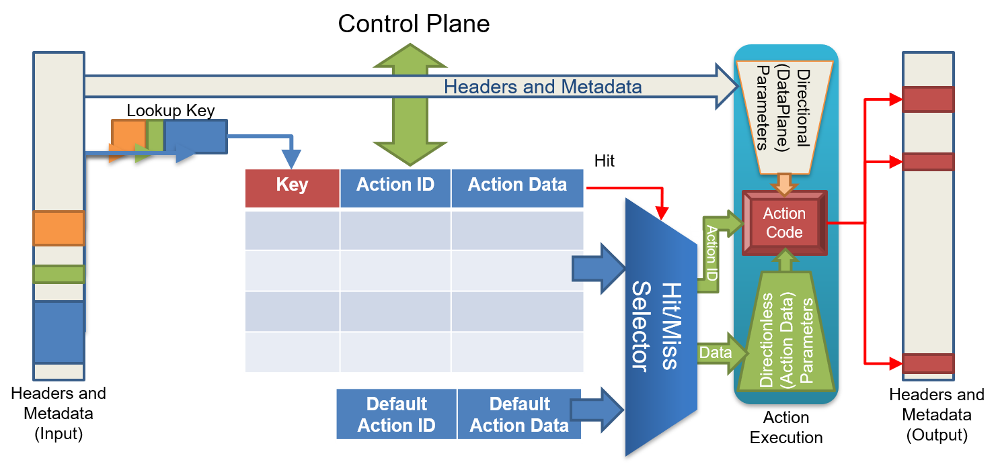
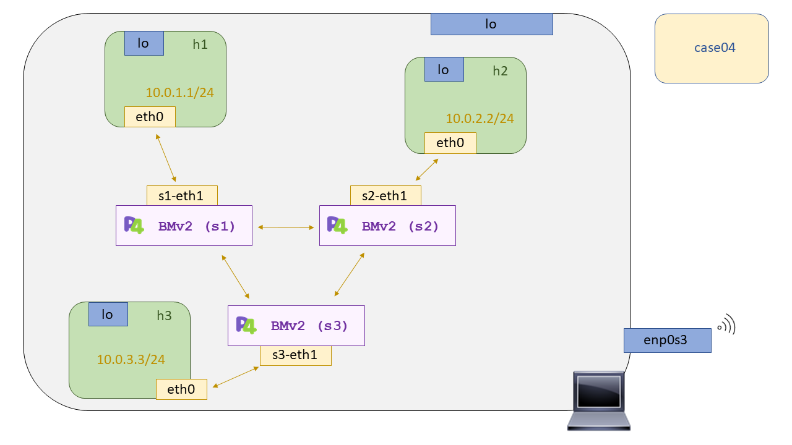

# P4 - Case04: Layer 3 Forwarding


En este caso de uso trataremos de implementar un forwarding a nivel de red, capa 3, por ello nuestro hipotético "switch" será ahora un un router muy básico y con muy pocas funcionalidades :smirk:. Por ello conviene recordar las anotaciones que hicimos sobre el [``BMV2``](https://github.com/p4lang/behavioral-model) y por que no debemos definirlo unicamente como un soft-switch, ya que depende del programa p4 que porte para definir su datapath y su interfaz con el plano de control. 

La motivación de este caso de uso es ver la relación que tiene el código de retorno XDP llamado ``XDP_REDIRECT`` con p4, y así ver su equivalente. En el anterior [caso de uso](https://github.com/davidcawork/TFG/blob/master/src/use_cases/p4/case03/) ya hacíamos uso de la información de metadatos para eligir el puerto de salida del paquete. Por lo que podríamos afirmar que este es el equivalente directo al  forwarding en XDP, solo que aquí en p4 nos resulta más sencillo ya que unicamente indicamos por número de puerto mientras que XDP debíamos obtener el ``ifindex`` de la interfaz a la cual íbamos hacer el reenvió. Dejamos aquí la sentencia: 

```C


standard_metadata.egress_spec = port

```

Pero a todo esto, **¿Números de puerto? ¿Cúando hemos establecido estos números?** :joy: 

Buena pregunta.. Estos números de puerto se establecen cuando se levanta la instancia del [``BMV2``](https://github.com/p4lang/behavioral-model). Se asocia interfaz real con un número identificativo, serán estos números identificativos los números de puerto de cada "switch". De esta manera el "switch" tiene a su alcance todos sus posibles puertos. El levantamiento de las instancias de [``BMV2``](https://github.com/p4lang/behavioral-model) se llevan a cabo con la carga del script [``run_exercise.py``](https://github.com/davidcawork/TFG/blob/master/src/use_cases/p4/utils/run_exercise.py). Este a su vez hace uso de la clase [``P4RuntimeSwitch``](https://github.com/davidcawork/TFG/blob/master/src/use_cases/p4/utils/p4runtime_switch.py#L100) para levantar dicho "switch" pasándole los parámetros adecuados. Podemos levantar una instancia del [``BMV2``](https://github.com/p4lang/behavioral-model) nosotros mismos haciendo un:

```bash

sudo simple_switch_grpc --log-console --dump-packet-data 64 \
                        –i 0@veth0 -i 1@veth2 … [--pcap] --no-p4 \
                        --grpc-server-addr 0.0.0.0:50051 --cpu-port 255 \
                        test.json

```

Una vez entendido de donde salen los números de puerto podemos preguntarnos lo siguiente, **¿Cómo un programa p4 es capaz de conoces los posibles puertos de los que puede disponer para reenviar un paquete?** 

No puede, y tampoco es lógico que en un programa p4 donde defines el datapath ya estén preestablecidos los números de puerto posibles a manejar. Ya que si eso fuera así, tendríamos que tener distintos programas p4 por cada entidad con un número de puertos distintos ( unicamente para implementar un único datapath). No es viable. Por ello, toda la información relativa a los puertos (asociada al forwarding) generalmente suele venir desde el plano de control quien tiene constancia de los puertos de dicho "switch". 

Por ejemplo, si yo quiero hacer forwarding de un paquete a un puerto en especifico dado su IP, necesitaremos que el plano de control nos indique el criterio a seguir, qué IPs están asociadas a según que puertos. Esta interfaz entre el plano de datos y el plano de control esta definidas por **tablas**.

Desde el programa p4 tenemos que definir el esqueleto de la tabla, indicando que _actions_ están disponibles, que parámetros reciben esas _actions_, que criterio de _match_ tendrá la tabla, sobre _keys_ se realizará el _lookup_ y cual es el número máximo de entradas en dicha tabla. A continuación, una [figura](https://github.com/p4lang/tutorials/blob/master/P4_tutorial.pdf) que resume bastante bien la funcionalidad de las tablas: 



Y desde el plano de control, via P4Runtime ó via json con los ficheros ``sX-runtime.json`` ( que se cargarán a través de la CLI-BMV2), se popularán las entradas de dicha tabla y los parámetros de las acciones a llevar a cabo cuando haya un hit con dicha entrada. En nuestro caso se asociarán IPs, a una acción de forwarding donde le pasaremos por que puerto tiene que salir el paquete y que MAC destino debe llevar.

Una vez entendidos los números de puerto, y el concepto de las tablas, debemos abordar el cómo hacer una acción de forwarding para reenviar nuestros paquetes. Esta acción de forwarding deberá se capaz de actualizar el puerto de salida, actualizar la MAC destino y decrementar en uno el campo ``ttl`` de la cabecera IP. A continuación se indica la acción propuesta para llevar a cabo dicho cometido:

```C

/*
 * Se quiso hacer uso del operador '-=' pero la sintaxis de P4 no lo permite :(
 */

action ipv4_forward(macAddr_t dstAddr, egressSpec_t port) {
        standard_metadata.egress_spec = port;
        hdr.ethernet.srcAddr = hdr.ethernet.dstAddr;
        hdr.ethernet.dstAddr = dstAddr;
        hdr.ipv4.ttl = hdr.ipv4.ttl - 1;
}

```

Teniendo la acción ya disponible, solo nos quedaría aplicar la tabla en nuestra pipeline de nuestro programa p4 y ya estaríamos haciendo un forwarding en capa 3 :smile:.

## Compilación y puesta en marcha del escenario

Para la compilación de nuestro programa p4 se hará uso del compilador [``p4c``](https://github.com/p4lang/p4c). Si usted no conoce dicho compilador o desconoce el proceso de compilación de un programa p4 le recomendamos que vuelva al [case01](https://github.com/davidcawork/TFG/tree/master/src/use_cases/p4/case01) donde se explica como se lleva a cabo la compilación y por que etapas transcurre. 

Dado que las personas que quieran replicar los casos de uso puede que no estén muy familiarizadas con todo este proceso de compilación y carga en los procesos de [``BMV2``](https://github.com/p4lang/behavioral-model), se ha dispuesto un de un Makefile para automatizar las tareas de compilación y carga, y las tareas de limpieza del caso de uso. Entonces para la puesta en marcha del caso de uso debemos hacer un:

```bash
sudo make run
```

Una vez hayamos finalizado la comprobación del correcto funcionamiento del caso de uso debemos hacer uso de otro target del Makefile para limpieza del directorio. En este caso debemos hacer uso de:

```bash
sudo make clean
```

Es importante señalar que este target limpiará tanto los ficheros auxiliares para la carga del programa p4 en el [``BMV2``](https://github.com/p4lang/behavioral-model), como los directorios de ``pcaps``, ``log``, y ``build`` generados en la puesta en marcha del escenario. Por lo que si se desea conservar las capturas de las distintas interfaces de los distintos  [``BMV2``](https://github.com/p4lang/behavioral-model), cópielas o haga la limpieza del escenario a mano de la siguiente manera:

```bash

# Limpiamos Mininet
sudo mn -c

# Limpiamos los directorios generados dinámicamente en la carga del escenario
sudo rm -rf build logs

```

## Comprobación del funcionamiento

Una vez realizado el ``make run`` en este directorio, tendremos levantada la topología descrita para este caso de uso, la cual se puede apreciar en la siguiente figura. Como en nuestro datapath no se contempla el manejo de ARP se ha añadido el ARP entry a pelo desde el fichero [``topology.json``](scenario/topology.json) consiguiendo así que no se genere la resolución ARP en el envión de los ICMP Request. Este arreglo es un poco "chapuzero" ya que le estamos indicándole un hipotético gateway que no existe, y estamos añadiendo un ARP entry con la MAC de dicho gateway, de esta forma todos los paquetes saldrán con la MAC destino indicada en la entry y no se producirá la resolución ARP. Al llegar al "switch" el paquete verá modificada su MAC destino en función de su IP destino, por lo que la "chapuza" no irá a más! :joy: 




Volviendo de nuevo a la comprobación del funcionamiento del caso de uso, tendremos la CLI de [``Mininet``](https://github.com/mininet/mininet) abierta, por lo que simplemente probaremos la conectividad entre todos los host. Esto lo podemos hacer de la siguiente manera:

```bash

mininet> pingall
```

De forma adicional, se podría hacer uso de un sniffer para comprobar que los paquetes llegan con el campo ``ttl`` modificado, en función de los saltos que ha dado el paquete. :smile:

## Fuentes 

*   [P4 tutorial](https://github.com/p4lang/tutorials)


