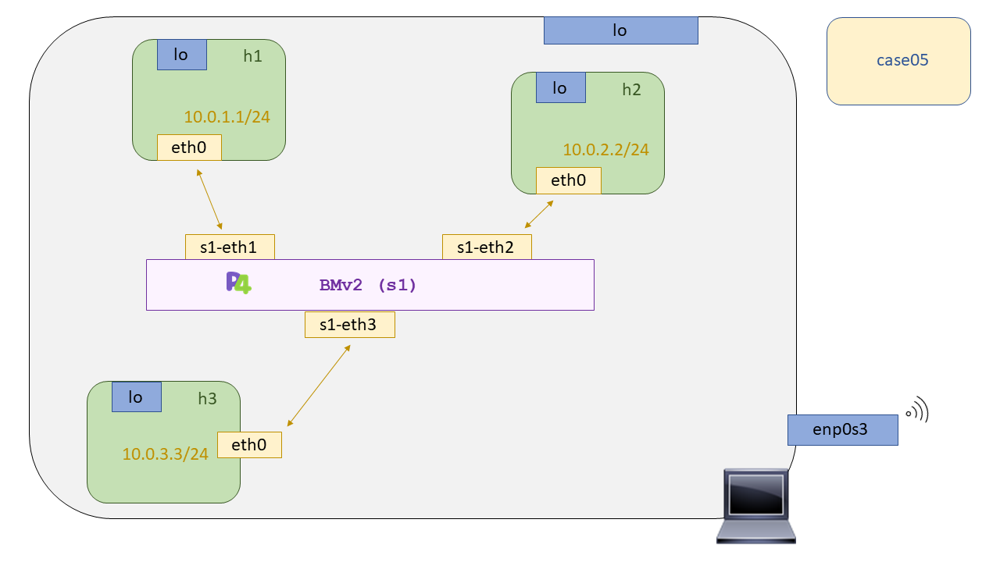

# P4 - Case05: Broadcast


## Compilación y puesta en marcha del escenario

Para la compilación de nuestro programa p4 se hará uso del compilador [``p4c``](https://github.com/p4lang/p4c). Si usted no conoce dicho compilador o desconoce el proceso de compilación de un programa p4 le recomendamos que vuelva al [case01](https://github.com/davidcawork/TFG/tree/master/src/use_cases/p4/case01) donde se explica como se lleva a cabo la compilación y por que etapas transcurre. 

Dado que las personas que quieran replicar los casos de uso puede que no estén muy familiarizadas con todo este proceso de compilación y carga en los procesos de [``BMV2``](https://github.com/p4lang/behavioral-model), se ha dispuesto un de un Makefile para automatizar las tareas de compilación y carga, y las tareas de limpieza del caso de uso. Entonces para la puesta en marcha del caso de uso debemos hacer un:

```bash
sudo make run
```

Una vez hayamos finalizado la comprobación del correcto funcionamiento del caso de uso debemos hacer uso de otro target del Makefile para limpieza del directorio. En este caso debemos hacer uso de:

```bash
sudo make clean
```

Es importante señalar que este target limpiará tanto los ficheros auxiliares para la carga del programa p4 en el [``BMV2``](https://github.com/p4lang/behavioral-model), como los directorios de ``pcaps``, ``log``, y ``build`` generados en la puesta en marcha del escenario. Por lo que si se desea conservar las capturas de las distintas interfaces de los distintos  [``BMV2``](https://github.com/p4lang/behavioral-model), cópielas o haga la limpieza del escenario a mano de la siguiente manera:

```bash

# Limpiamos Mininet
sudo mn -c

# Limpiamos los directorios generados dinámicamente en la carga del escenario
sudo rm -rf build logs

```

## Comprobación del funcionamiento


Una vez realizado el ``make run`` en este directorio, tendremos levantada la topología descrita para este caso de uso, la cual se puede apreciar en la siguiente figura.




Volviendo de nuevo a la comprobación del funcionamiento del caso de uso, tendremos la CLI de [``Mininet``](https://github.com/mininet/mininet) abierta, por lo que nos dispondremos a abrir tres terminales para cada host de la topología. Esto lo podemos hacer de la siguiente manera:

```bash

mininet> xterm h1 h2 h3 
```

Cuando ya tengamos las tres terminales abiertas, procederemos a escuchar las interfaces de los host2 y host3. Esto lo haremos haciendo uso de la herramienta ``tcpdump``, podríamos utilizar también Wireshark.

```bash

# Hacemos lo mismo en el host2 y host3
tcpdump -l

```

Una vez que estamos escuchando desde el host2 y host3, vamos a generar ARP Request desde el host1 para que así, al ir con MAC destino a FF's se propague por todos los posibles puertos del "switch" menos por aquel por el cual le llegó. Por tanto, hacemos un:

```bash
# Desde el host1
arping 10.0.2.2
```

Si funciona correctamente se el paquete ARP Request debería haber llego tanto al host2 como el host3. Pero solo será el host2, en este caso, el que contestará ya que iab dirigido a este. Verá que al host3 solo le llega un ARP Request, y después se detiene, ¿El por qué :sweat_smile:? Esto es así ya que al completarse la resolución ARP el host1 ya conoce la dirección MAC del host2, por tanto los ARP Request que se generen a posteriori llevarán la MAC destino la del host2, entonces nuestro "switch" no lo difundirá por todos su puestos, se lo pasará directamente al host2. 

## Fuentes

* [P4 Tutorials](https://github.com/p4lang/tutorials)
* [Multicas issue](https://github.com/p4lang/tutorials/issues/337)
* [Multicast Execise](https://github.com/p4lang/tutorials/tree/master/exercises/multicast)
