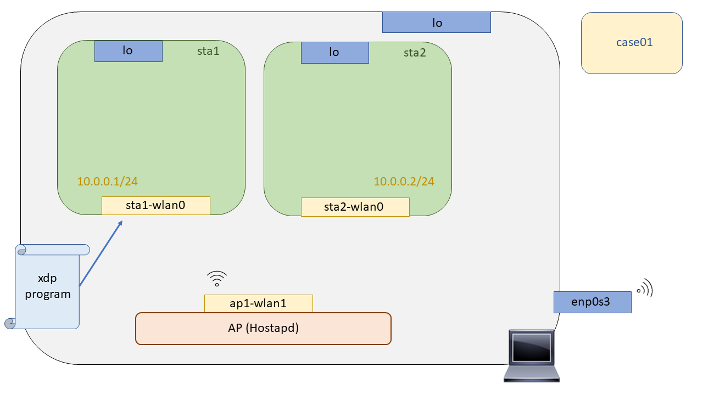

# XDP Wireless - Case01: Drop

En este test probaremos que es posible descartar todos los paquetes recibidos haciendo uso de la tecnología XDP. Para la realizar la prueba, primero deberemos compilar nuestro programa XDP, levantar el escenario donde se va a realizar la prueba, anclar el binario a un interfaz del escenario y observar los resultados cuando generamos tráfico que atraviesa dicha interfaz.

## Compilación

Para compilar el programa XDP se ha dejado un Makefile preparado en este directorio, por lo que no es necesario entender todo el proceso de compilación. Más adelante se detallará este proceso pero de momento y dado que es el primer caso de uso, y puede que el primer contacto con esta tecnología, no se quiere saturar al lector. Por lo que exclusivamente hacemos un:

```bash
sudo make
```

Ya tendríamos compilado el programa XDP, podrá observar que en su directorio se han generado varios ficheros con extensiones ``*.ll``, ``*.o``,  varios ejecutables que utilizaremos más adelante para anclar programas xdp en interfaces (``xdp_loader``), y para comprobar los códigos de retorno de nuestros programas xdp una vez ya anclados (``xdp_stats``).


## Puesta en marcha del escenario

Para testear los programas XDP en un entorno inalámbrico, haremos Mininet-Wifi para emular las topologías de red. Esta herramienta de emulación es un fork de Mininet, la cuales hacen uso de  las Network Namespaces para conseguir aislar los nodos independientes de la red. Pero, ¿Qué es una Network Namespaces? Una network namespace consiste en una replica lógica de stack de red que por defecto tiene el kernel de Linux, rutas, tablas ARP, Iptables e interfaces de red.

Linux se inicia con un Network namespace por defecto, con su tabla de rutas, con su tabla ARP, con sus Iptables e interfaces de red. Pero también es posible crear más network namespaces no predeterminadas, crear nuevos dispositivos en esos espacios de nombres, o mover un dispositivo existente de un espacio de nombres a otro. De esta manera, cada elemento de la "red" tiene su propia network namespace, es decir, cada elemento tiene su propio stack de red e interfaces. Por lo que a nivel de networking como se diría se pueden ver como elementos independientes.

Para levantar el escenario solo tendremos que ejecutar el script en Python que hace uso de la API de Mininet-Wifi para generar toda la topología de red. Una vez ejecutado este abrirá la interfaz de linea de comandos de Mininet-Wifi, desde la cual podremos comprobar el funcionamiento de nuestro caso de uso. En este caso de uso en particular, se realiza la carga del programa XDP desde el propio script de python, [aquí](https://github.com/davidcawork/TFG/blob/master/src/use_cases/xdp-wireless/case01/runenv.py#L36) se puede ver, haciendo uso de la herramienta `xdp_loader` desarrollada para ello. Por tanto, como hemos dicho este script está autocontenido, por lo que solo deberemos ejecutarlo :smile::

```bash
sudo python runenv.py
```

Para limpiar nuestra máquina del escenario recreado anteriormente con Mininet-Wifi podríamos hacer un `sudo mn -c` pero se le recomienda al usuario que haga uso del target del Makefile destinado para ello, ya que adicionalmente limpiará los ficheros intermedios generados en el proceso de compilación de nuestro programa XDP. Ejecutando el siguiente comando limpiaríamos nuestra máquina:

```bash
sudo make clean
```

Por último únicamente indicar que el escenario recreado es el siguiente, compuesto exclusivamente de dos estaciones wireless, aisladas en sus propias network namespaces, y un punto de acceso corriendo el daemon de `Hostapd` para intercomunicar dichas estaciones wifi.



## Carga del programa  XDP

Hora de cargar nuestro programa XDP en el Kernel! ¿Cómo lo hacemos? Habría dos maneras de cargar nuestro bytecode en el Kernel, la primera sería hacer uso de la herramienta [``iproute2``](https://wiki.linuxfoundation.org/networking/iproute2) a partir de la versión ``v4.12``. La segunda, y la más utilizada debido a las limitaciones de [``iproute2``](https://wiki.linuxfoundation.org/networking/iproute2) para trabajar con los mapas BPF, es hacer uso de la libreria [``libbpf``](https://github.com/torvalds/linux/tree/master/tools/lib/bpf). En nuestro caso haremos uso de un programa hecho en C haciendo uso de dicha librería para cargar nuestros programas XDP en el kernel, mapas BPF y demás.

El código de dicho programa se puede encontrar [aquí](https://github.com/davidcawork/TFG/blob/master/src/use_cases/xdp/util/xdp_loader.c), este loader fue desarrollado siguiendo el tutorial de los desarrolladores del kernel de Linux llamado [xdp-tutorial](https://github.com/xdp-project/xdp-tutorial).

Al loader le estamos indicando ``-d`` (device), ``-S`` para indicar que la carga sobre la interfaz se lleva a cabo en modo genérico,``-F`` (Force) para que haga un override en caso de que ya haya un programa XDP anclado a dicha interfaz y por último, le indicamos el ``--progsec`` (program section) utilizados en XDP para englobar distintas funcionalidades ya que en un mismo bytecode puede haber distintos programas XDP. 

```bash
# Linea 38 del script runenv.py
sudo ./xdp_loader -d sta1-wlan0 -F --progsec xdp_case01 -S
```

## Comprobación del funcionamiento

Una vez que el programa XDP fue anclado a la interfaz de la estación wifi ``sta1``, debemos asegurarnos de que funciona según lo esperado. Esto lo haremos generando tráfico desde una estación wifi hacia la otra, para que atraviese por la interfaz que tiene anclado el programa XDP y observaremos su comportamiento. En este caso el comportamiento esperado es que haga un drop de los paquetes nada más llegar a la interfaz, en este caso la interfaz ``sta1-wlan0``.


```bash

# Ejecutamos un ping desde la estación sta2 hacia la estación sta1
mininet-wifi> sta2 ping sta1

# De forma adicional podemos abrir una xterm en la sta1, y ponernos a escuchar con un sniffer :)
mininet-wifi> xterm sta1

root@sta1~$ tcpdump -l

# Ahora que ya hemos visto que no tenemos conectividad, debido al programa XDP, vamos hacer un unload
# del programa XDP, y probaremos de nuevo la conectividad.
mininet-wifi> sta1 ./xdp_loader -S -U -d sta1-wlan0


# Ejecutamos un ping desde la estación sta2 hacia la estación sta1, y ahora si, debería funcionar la
# conectividad.
mininet-wifi> sta2 ping sta1
```

## Fuentes

* [Namespaces](http://man7.org/linux/man-pages/man7/namespaces.7.html)
* [Network Namespaces](http://man7.org/linux/man-pages/man7/network_namespaces.7.html)
