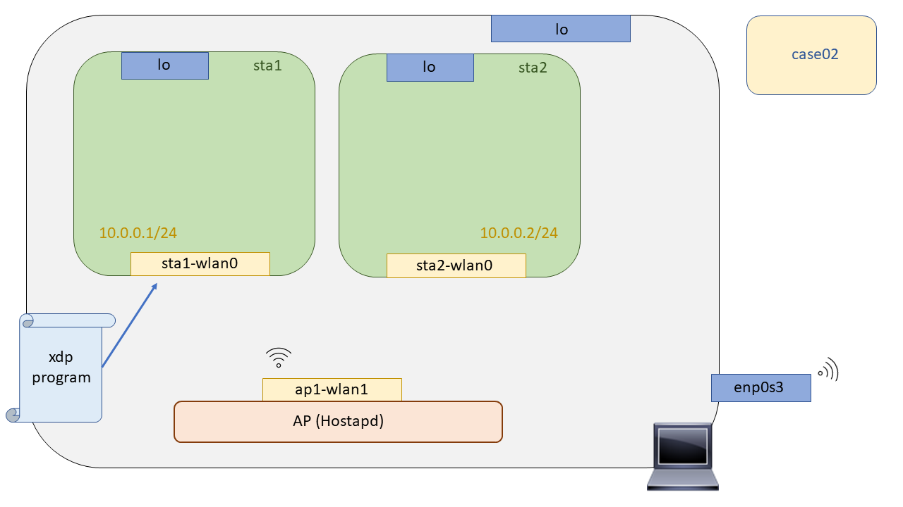

# XDP Wireless - Case02: Pass

In this test we will prove that it is possible to support all received packets by using XDP technology. Support? Yes, support, because although XDP is designed by many people to bypass the Linux Kernel network stack, it is often useful to work together to achieve the desired functionality. To perform the test, as in [``case01``](https://github.com/davidcawork/TFG/tree/master/src/use_cases/xdp-wireless/case01) we must first compile our XDP program, then build the scenario where the test will be performed, and finally anchor the binary to a scenario interface.

## Compilation

To compile the XDP program a Makefile has been left prepared in this directory as well as in the [``case01``](https://github.com/davidcawork/TFG/tree/master/src/use_cases/xdp-wireless/case01), so to compile it you only need to make a

```bash
sudo make
```

Now, how does the compilation of our XDP programs take place? Good question : smile: ! As you can see the XDP programs are written in what they already call a restricted C language, which always starts with "xdp" as otherwise the Kernel checker will not be able to tell what kind of bytecode it is and will reject it.

This restricted C code will be compiled using the [``clang``] '(https://clang.llvm.org/) compiler as the frontend and the [``LLVM``] (http://llvm.org/) compiler as the backend, to get a BPF bytecode and store it in an ELF object. The latter will be loaded into the Kernel (``*.o``).


It is curious to understand how we go from hypothetical XDP programs (restricted C) to bytecode BPF, since, when we dig a little deeper into XDP, we come to the conclusion that XDP could be seen as a BPF framework to work at the NIC level. There are more factors that differentiate it from BPF programs, such as the data structures that they handle, as well as the metadata, but in the end, in order to anchor an XDP program it must first be "translated" into a BPF bytecode.


## Setting up the scenario

To test the XDP programs in a wireless environment, we will do Mininet-Wifi to emulate the network topologies. This emulation tool is a Mininet fork, which makes use of the Network Namespaces to isolate the independent nodes of the network. But what is a Network Namespaces? A network namespace consists of a logical network stack replica that by default has the Linux kernel, routes, ARP tables, Iptables and network interfaces.

As we already mentioned, to raise the scenario we will only have to execute the script in Python that makes use of the Mininet-Wifi API to generate all the network topology. Once executed, it will open the Mininet-Wifi command line interface, from which we can check the operation of our use case. In this particular use case, the XDP program is loaded from the python script itself, [here](https://github.com/davidcawork/TFG/blob/master/src/use_cases/xdp-wireless/case02/runenv.py#L36) you can see it, using the `xdp_loader` tool developed for it. So, as we said this script is self-contained, so we just need to run it :smile::

```bash
sudo python runenv.py
```

To clean our machine from the scenario previously recreated with Mininet-Wifi we could do a `sudo mn -c` but it is recommended that the user makes use of the Makefile target intended for this purpose, since it will additionally clean the intermediate files generated in the process of compiling our XDP program. Executing the following command would clean up our machine:

```bash
sudo make clean
```

Finally just indicate that the recreated scenario is the following, composed exclusively of two wireless stations, isolated in their own network namespaces, and an access point running the `Hostapd` daemon to intercommunicate these wifi stations.




## Loading the XDP program

We already have a stage and the compiled XDP program.. It's time to load it into the Kernel :smile:. If you don't know where the program [``xdp_loader``](https://github.com/davidcawork/TFG/blob/master/src/use_cases/xdp/util/xdp_loader.c) came from, what the library [``libbpf``](https://github.com/torvalds/linux/tree/master/tools/lib/bpf) gives us, or why we don't use the tool [``iproute2``](https://wiki.linuxfoundation.org/networking/iproute2) to load the XDP programs into the Kernel, please go back to [``case01``](https://github.com/davidcawork/TFG/tree/master/src/use_cases/xdp/case01) where we try to address all these questions. If you still have additional questions or feel that they are not fully explained, please contact me or my tutors.

We are indicating ``-d`` (device) to the loader, ``S`` to indicate that the loading on the interface is carried out in generic mode, ``-F`` (Force) to make an override in case there is already an XDP program attached to that interface and finally, we indicate the ``--progsec`` (program section) used in XDP to include different functionalities since in the same bytecode there can be different XDP programs. 

```bash
# Line 38 of the script runenv.py
sudo ./xdp_loader -d sta1-wlan0 -F --progsec xdp_case02 -S
```

## Testing

Once the XDP program was anchored to the interface of the wifi station ``sta1``, we must make sure that it works as expected.. This may be a bit of a simple test, but it works for us, as we just want to verify that our program anchored to the interface is passing the packets that arrive at the network stack. 

**Personal note**: Since I started working with XDP, I saw the Linux network stack as an enemy to be beaten, or "by-passed" :smile_cat: . Since with XDP we want to be able to define in an exclusive way the datapath that we want to implement with a team that carries the Linux Kernel, this way we get a superior performance since we remove all the redundancy and layers that are not necessary for the processing of our hypothetical datapath. 

Now, in the course of my learning with this technology I have seen that sometimes working in a cooperative way with the network stack can bring us many facilities (It will be seen in the [``case04``](https://github.com/davidcawork/TFG/tree/master/src/use_cases/xdp/case04)) and many other functionalities already implemented in it. It is not a question of re-inventing the wheel, mainly because the performance that can be gained by doing all the processing exclusively in the NIC itself, in my opinion, does not compensate with the robustness and reliability that such functionality will have in the Linux network stack. 


```bash
# Unbind the XDP program(s) from the sta1-wlan0 interface
mininet-wifi> sta1 ./xdp_loader -S -d sta1-wlan0 -U

# We ping from one wifi station to the other. We should have connectivity.
mininet-wifi> sta2 ping sta1

# Now let's anchor the XDP program in the wireless interface of the wifi station and
# Check the connectivity again
mininet-wifi> sta1 ./xdp_loader -S -d sta1-wlan0 -F --progsec xdp_case02

# We ping again, and if everything went well we should have connectivity :)
mininet-wifi> sta2 ping sta1
```

## References
* [clang](https://clang.llvm.org/)
* [LLVM](http://llvm.org/)
* [iproute2 - netns](http://man7.org/linux/man-pages/man8/ip-netns.8.html)
* [Network Namespaces](http://man7.org/linux/man-pages/man7/network_namespaces.7.html)

---

# XDP Wireless - Case02: Pass

En este test probaremos que es posible admitir todos los paquetes recibidos haciendo uso de la tecnología XDP. ¿Admitir? Si admitir, ya que, aunque XDP mucha gente lo concibe para hacer un by-pass al stack de red del Kernel de Linux en muchas ocasiones será util trabajar en conjunto para conseguir la funcionalidad deseada. Para la realizar la prueba, al igual que en el [``case01``](https://github.com/davidcawork/TFG/tree/master/src/use_cases/xdp-wireless/case01) primero deberemos compilar nuestro programa XDP, acto seguido levantar el escenario donde se va a realizar la prueba, y por último anclar el binario a un interfaz del escenario.

## Compilación

Para compilar el programa XDP se ha dejado un Makefile preparado en este directorio al igual que en el [``case01``](https://github.com/davidcawork/TFG/tree/master/src/use_cases/xdp-wireless/case01), por lo que para compilarlo unicamente hay que  hacer un:

```bash
sudo make
```

Ahora bien, ¿Cómo se produce la compilación de nuestros programas XDP? Buena pregunta :smile: ! Como ya se ha podido ver los programas  XDP están escritos en lo que ya llaman un lenguaje C restringido, los cuales su nombre de secuencia siempre empieza por "xdp" ya que si no el verificador del Kernel no podrá saber de que tipo de bytecode se trata y lo rechazará.

Este código C restringido, se compilará haciendo uso del compilador de [``clang``](https://clang.llvm.org/) como frontend y del compilador [``LLVM``](http://llvm.org/) como backend, para conseguir un bytecode BPF y almacenarlo en un objeto ELF. Estos últimos serán los que se carguen en el Kernel (``*.o``).


Es curioso el hecho de entender, como pasamos de los hipotéticos programas XDP (C restringido) a bytecode BPF, ya que, cuando se indaga un poco más en XDP, se llega a la conclusión que XDP se podría ver como un framework de BPF para trabajar a nivel de NIC. Hay más factores que lo diferencian de los programas BPF como son las estructuras de datos que manejan, además de los metadatos pero al fin y al cabo, para anclar un programa XDP este debe antes ser "traducido" a un byte code BPF.


## Puesta en marcha del escenario

Para testear los programas XDP en un entorno inalámbrico, haremos Mininet-Wifi para emular las topologías de red. Esta herramienta de emulación es un fork de Mininet, la cuales hacen uso de  las Network Namespaces para conseguir aislar los nodos independientes de la red. Pero, ¿Qué es una Network Namespaces? Una network namespace consiste en una replica lógica de stack de red que por defecto tiene el kernel de Linux, rutas, tablas ARP, Iptables e interfaces de red.

Como ya comentábamos, para levantar el escenario solo tendremos que ejecutar el script en Python que hace uso de la API de Mininet-Wifi para generar toda la topología de red. Una vez ejecutado este abrirá la interfaz de linea de comandos de Mininet-Wifi, desde la cual podremos comprobar el funcionamiento de nuestro caso de uso. En este caso de uso en particular, se realiza la carga del programa XDP desde el propio script de python, [aquí](https://github.com/davidcawork/TFG/blob/master/src/use_cases/xdp-wireless/case02/runenv.py#L36) se puede ver, haciendo uso de la herramienta `xdp_loader` desarrollada para ello. Por tanto, como hemos dicho este script está autocontenido, por lo que solo deberemos ejecutarlo :smile::

```bash
sudo python runenv.py
```

Para limpiar nuestra máquina del escenario recreado anteriormente con Mininet-Wifi podríamos hacer un `sudo mn -c` pero se le recomienda al usuario que haga uso del target del Makefile destinado para ello, ya que adicionalmente limpiará los ficheros intermedios generados en el proceso de compilación de nuestro programa XDP. Ejecutando el siguiente comando limpiaríamos nuestra máquina:

```bash
sudo make clean
```

Por último únicamente indicar que el escenario recreado es el siguiente, compuesto exclusivamente de dos estaciones wireless, aisladas en sus propias network namespaces, y un punto de acceso corriendo el daemon de `Hostapd` para intercomunicar dichas estaciones wifi.


## Carga del programa  XDP

Ya tenemos escenario y el programa XDP compilado.. Es hora de cargarlo en el Kernel :smile:. Si usted no sabe de dónde ha salido el programa [``xdp_loader``](https://github.com/davidcawork/TFG/blob/master/src/use_cases/xdp/util/xdp_loader.c), qué nos aporta la librería [``libbpf``](https://github.com/torvalds/linux/tree/master/tools/lib/bpf), o por que no hacemos uso de la herramienta [``iproute2``](https://wiki.linuxfoundation.org/networking/iproute2) para cargar los programas XDP en el Kernel, por favor vuelva al [``case01``](https://github.com/davidcawork/TFG/tree/master/src/use_cases/xdp/case01) donde se intenta abordar todas estas dudas. Si aun así tiene alguna duda extra o considera que no se encuentra del todo explicado póngase en contacto conmigo o mis tutores.

Al loader le estamos indicando ``-d`` (device), ``-S`` para indicar que la carga sobre la interfaz se lleva a cabo en modo genérico,``-F`` (Force) para que haga un override en caso de que ya haya un programa XDP anclado a dicha interfaz y por último, le indicamos el ``--progsec`` (program section) utilizados en XDP para englobar distintas funcionalidades ya que en un mismo bytecode puede haber distintos programas XDP. 

```bash
# Linea 38 del script runenv.py
sudo ./xdp_loader -d sta1-wlan0 -F --progsec xdp_case02 -S
```

## Comprobación del funcionamiento

Una vez que el programa XDP fue anclado a la interfaz de la estación wifi ``sta1``, debemos asegurarnos de que funciona según lo esperado.. Puede que sea una prueba un poco simple, pero nos vale, ya que unicamente queremos verificar que nuestro programa anclado en la interfaz está pasando los paquetes que le llegan al stack de red. 

**Nota personal**: Desde que empece a trabajar con XDP, veía al stack de red de Linux como a un enemigo a batir, o "by-passear" :smile_cat: .. Ya que con XDP queremos conseguir definir de manera exclusiva el datapath que se desea implementar con un equipo que porte el Kernel de Linux, de esta manera conseguimos un performance superior ya que nos quitamos de encima toda la redundancia y capas que no nos son necesarias para el procesamiento de nuestro hipotético datapath. 

Ahora bien, en el transcurso  mi aprendizaje con esta tecnología he visto que en ocasiones trabajar de manera cooperativa con el stack de red puede reportarnos muchas facilidades (Se verá en el [``case04``](https://github.com/davidcawork/TFG/tree/master/src/use_cases/xdp/case04)) y muchas otras funcionalidades ya implementadas en este. No es cuestión de re-inventar la rueda, más que nada por que el performance que se puede llegar a ganar por hacer todo el procesamiento de manera exclusiva en la propia NIC, en mi opinión, no compensa con la robustez y fiabilidad que tendrá dicha funcionalidad en el stack de red de Linux. 


```bash
# Desanclamos el programa/s XDP de la interfaz sta1-wlan0
mininet-wifi> sta1 ./xdp_loader -S -d sta1-wlan0 -U

# Hacemos ping desde una estación wifi hacia la otra. Deberíamos tener conectividad.
mininet-wifi> sta2 ping sta1

# Ahora vamos anclar el programa XDP en la interfaz inalámbrica de la estación wifi y
# comprobar la conectividad de nuevo
mininet-wifi> sta1 ./xdp_loader -S -d sta1-wlan0 -F --progsec xdp_case02

# Hacemos de nuevo el ping, y si todo ha salido bien deberíamos tener conectividad :)
mininet-wifi> sta2 ping sta1
```

## Fuentes
* [clang](https://clang.llvm.org/)
* [LLVM](http://llvm.org/)
* [iproute2 - netns](http://man7.org/linux/man-pages/man8/ip-netns.8.html)
* [Network Namespaces](http://man7.org/linux/man-pages/man7/network_namespaces.7.html)

