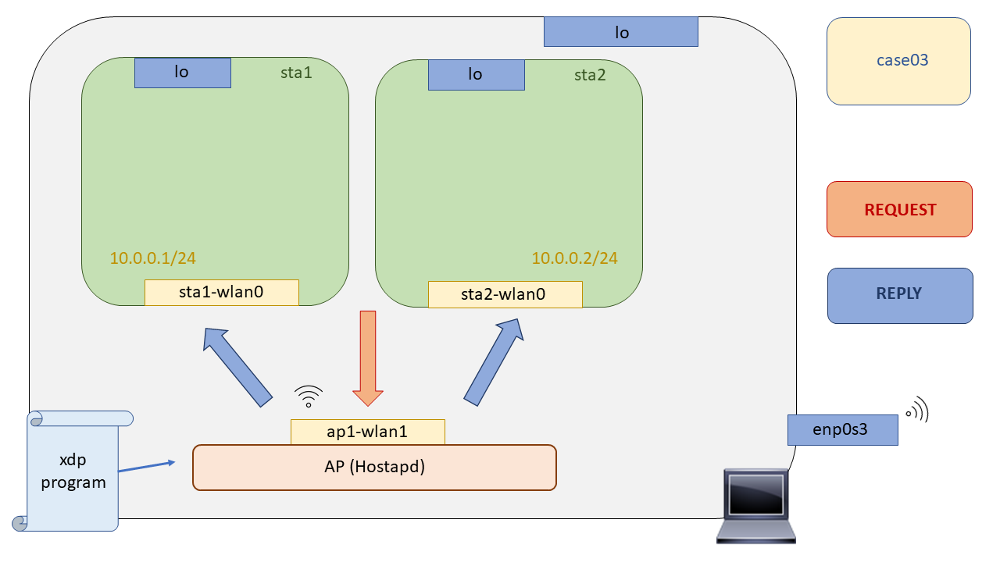

# XDP Wireless - Case03: Echo server

En este test nos adentraremos al parseo de paquetes, su filtrado y manejo. En los anteriores caso de uso exclusivamente definíamos un comportamiento de los paquetes haciendo un uso exclusivo de los códigos de retorno XDP, más concretamente ``XDP_DROP`` para tirar los paquetes y ``XDP_PASS`` para admitir los paquetes. Hay más códigos de retorno XDP pero con ellos no podemos lograr desarrollar todas las lógicas posibles, se pueden consultar en el siguiente archivo de cabecera [``bpf.h``](https://github.com/torvalds/linux/blob/master/include/uapi/linux/bpf.h#L3298). En la siguiente tabla se pueden contemplar todos los códigos de retorno XDP.

<div align="center">
  
  <br>

|     **Código de Retorno**    |     **Comportamiento** |
|:-------------:|:-------------:|
| ``XDP_PASS`` | Admitir el paquete, pasarselo al stack de red |
| ``XDP_DROP`` | Tirar el paquete |
| ``XDP_ABORTED``  | Tirar el paquete y generar una xdp:xdp_exception, útiles para depurar. |
| ``XDP_REDIRECT`` | Utilizado cuando se realiza un forwarding del paquete a otra interfaz |
| ``XDP_TX`` | Re-transmitir el paquete por la misma interfaz por la cual se ha recibido el paquete |

<br>

</div>


Ahora bien, ¿Cómo podemos implementar una lógica más avanzada? Filtrando los paquetes y en base al tipo de paquete aplicar un acciones u otras. Para filtrar paquetes tendremos que hacer uso de las estructuras de datos  de los protocolos de red definidas en  el Kernel de Linux, además hacer numerosas comprobaciones de limites de acceso a memoria para que el verificador del Kernel no nos tire el paquete. ¿Qué estructuras de datos están a nuestra disposición para filtrar paquetes?


<div align="center">
  
  <br>

| **Estructura**            | **Archivo de cabecera**       |
|:-------------:|:-------------:|
| ``struct ethhdr``   | ``<linux/if_ether.h>`` |
| ``struct ipv6hdr``  | ``<linux/ipv6.h>``     |
| ``struct iphdr``    | ``<linux/ip.h>``       |
| ``struct icmp6hdr`` | ``<linux/icmpv6.h>``   |
| ``struct icmphdr``  | ``<linux/icmp.h>``    |

<br>

</div>

Dado que los paquetes vienen por la red en un byte order denominado como network byte order, se necesitará traducirlo al byte order usado por nuestra maquina ( Host order ), para ello, se hará uso de las funciones ```bpf_ntohs``` y ```bpf_htons```.

Sabiendo ahora que estructuras de datos utilizar para ir filtrando los paquetes, en este test, para ponerlo en práctica, filtraremos todos los paquetes de tipo ICMP - ICMPv6 con un código ICMP-ECHO. El resto de apquetes se los pasaremos al stack de red para que el lo maneje. En cuanto a los paquetes filtrados ICMP los contestaremos nosotros mismos en la propia NIC, cambiando el ICMP-ECHO por un ICMP-REPLY, cambiando MACs, y actualizando el checksum. Como en este caso el paquete debe ser reenviado por la misma interfaz por la cual se recibió, haremos uso de código de retorno ``XDP_TX``.

## Limitaciones XDP

Ahora bien, hemos dicho que el acceso al paquete se haría de forma directa en memoria, pero, ¿Cómo sabemos nosotros a que dirección apuntar para leer el paquete? Muy buena pregunta, cada vez que un programa XDP es ejecutado este recibirá por argumentos un puntero a una estructura struct xdp md que contiene toda la información asociada al paquete. Esta estructura está definida en el siguiente archivo de cabecera [``bpf.h``](https://github.com/torvalds/linux/blob/master/include/uapi/linux/bpf.h). Su definición es la siguiente:

```C
struct xdp_md {
 __u32 data;
 __u32 data_end;
 __u32 data_meta;
 /* Below access go through struct xdp_rxq_info */
 __u32 ingress_ifindex; /* rxq->dev->ifindex */
 __u32 rx_queue_index; /* rxq->queue_index */
};

``` 

Los dos últimos elementos de la estructura son campos de datos que nos indican el ``ifindex`` y ``index de la cola`` por la cual ha sido recibido. Los tres primeros campos de la estructura, son punteros al inicio del paquete, al final del paquete y a los metadatos del mismo.

El verificador del kernel, cuando el programa XDP sea cargado, se encargará de reescribir los accesos hechos con los punteros al paquete a las direcciones actuales donde este se encuentre en memoria. Es muy común ver las siguientes lineas al principio de los programas XDP:


```C

void *data_end = (void *)(long)ctx->data_end;
void *data = (void *)(long)ctx->data;

```

Esto se debe a que el compilador aplica una comprobación de tipos y dará error si no hacemos un casting de u32 a punteros a void. Esto se debe a que los campos u32 en verdad son direcciones de 32 bits, por lo que si hacemos un casting hacia puntero void nos servirán como una wildcard para seguir adelante satisfaciendo al compilador.

### Comprobación de los limites de acceso al paquete

Como se mencionó antes, se accede a los paquetes mediante acceso directo a la memoria, sabiendo que el verificador se asegurará de que dichos accesos sean seguros. Sin embargo, hacer esto en tiempo de ejecución para cada acceso de puntero resultaría en una sobrecarga de rendimiento significativa. Por lo tanto, lo que el verificador hace es comprobar que el programa XDP hace su propia comprobación de límites en su propia lógica por ello se nos suministra el puntero ```data_end```.


Cuando el verificador realiza su análisis estático en tiempo de carga, rastreará todas las direcciones de memoria utilizadas por el programa, y buscará comparaciones con el puntero data end, el cual será puesto al final del paquete en tiempo de ejecución

### Bucles y funciones inline

Dado que XDP se puede ver como un framework de los eBPF, también comparte sus limitaciones como son las limitaciones de llamadas a funciones y los bucles. Por ello muchas de las funciones que se van a desarrollar en nuestros programas XDP necesitaran ser de un carácter inline ( ```__always_inline```) para que así el compilador las sustituya tal cual en código consiguiendo una mejora de performance ya que no hay que hacer una llamada a una función con todo lo que ello conlleva (Cambio de contexto, salvado de registros, cambio del PC), y además evitar las limitaciones de llamadas a funciones del verificador.

En cuanto a la limitación de los bucles, eBPF no soporta los bucles, debemos desenrollar los bucles. ¿Desenrollar? Si, por ejemplo:

```C
for ( int i = 0; i < 4 ; i++)
 printf("Contador %d \n", i);

// Si lo desenrollamos, quedaría así:
printf("Contador %d \n", 0);
printf("Contador %d \n", 1);
printf("Contador %d \n", 2);
printf("Contador %d \n", 3);

```

Para conseguir esto debemos añaadir la siguiente declaración antes del bucle pragma unroll. Esta declaración solo es valida cuando el numero de iteraciones del bucle es conocida en tiempo de compilación.

## Compilación

Para compilar el programa XDP se ha dejado un Makefile preparado en este directorio al igual que en el [``case02``](https://github.com/davidcawork/TFG/tree/master/src/use_cases/xdp-wireless/case02), por lo que para compilarlo unicamente hay que hacer un:

```bash
sudo make
```
Si tiene dudas sobre el proceso de compilación del programa XDP le recomendamos que vuelva al [``case02``](https://github.com/davidcawork/TFG/tree/master/src/use_cases/xdp/case02) donde se hace referencia al flow dispuesto para la compilación de los programas.


## Puesta en marcha del escenario

Para testear los programas XDP en un entorno inalámbrico, haremos Mininet-Wifi para emular las topologías de red. Esta herramienta de emulación es un fork de Mininet, la cuales hacen uso de  las Network Namespaces para conseguir aislar los nodos independientes de la red. Pero, ¿Qué es una Network Namespaces? Una network namespace consiste en una replica lógica de stack de red que por defecto tiene el kernel de Linux, rutas, tablas ARP, Iptables e interfaces de red.

Como ya comentábamos, para levantar el escenario solo tendremos que ejecutar el script en Python que hace uso de la API de Mininet-Wifi para generar toda la topología de red. Una vez ejecutado este abrirá la interfaz de linea de comandos de Mininet-Wifi, desde la cual podremos comprobar el funcionamiento de nuestro caso de uso. En este caso de uso en particular, se realiza la carga del programa XDP desde el propio script de python, [aquí](https://github.com/davidcawork/TFG/blob/master/src/use_cases/xdp-wireless/case03/runenv.py#L37) se puede ver, haciendo uso de la herramienta `xdp_loader` desarrollada para ello. Por tanto, como hemos dicho este script está autocontenido, por lo que solo deberemos ejecutarlo :smile::

```bash
sudo python runenv.py
```

Para limpiar nuestra máquina del escenario recreado anteriormente con Mininet-Wifi podríamos hacer un `sudo mn -c` pero se le recomienda al usuario que haga uso del target del Makefile destinado para ello, ya que adicionalmente limpiará los ficheros intermedios generados en el proceso de compilación de nuestro programa XDP. Ejecutando el siguiente comando limpiaríamos nuestra máquina:

```bash
sudo make clean
```

Por último únicamente indicar que el escenario recreado es el siguiente, compuesto exclusivamente de dos estaciones wireless, aisladas en sus propias network namespaces, y un punto de acceso corriendo el daemon de `Hostapd` para intercomunicar dichas estaciones wifi.



## Carga del programa  XDP

Ya tenemos escenario y el programa XDP compilado.. Es hora de cargarlo en el Kernel :smirk:. Si usted no sabe de dónde ha salido el programa [``xdp_loader``](https://github.com/davidcawork/TFG/blob/master/src/use_cases/xdp/util/xdp_loader.c), qué nos aporta la librería [``libbpf``](https://github.com/torvalds/linux/tree/master/tools/lib/bpf), o por que no hacemos uso de la herramienta [``iproute2``](https://wiki.linuxfoundation.org/networking/iproute2) para cargar los programas XDP en el Kernel, por favor vuelva al [``case01``](https://github.com/davidcawork/TFG/tree/master/src/use_cases/xdp/case01) donde se intenta abordar todas estas dudas. Si aun así tiene alguna duda extra o considera que no se encuentra del todo explicado póngase en contacto conmigo o mis tutores.


Al loader le estamos indicando ``-d`` (device), ``-S`` para indicar que la carga sobre la interfaz se lleva a cabo en modo genérico,``-F`` (Force) para que haga un override en caso de que ya haya un programa XDP anclado a dicha interfaz y por último, le indicamos el ``--progsec`` (program section) utilizados en XDP para englobar distintas funcionalidades ya que en un mismo bytecode puede haber distintos programas XDP. 

```bash
# Linea 38 del script runenv.py
sudo ./xdp_loader -d ap1-wlan1 -F --progsec xdp_case03 -S
```

## Comprobación del funcionamiento

La comprobación del funcionamiento del programa XDP anclado a la interfaz ``ap1-wlan1`` se llevará a cabo generando pings desde las estaciones wireless hacia el punto de acceso, para que la interfaz ``ap1-wlan1`` los filtre, analice y nos genere una respuesta. De forma adicional comentar que el programa soporta tanto direccionamiento IPv4 como IPv6, su funcionalidad se vio extendida debido a que la gran parte de la documentación encontrada sobre XDP donde llevan a cabo ejemplos como este hacen uso de direccionamiento IPv6 por lo que, a modo personal, me pareció un buen punto seguir esta corriente ya que el direccionamiento IPv4 se ha agotado este mismo [año](https://www.ripe.net/manage-ips-and-asns/ipv4/ipv4-run-out)  :cold_sweat: ..


```bash

# Lanzamos un ping desde una estación wireless, hacia cualquier máquina, el cual atraviese
# la interfaz ap1-wlan1. 
mininet-wifi> sta1 ping sta2

ó 

mininet-wifi> sta1 ping 9.9.9.9

# En una consola aparte lanzamos el programa xdp_stats para ir viendo a tiempo real los códigos de retorno XDP empleados
mininet-wifi> ap1 ./xdp_stats -d ap1-wlan1
```

Si todo funciona correctamente deberíamos ver como los códigos de retorno mayormente empleados son los 
de ``XDP_TX`` siempre y cuando no hayamos detenido el ping desde dentro de la Network
Namespace. El funcionamiento de este programa es muy simple, ya que desde el programa anclado en el Kernel
generamos un mapa donde se van a almacenar las estadísticas sobre los códigos de retorno XDP , y después el programa ``xdp_stats``, programa de espacio de usuario, sabiendo el nombre del mapa BPF donde  se almacenan las estadísticas va a buscarlas y las imprime por pantalla de forma periódica.

## Fuentes

* [Conferencia Veths y XDP](https://netdevconf.info/0x13/session.html?talk-veth-xdp)
* [Mapas eBPF](https://prototype-kernel.readthedocs.io/en/latest/bpf/ebpf_maps.html)
