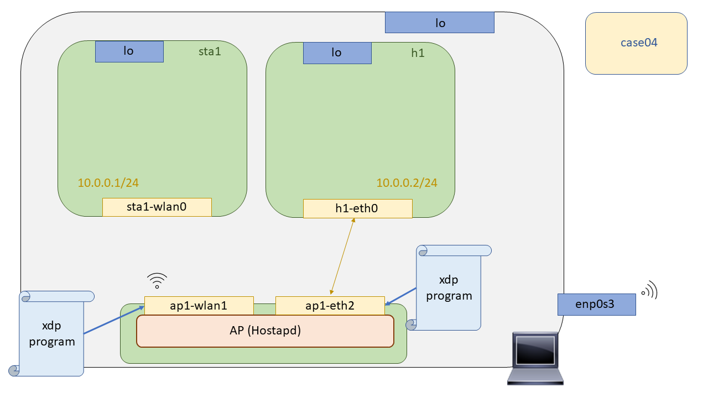

# XDP Wireless - Case04: Layer 3 forwarding

In this use case we will explore packet forwarding, at this point we already know how to filter by the packet headers, analyze them and establish a logic associated with that filtering with the XDP return codes. An extra action to be done with the packets will be the forwarding, in XDP it will be implemented by return codes and by [``helpers BPF``](http://man7.org/linux/man-pages/man7/bpf-helpers.7.html), because as we already mentioned in [case02](https://github.com/davidcawork/TFG/tree/master/src/use_cases/xdp-wireless/case02), XDP ends up being translated into BPF (eBPF), so certain functions, not all, to work with bpf are available when working with XDP. 

Throughout this use case, the different ways to achieve forwarding with XDP have been explored. We have gone from the simplest way to the most robust and complex way. In order to avoid differences between these ways of forwarding, a single scenario has been created where these paths will be explored without any differences induced by forwarding.

In the previous case we were already doing a forwarding, since, with the code ``XDP_TX`` we are doing a forwarding to the interface through which that package was received. But, how do we do a Forwarding to other interfaces? How can we route a packet that comes to us through an A interface and to another B interface? Well, reading the man-page of the [``helpers BPF``](http://man7.org/linux/man-pages/man7/bpf-helpers.7.html) we find the functions ``bpf_redirect()``, ``bpf_redirect_map()`` which, reading their description, will be the way used to address this need.

```C

int bpf_redirect(u32 ifindex, u64 flags);

int bpf_redirect_map(struct bpf_map *map, u32 key, u64 flags);

```

If we look at their definition, none of them works with the ``sk_buff``, data structure used very frequently in the network stack of the Linux Kernel in [case05](https://github.com/davidcawork/TFG/blob/master/src/use_cases/xdp/case05/), it will be explained what limitations induce some of the _BPF_ helpers to make use of it. The first one, ``bpf_redirect()`` makes use of ``ifindex`` as an identifier element of the interface to which it has to forward. As for the function ``bpf_redirect_map()`` makes use of a BPF map and a _key_, remember that BPF maps are of the key - value type, and based on the key we give it will go to the BPF map to find the value associated with that key, which will be an ``ifindex``. This last function will be explored further in this use case.


## Compilation

To compile the XDP program a Makefile has been left prepared in this directory as well as in the [``case03``](https://github.com/davidcawork/TFG/tree/master/src/use_cases/xdp-wireless/case03), so to compile it you only need to make a:

```bash
sudo make
```

If you are in doubt about the process of compiling the XDP program, we recommend that you return to [``case02``](https://github.com/davidcawork/TFG/tree/master/src/use_cases/xdp/case02)] where the flow arranged for compiling the programs is referred to.

## Setting up the scenario 


To test the XDP programs in a wireless environment, we will do Mininet-Wifi to emulate the network topologies. This emulation tool is a Mininet fork, which makes use of the Network Namespaces to isolate the independent nodes of the network. But what is a Network Namespaces? A network namespace consists of a logical network stack replica that by default has the Linux kernel, routes, ARP tables, Iptables and network interfaces.

As we already mentioned, to raise the scenario we will only have to execute the script in Python that makes use of the Mininet-Wifi API to generate all the network topology. Once executed, it will open the Mininet-Wifi command line interface, from which we can check the operation of our use case. So we only need to run it :smile::

```bash
sudo python runenv.py
```

To clean our machine from the scenario previously recreated with Mininet-Wifi we could do a `sudo mn -c` but it is recommended that the user makes use of the Makefile target intended for this purpose, since it will additionally clean the intermediate files generated in the process of compiling our XDP program. Executing the following command would clean up our machine:

```bash
sudo make clean
```

## Forwarding Hardcoded

The scenario raised is the following, it is composed of a wireless station and a host, which run within their respective Network Namespaces, and an access point running a `Hostapd` process to communicate the two wireless stations to each other. Additionally, and for consistency of the use case, it has been decided to run the switch within its own Network Namespace so that there is no doubt that the forwarding is being done correctly and there are no "bypasses" of any kind. In this case the forwarding will be done from the ``ap1-wlan1`` interface to the ``ap1-eth2`` interface.


### Loading the XDP program

Before loading the program **we must obtain two data**, the **`ifindex`` of the ``ap1-eth2`` interface to which we are going to send the packets generated from the ``sta1` wireless station`, and the **MAC** of the host1 interface, since it will be necessary that the packets that go to the ``ap1-wlan1`` interface have as destination MAC the one of the ``ap1-eth2`` so that the packets are not discarded. Once we have this data noted, we will open the xdp program (``*.c``) like any text editor, and go to the declaration of variables and hardcode both the ``ifindex`` and the MAC. For example:

```C 

    ...
    
    unsigned char dst[ETH_ALEN + 1] = {0x9a,0xde,0xaf,0xec,0x18,0x6e, '\0'} ;
    unsigned ifindex = 6; 

    ...

```

Once we have hardcoded the data to do the forwarding we will have to recompile the XDP program so that the bytecode we anchor to the ``ap1-wlan1`` interface does the forwarding correctly. Therefore, we simply have to do a **``sudo make``** again. Now if :smile: .. We're all set to anchor the XDP program again!

```bash
# First of all, we must launch the scenario in case we haven't done so already.
sudo python runenv.py


# We execute the following command within the AP1 Network Namespace, thus loading the
# XDP program on interface 1.
mininet-wifi> ap1 ./xdp_loader -d ap1-wlan1 -F --progsec xdp_case04 -S

```

### Testing


The performance check of this XDP program is quite basic, we are going to generate packets from the wireless station `sta1` to the host, `h1`. To do this we will open two terminals, in each of them we will carry out a task:


```bash

# We opened both terminals
mininet-wifi> xterm h1 sta1

# In the terminal of host1 we will put a sniffer to listen to the packages that arrive to us.
[Terminal:h1] tcpdump -l

# In the terminal of the sta1 we will throw pings against the h1
[Terminal:sta1] ping 10.0.0.2

# Finally, optionally, we can run the program that acted as a collector of statistics on XDP return codes
mininet-wifi> ap1 ./xdp_stats -d ap1-wlan1

```
Why is there no connectivity? Good question, it's not that the program doesn't work, you can see it in the XDP return codes, only that the communication is currently only supported in one direction, since we are only supporting the forwarding from the `ap1-wlan1` interface to the `ap1-eth2` interface. Currently the ping process is stopped at the ARP resolution of the MAC associated to the IP address 10.0.0.2, arriving the ARP - Request but the ARP replay will never reach its destination :joy:.

```bash
# In the terminal of the sta1 we will throw pings against the h1
[Terminal:sta1] arp -s 10.0.0.2 {MAC de la interfaz h1-eth0 del h1}
```

 We can additionally add the ARP entry in a static way to the Network Namespace of the wireless station `sta1` but the ping would still not work, since the ICMP REPLAY packages associated to the received ECHO REQUEST will never be able to reach back to the wireless station `sta1`. The following approach to forwarding will address this communication gap with a new approach to achieve two-way communication while being scalable. 


## Forwarding semi-Hardcoded (BPF maps)

The scenario raised is the following, it is composed of a wireless station and a host, which run within their respective Network Namespaces, and an access point running a 'Hostapd' process to communicate the two wireless stations to each other. Additionally, and for consistency of the use case, it has been decided to run the switch within its own Network Namespace so that there is no doubt that the forwarding is being done correctly and there are no "bypasses" of any kind. In this case the forwarding will be done from the ``ap1-wlan1`` interface to the ``ap1-eth2`` interface and vice versa.




### Loading the XDP program

This way of doing the forwarding does not require hardcoding data in the XDP program itself that will go to the Kernel, but rather, that the BPF maps will be used as a means to save forwarding data such as the ``ifindex`` and the destination MACs from user space so that later the program anchored in the Kernel will be able to read the maps, obtain the forwarding information and do it based on the perceived information from the BPF maps.


It is important to note that previously anchored programs must be removed, so one option would be to clean the scenario using the given Makefile ( ``sudo make clean``) and start over.


```bash

# We launched the script that raises the stage
sudo python runenv.py

# We anchor the XDP program on each interface to achieve two-way communication 
mininet-wifi> ap1 ./xdp_loader -d ap1-wlan1 -F --progsec xdp_case04_map -S
mininet-wifi> ap1 ./xdp_loader -d ap1-eth2 -F --progsec xdp_case04_map -S

# We store the necessary information for forwarding and populate the BPF maps
# with the useful information to carry out the forwarding in both directions
mininet-wifi> ap1 ./redirect.sh


```

### Testing

This program can be tested from one end or the other because, if everything works correctly, there will be two-way communication. So we will test from the wireless station `sta1` to the host `h1`.

```bash

# We ping from h1 to sta1, or the other way around
mininet-wifi> sta1 ping h1

# We check with the statistics collector that they are producing XDP_REDIRECT
mininet-wifi> ap1 sudo ./xdp_stats -d ap1-wlan1

or

mininet-wifi> ap1 sudo ./xdp_stats -d ap1-eth2

``` 


## References 

* [Helpers BPF](http://man7.org/linux/man-pages/man7/bpf-helpers.7.html) 


---


# XDP Wireless - Case04: Layer 3 forwarding

En este caso de uso exploraremos el forwarding de paquetes, en este punto ya sabemos como filtrar por las cabeceras de los paquetes, analizarlos y establecer una lógica asociada a ese filtrado con los códigos de retorno XDP. Una acción extra a realizar con los paquetes será el forwarding, en XDP vendrá implementado por códigos de retorno y por [``helpers BPF``](http://man7.org/linux/man-pages/man7/bpf-helpers.7.html), por que como ya comentábamos en el [case02](https://github.com/davidcawork/TFG/tree/master/src/use_cases/xdp-wireless/case02), XDP se termina traduciendo en BPF (eBPF), por lo que ciertas funciones, no todas, para trabajar con bpf están disponibles a la hora de trabajar con XDP. 

A lo largo de este caso de uso, se han explorado las distintas maneras para lograr el forwarding con XDP. Hemos ido desde la manera más simple a la manera más robusta y compleja. Para que no haya diferencias entre estas formas de realizar el forwarding, se ha creado un mismo escenario donde se explorarán estas vias sin que existan diferencias inducidas por este.

En el caso de uso anterior ya estábamos haciendo un forwarding, ya que, con el código ``XDP_TX`` estamos haciendo un forwarding hacia la interfaz por la cual se recibió dicho paquete. Pero, ¿Cómo hacemos un Forwarding hacia otras interfaces? ¿Cómo podemos encaminar un paquete que nos llega por una interfaz A y hacia otra interfaz B? Bien, leyendo la man-page de los [``helpers BPF``](http://man7.org/linux/man-pages/man7/bpf-helpers.7.html) nos encontramos con las funciones ``bpf_redirect()``, ``bpf_redirect_map()`` las cuales, leyendo su descripción, serán la vía utilizada para abordar esta necesidad.

```C

int bpf_redirect(u32 ifindex, u64 flags);

int bpf_redirect_map(struct bpf_map *map, u32 key, u64 flags);

```

Si nos fijamos en su definición ninguna de ellas opera con los ``sk_buff``, estructura de datos utilizada de forma muy frecuente en el stack de red del Kernel de Linux en el [case05](https://github.com/davidcawork/TFG/blob/master/src/use_cases/xdp/case05/) se explicará que limitaciones nos induce que alguno de los _helpers BPF_ hagan uso de ella. La primera de ellas, ``bpf_redirect()`` hace uso del ``ifindex`` como elemento identificador de la interfaz a la cual tiene que hacer el forwarding. En cuanto a la función ``bpf_redirect_map()`` hace uso de un mapa BPF y una _key_, recordemos que los mapas BPF son del tipo clave - valor, y en base a la key que le demos irá al mapa BPF buscara el valor asociado a esa clave, el cual, será un ``ifindex``. Esta última función la exploraremos más a fondo en este caso de uso.


## Compilación

Para compilar el programa XDP se ha dejado un Makefile preparado en este directorio al igual que en el [``case03``](https://github.com/davidcawork/TFG/tree/master/src/use_cases/xdp-wireless/case03), por lo que para compilarlo unicamente hay que hacer un:

```bash
sudo make
```
Si tiene dudas sobre el proceso de compilación del programa XDP le recomendamos que vuelva al [``case02``](https://github.com/davidcawork/TFG/tree/master/src/use_cases/xdp/case02) donde se hace referencia al flow dispuesto para la compilación de los programas.

## Puesta en marcha del escenario

Para testear los programas XDP en un entorno inalámbrico, haremos Mininet-Wifi para emular las topologías de red. Esta herramienta de emulación es un fork de Mininet, la cuales hacen uso de  las Network Namespaces para conseguir aislar los nodos independientes de la red. Pero, ¿Qué es una Network Namespaces? Una network namespace consiste en una replica lógica de stack de red que por defecto tiene el kernel de Linux, rutas, tablas ARP, Iptables e interfaces de red.

Como ya comentábamos, para levantar el escenario solo tendremos que ejecutar el script en Python que hace uso de la API de Mininet-Wifi para generar toda la topología de red. Una vez ejecutado este abrirá la interfaz de linea de comandos de Mininet-Wifi, desde la cual podremos comprobar el funcionamiento de nuestro caso de uso. Por lo que solo deberemos ejecutarlo :smile::

```bash
sudo python runenv.py
```

Para limpiar nuestra máquina del escenario recreado anteriormente con Mininet-Wifi podríamos hacer un `sudo mn -c` pero se le recomienda al usuario que haga uso del target del Makefile destinado para ello, ya que adicionalmente limpiará los ficheros intermedios generados en el proceso de compilación de nuestro programa XDP. Ejecutando el siguiente comando limpiaríamos nuestra máquina:

```bash
sudo make clean
```

## Forwarding Hardcodeado

El escenario levantado es el siguiente, está compuesto de una estación wireless y un host, que corren dentro de su respectivas Network Namespaces, y un punto de acceso corriendo un proceso de `Hostapd` para comunicar las dos estaciones wireless entre sí. De forma adicional, y por consistencia del caso de uso se ha decidido correr dicho switch dentro de su propia Network Namespace para que no haya lugar a dudas de que el forwarding se está realizando correctamente y no está habiendo "bypasses" de ningun tipo. En este caso el forwarding lo haremos desde la interfaz ``ap1-wlan1`` hacia la interfaz ``ap1-eth2``.


### Carga del programa  XDP

Antes de realizar la carga del programa **debemos obtener dos datos**, la **``ifindex`` de la interfaz ``ap1-eth2``** a la cual le vamos a mandar los paquetes generados desde la estación wireless `sta1`, y la **MAC** de la interfaz del host1, ya que será necesario que los paquetes que se dirijan a la interfaz ``ap1-wlan1`` lleven como MAC destino la de la ``ap1-eth2`` para que así los paquetes no sean descartados. Una vez tengamos estos datos anotados abriremos el programa xdp (``*.c``) cuan cualquier editor de texto, e iremos a la declaración de variables y hardcoderemos tanto el ``ifindex`` como la MAC. Por ejemplo:

```C 

    /*  Para un ifindex: 6 y una MAC: 9A:DE:AF:EC:18:6E */
    /*  Ojo con los 00's comentar error de validación por escritura de null en una estructura del Kernel*/
    ...
    
    unsigned char dst[ETH_ALEN + 1] = {0x9a,0xde,0xaf,0xec,0x18,0x6e, '\0'} ;
    unsigned ifindex = 6; 

    ...

```

Una vez que tengamos hardcodeado los datos para realizar el forwarding deberemos recompilar el programa XDP para que el bytecode que anclemos a la interfaz ``ap1-wlan1`` haga correctamente el forwarding. Por ello, simplemente tenemos que hacer un **``sudo make``** nuevamente. Ahora si :smile: .. Ya tenemos todo preparado para anclar de nuevo el programa XDP!

```bash
# Antes que nada, debemos lanzar el escenario en caso de que no lo hayamos hecho todavía.
sudo python runenv.py


# Ejecutamos el siguiente comando dentro de la Network Namespace del AP1, cargando así el
# programa XDP en la interfaz 1.
mininet-wifi> ap1 ./xdp_loader -d ap1-wlan1 -F --progsec xdp_case04 -S

```

### Comprobación del funcionamiento


La comprobación de funcionamiento de este programa XDP es bastante básica, vamos a generar paquetes desde la estación wireless `sta1` hacia el host, `h1`. Para ello abriremos dos terminales, en cada una de ellas llevaremos a cabo una tarea:


```bash

# Abrimos las dos terminales
mininet-wifi> xterm h1 sta1

# En la terminal del host1 pondremos a un sniffer a escuchar los paquetes que nos lleguen.
[Terminal:h1] tcpdump -l

# En la terminal de la sta1 lanzaremos pings contra el h1
[Terminal:sta1] ping 10.0.0.2

# Por último, opcionalmente, podemos ejecutar el programa que actuaba como recolector de estadísticas sobre los códigos de retorno XDP
mininet-wifi> ap1 ./xdp_stats -d ap1-wlan1

```
¿Por que no hay conectividad? Buena pregunta, no es que el programa no funcione, está funcionando lo puede ver en los códigos de retorno XDP, solo que la comunicación actualmente solo está soportada en un sentido, ya que solo estamos soportando el forwarding de la interfaz `ap1-wlan1` a la interfaz `ap1-eth2`. Actualmente el proceso de ping está detenido en la resolución ARP de la MAC asociada a la dirección IP 10.0.0.2, llegando los ARP - Request pero los ARP replay nunca llegarán a su destino :joy:.

```bash
# En la terminal de la sta1 lanzaremos pings contra el h1
[Terminal:sta1] arp -s 10.0.0.2 {MAC de la interfaz h1-eth0 del h1}
```

 Podemos de forma adicional, añadir la entrada ARP de forma estática a la Network Namespace de la estación wireless `sta1` pero el ping seguiría sin funcionar, ya que los paquetes ICMP REPLAY asociados a los  ECHO REQUEST recibidos nunca podrán llegar de vuelta a la estación wireless `sta1`. En el siguiente planteamiento del forwarding se abordará esta carencia en la comunicación con un nuevo planteamiento para conseguir un bidireccionalidad en la comunicación, a la par que escalable. 

## Forwarding semi-Hardcodeado (BPF maps)

El escenario levantado es el siguiente, está compuesto de una estación wireless y un host, que corren dentro de su respectivas Network Namespaces, y un punto de acceso corriendo un proceso de `Hostapd` para comunicar las dos estaciones wireless entre sí. De forma adicional, y por consistencia del caso de uso se ha decidido correr dicho switch dentro de su propia Network Namespace para que no haya lugar a dudas de que el forwarding se está realizando correctamente y no está habiendo "bypasses" de ningún tipo. En este caso el forwarding lo haremos desde la interfaz ``ap1-wlan1`` hacia la interfaz ``ap1-eth2`` y viceversa.


### Carga del programa  XDP

Esta manera de hacer el forwarding no requiere de hardcodear datos en el propio programa XDP que irá al Kernel, si no, que se usarán los mapas BPF como medio para guardar datos de forwarding como son las ``ifindex`` y las MAC destino desde espacio de usuario para que posteriormente el programa anclado en el Kernel sea capaz de leer los mapas, obtener la información de forwarding y realizarlo en base a la información percibida de los mapas BPF.


Es importante señalar que los programas anclados previamente deben ser removidos, por lo que una opción sería hacer un clean del escenario haciendo uso del Makefile dado ( ``sudo make clean``) y empezar de nuevo.


```bash

# Lnazamos el script que levanta el escenario
sudo python runenv.py

# Anclamos el programa XDP en cada interfaz para conseguir un comunicación bidireccional 
mininet-wifi> ap1 ./xdp_loader -d ap1-wlan1 -F --progsec xdp_case04_map -S
mininet-wifi> ap1 ./xdp_loader -d ap1-eth2 -F --progsec xdp_case04_map -S

# Almacenamos la información necesaria para realizar el forwarding y populamos los mapas BPF
# con la información útil para llevar a cabo el forwarding en ambas direcciones.
mininet-wifi> ap1 ./redirect.sh


```

### Comprobación del funcionamiento

La comprobación de funcionamiento de este programa puede ser llevada a cabo desde un extremo u otro debido a que, si todo funciona correctamente, existirá una comunicación bidireccional. Por lo que nosotros haremos las pruebas desde la estación wireless `sta1`  hacia el host `h1`.

```bash

# Hacemos un ping desde el h1 a la sta1, o al revés
mininet-wifi> sta1 ping h1

# Comprobamos con el recolector de estadísticas que se están produciendo XDP_REDIRECT
mininet-wifi> ap1 sudo ./xdp_stats -d ap1-wlan1

ó

mininet-wifi> ap1 sudo ./xdp_stats -d ap1-eth2

``` 


## Fuentes

* [Helpers BPF](http://man7.org/linux/man-pages/man7/bpf-helpers.7.html) 

