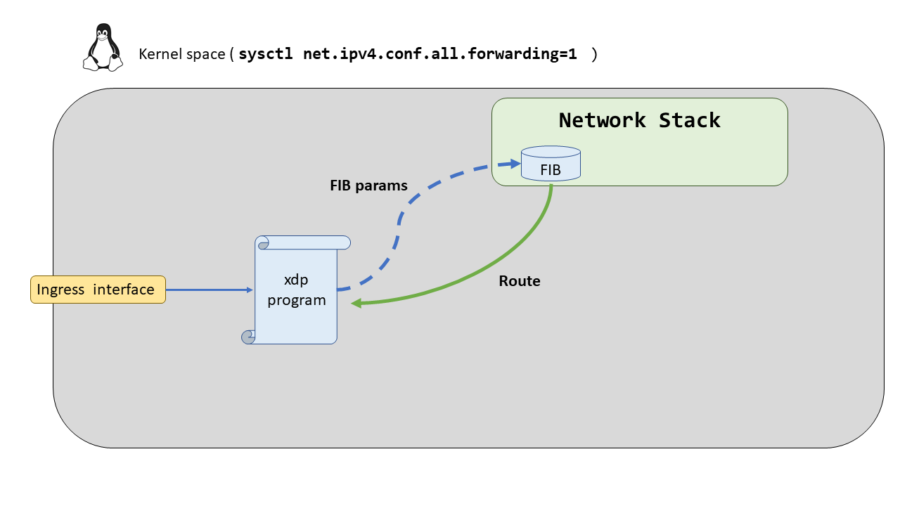

# XDP - Case04: Layer 3 forwarding

En este caso de uso exploraremos el forwarding de paquetes, en este punto ya sabemos como filtrar por las cabeceras de los paquetes, analizarlos y establecer una lógica asociada a ese filtrado con los códigos de retorno XDP. Una acción extra a realizar con los paquetes será el forwarding, en XDP vendrá implementado por códigos de retorno y por [``helpers BPF``](http://man7.org/linux/man-pages/man7/bpf-helpers.7.html), por que como ya comentábamos en el [case02](https://github.com/davidcawork/TFG/tree/master/src/use_cases/xdp/case02), XDP se termina traduciendo en BPF (eBPF), por lo que ciertas funciones, no todas, para trabajar con bpf están disponibles a la hora de trabajar con XDP. 

A lo largo de este caso de uso, se han explorado las distintas maneras para lograr el forwarding con XDP. Hemos ido desde la manera más simple a la manera más robusta y compleja. Para que no haya diferencias entre estas formas de realizar el forwarding, se ha creado un mismo escenario donde se explorarán estas vias sin que existan diferencias inducidas por este.

En el caso de uso anterior ya estábamos haciendo un forwarding, ya que, con el código ``XDP_TX`` estamos haciendo un forwarding hacia la interfaz por la cual se recibió dicho paquete. Pero, ¿Cómo hacemos un Forwarding hacia otras interfaces? ¿Cómo podemos encaminar un paquete que nos llega por una interfaz A y hacia otra interfaz B? Bien, leyendo la man-page de los [``helpers BPF``](http://man7.org/linux/man-pages/man7/bpf-helpers.7.html) nos encontramos con las funciones ``bpf_redirect()``, ``bpf_redirect_map()`` las cuales, leyendo su descripción, serán la vía utilizada para abordar esta necesidad.

```C

int bpf_redirect(u32 ifindex, u64 flags);

int bpf_redirect_map(struct bpf_map *map, u32 key, u64 flags);

```

Si nos fijamos en su definición ninguna de ellas opera con los ``sk_buff``, estructura de datos utilizada de forma muy frecuente en el stack de red del Kernel de Linux en el [case05](https://github.com/davidcawork/TFG/blob/master/src/use_cases/xdp/case05/) se explicará que limitaciones nos induce que alguno de los _helpers BPF_ hagan uso de ella. La primera de ellas, ``bpf_redirect()`` hace uso del ``ifindex`` como elemento identificador de la interfaz a la cual tiene que hacer el forwarding. En cuanto a la función ``bpf_redirect_map()`` hace uso de un mapa BPF y una _key_, recordemos que los mapas BPF son del tipo clave - valor, y en base a la key que le demos irá al mapa BPF buscara el valor asociado a esa clave, el cual, será un ``ifindex``. Esta última función la exploraremos más a fondo en este caso de uso.


## Compilación

Para compilar el programa XDP se ha dejado un Makefile preparado en este directorio al igual que en el [``case03``](https://github.com/davidcawork/TFG/tree/master/src/use_cases/xdp/case03), por lo que para compilarlo unicamente hay que hacer un:

```bash
make
```
Si tiene dudas sobre el proceso de compilación del programa XDP le recomendamos que vuelva al [``case02``](https://github.com/davidcawork/TFG/tree/master/src/use_cases/xdp/case02) donde se hace referencia al flow dispuesto para la compilación de los programas.

## Puesta en marcha del escenario

Para testear los programas XDP haremos uso de las Network Namespaces. Si usted no sabe lo que son las Network Namespaces, o el concepto de namespace en general, le recomendamos que se lea el [``case01``](https://github.com/davidcawork/TFG/tree/master/src/use_cases/xdp/case01) donde se hace una pequeña introducción a las Network Namespaces, qué son y cómo podemos utilizarlas para emular nuestros escenarios de Red. 

Como ya comentábamos, para que no suponga una barrera de entrada el concepto de las Network Namespaces, se ha dejado escrito un script para levantar el escenario, y para su posterior limpieza. Es importante señalar que el script debe ser lanzado con permisos de root. Para levantar el escenario debemos ejecutar dicho script de la siguiente manera:

```bash
sudo ./runenv.sh -i
```

Para limpiar nuestra máquina del escenario recreado anteriormente podemos correr el mismo script indicándole ahora el parámetro -c (Clean). A unas malas, y si se cree que la limpieza no se ha realizado de manera satisfactoria, podemos hacer un reboot de nuestra máquina consiguiendo así que todos los entes no persistentes(veth, netns..) desaparezcan de nuestro equipo.

```bash
sudo ./runenv.sh -c
```


## Forwarding Hardcodeado

El escenario levantado es el siguiente, está compuesto de dos Network Namespace, y de dos pares de ``veth's`` las cuales utilizaremos para comunicar las dos network namespaces entre sí, a través del la Network namespace por defecto. En este caso el forwarding lo haremos desde la interfaz ``dos`` hacia la interfaz ``uno``.


### Carga del programa  XDP

Antes de realizar la carga del programa **debemos obtener dos datos**, la **``ifindex`` de la interfaz ``uno``** a la cual le vamos a mandar los paquetes generados desde el interior de la network namespace ``dos``, y la **MAC de la interfaz interna** de la Network namespace ``uno``, ya que será necesario que los paquetes que se dirijan a la interfaz ``uno`` lleven como MAC destino la de la ``veth0`` para que así los paquetes no sean descartados. Una vez tengamos estos datos anotados abriremos el programa xdp (``*.c``) cuan cualquier editor de texto, e iremos a la declaración de variables y hardcoderemos tanto el ``ifindex`` como la MAC. Por ejemplo:

```C 

    /*  Para un ifindex: 6 y una MAC: 9A:DE:AF:EC:18:6E */

    ...
    
    unsigned char dst[ETH_ALEN + 1] = {0x9a,0xde,0xaf,0xec,0x18,0x6e, '\0'} ;
    unsigned ifindex = 6; 

    ...

```

Una vez que tengamos hardcodeado los datos para realizar el forwarding deberemos recompilar el programa XDP para que el bytecode que anclemos a la interfaz ``dos`` haga correctamente el forwarding. Por ello, simplemente tenemos que hacer un **``make``** nuevamente. 

Ahora si :smile: .. Ya tenemos todo preparado para anclar de nuevo el programa XDP! Recordemos que por el estar trabajando con interfaz ``veth's`` debemos anclar un dummy program en el extremo donde se vayan a recibir los paquetes, para más información de esta limitación le recomendamos que vuelva al [case03](https://github.com/davidcawork/TFG/tree/master/src/use_cases/xdp/case03) ó ver la charla de la [Netdev](https://netdevconf.info) llamada **_Veth XDP: XDP for containers_** donde explican con un mayor detalle esta limitación, como abordarla y por que está inducida.  [Enlace a la charla](https://netdevconf.info/0x13/session.html?talk-veth-xdp).

```bash

# Entramos a la Network Namespace "uno" y anclamos el dummy program a la interfaz veth0
sudo ip netns exec uno ./xdp_loader -d veth0 -F --progsec xdp_pass

# Acto seguido, anclamos el programa a la interfaz "dos" como ya comentábamos antes
sudo ./xdp_loader -d dos -F --progsec xdp_case04

```

### Comprobación del funcionamiento


La comprobación de funcionamiento de este programa XDP es bastante básica, vamos a generar paquetes desde el interior de la Network Namespace ``dos`` hacia la ``veth`` interna de la Network Namespace ``uno``. Para ello abriremos tres terminales, en cada una de ellas llevaremos a cabo una tarea:


```bash

# En esta terminal generaremos el ping hacia la interfaz de la Network Namespace "uno" desde la Network Namespace "dos"
[Terminal:1] sudo ip netns exec dos ping {IP_veth0_uno}

# En esta terminal pondremos a un sniffer a escuchar los paquetes que nos lleguen dentro de la Network Namespace "dos"
[Terminal:2] sudo ip netns exec uno tcpdump -l

# Por último, opcionalmente, podemos ejecutar el programa que actuaba como recolector de estadísticas sobre los códigos de retorno XDP
[Terminal:3] sudo ./xdp_stats -d dos
```


## Forwarding semi-Hardcodeado (BPF maps)

El escenario levantado es el siguiente, está compuesto de dos Network Namespace, y de dos pares de ``veth's`` las cuales utilizaremos para comunicar las dos network namespaces entre sí, a través del la Network namespace por defecto. En este caso el forwarding lo haremos desde la interfaz ``dos`` hacia la interfaz ``uno`` y viceversa, por lo que la comunicación será bidireccional.


### Carga del programa  XDP

Esta manera de hacer el forwarding no requiere de hardcodear datos en el propio programa XDP que irá al Kernel, si no, que se usarán los mapas BPF como medio para guardar datos de forwarding como son las ``ifindex`` y las MAC destino desde espacio de usuario para que posteriormente el programa anclado en el Kernel sea capaz de leer los mapas, obtener la información de forwarding y realizarlo en base a la información percibida de los mapas BPF.

De nuevo, y como en este caso la comunicación será bidireccional debemos anclar dos _dummy program_ en los dos extremos donde van a llegar los paquetes, si no estás al tanto de esta limitación vuelva a esta [sección](https://github.com/davidcawork/TFG/blob/master/src/use_cases/xdp/case04/README.md#carga-del-programa--xdp) donde se menciona la limitación.

Es importante señalar que los programas anclados previamente deben ser removidos, por lo que una opción sería hacer un clean del escenario haciendo uso del script dado ( ``sudo ./runenv.sh -c``) y empezar de nuevo.


```bash

# Entramos en cada Network Namespace y anclamos los "dummy programs"
sudo ip netns exec uno ./xdp_loader -d veth0 -F --progsec xdp_pass
sudo ip netns exec dos ./xdp_loader -d veth0 -F --progsec xdp_pass

# Anclamos el programa XDP en cada interfaz para conseguir un comunicación bidireccional 
sudo ./xdp_loader -d uno -F --progsec xdp_case04_map
sudo ./xdp_loader -d dos -F --progsec xdp_case04_map

# Almacenamos la información necesaria para realizar el forwarding 
local src="uno"
local dest="dos"
local src_mac=$(ip netns exec $src cat /sys/class/net/veth0/address)
local dest_mac=$(ip netns exec $dest cat /sys/class/net/veth0/address)
 
# Populamos los mapas BPF con la información útil para llevar a cabo el forwarding en ambas direcciones
./prog_user -d $src -r $dest --src-mac $src_mac --dest-mac $dest_mac
./prog_user -d $dest -r $src --src-mac $dest_mac --dest-mac $src_mac


```

### Comprobación del funcionamiento

La comprobación de funcionamiento de este programa puede ser llevada a cabo desde un extremo u otro debido a que, si todo funciona correctamente, existirá una comunicación bidireccional. Por lo que nosotros haremos las pruebas desde la Network namepsace ``uno``  hacia la ``dos``.

```bash

# Hacemos un ping desde el interior de la Network namespace "uno" hacia la veth0 de la Network namespace "dos"
ping  {IP_veth_dos} [ y viceversa..]

# Comprobamos con el recolector de estadísticas que se están produciendo XDP_REDIRECT
sudo ./xdp_stats -d uno

ó

sudo ./xdp_stats -d dos

``` 

## Forwarding auto (Kernel FIBs)

El escenario sobre el cual trabajaremos será el mismo que el anterior por lo que unicamente debemos preocuparnos de limpiar el escenario de los programas XDP anteriormente anclados a cada interfaz para que no interfieran con los nuevos programas XDP que vamos a anclar. 

En este caso, vamos a ir un paso más allá y el forwarding será automático. ¿Automático? Si, no hardcodearemos ningún tipo de información para hacer el forwarding a los paquetes. Pero, entonces, ¿Cómo sabremos a dónde hay que mandar los paquetes? Muy buena pregunta, esta información la conseguiremos del stack de red del kernel de Linux el cual tiene una FIB (_Forwarding Information Base_) con reglas muy útiles las cuales podemos sacar partido. Por lo que haremos una consulta a la FIB con el _helper_ ``bpf_fib_lookup()`` para obtener información de forwarding desde el propio stack de red, este es un claro ejemplo donde la cooperación con el stack de red hace que nuestro programa XDP sea más robusto e independiente del espacio de usuario. 




### Carga del programa  XDP

Para la carga de nuestro programa XDP deberemos primero habilitar el forwarding en nuestro Kernel, acto seguido nos procuraremos de anclar los _dummy program_ y por último anclar los programas en ambas interfaces tanto ``uno`` como ``dos`` para conseguir que la comunicación se bidireccional.

```bash

# Habilitamos el forwarding 
sudo sysctl net.ipv4.conf.all.forwarding=1

# Anclamos los programas XDP a cada interfaz 
sudo ./xdp_loader -d uno -F --progsec xdp_case04_fib
sudo ./xdp_loader -d dos -F --progsec xdp_case04_fib

# Ahora añadimos a cada interfaz destino su "dummy program"
sudo ip netns exec uno ./xdp_loader -d veth0 -F --progsec xdp_pass
sudo ip netns exec dos ./xdp_loader -d veth0 -F --progsec xdp_pass

# Habilitamos los ifindex 
sudo ./prog_user -d uno
sudo ./prog_user -d dos

```

### Comprobación del funcionamiento

La comprobación de funcionamiento de este programa puede ser llevada a cabo desde un extremo u otro debido a que, si todo funciona correctamente, existirá una comunicación bidireccional. Por lo que nosotros haremos las pruebas desde la Network namepsace ``uno``  hacia la ``dos``.

```bash

# Hacemos un ping desde el interior de la Network namespace "uno" hacia la veth0 de la Network namespace "dos"
ping  {IP_veth_dos} [ y viceversa..]

# Comprobamos con el recolector de estadísticas que se están produciendo XDP_REDIRECT
sudo ./xdp_stats -d uno

ó

sudo ./xdp_stats -d dos

```

## Fuentes

* [Helpers BPF](http://man7.org/linux/man-pages/man7/bpf-helpers.7.html) 
* [Rounting Linux - FIB](https://www.net.in.tum.de/fileadmin/TUM/NET/NET-2015-09-1/NET-2015-09-1_07.pdf)
* [Rounting Linux - FIB (source)](https://github.com/torvalds/linux/blob/master/include/net/fib_rules.h)
