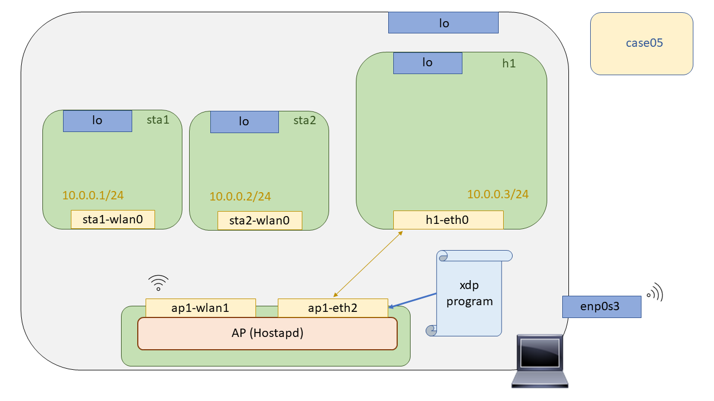

# XDP Wireless - Case05: Broadcast

Finally, in this use case we will explore the forwarding capability of XDP ( :joy: ). Therefore we have tried to replicate a basic broadcast scenario in a wireless scenario. We have proposed to use the tool [**arping**](http://man7.org/linux/man-pages/man8/arping.8.html) to emulate an ARP resolution, generating ARP Request, these take their destination MAC all to FF:FF:FF:FF:FF and their broadcast domain would include all those network nodes operating up to layer 2.



The proposed scenario to emulate that scenario was as follows. This would be composed of two wireless stations connected to an access point on which all the XDP logic will go, and finally, a host from which we can start the ARP resolutions to see their broadcast in a wireless environment. 

## Compilation

To compile the XDP program a Makefile has been left prepared in this directory as well as in the [``case04``](https://github.com/davidcawork/TFG/tree/master/src/use_cases/xdp-wireless/case04), so to compile it you only have to make a

```bash

# Before doing the make, we must check the ifindex of the ap1-wlan1 interface and modify it in the program.
sudo make
```

If you are in doubt about the process of compiling the XDP program, we recommend that you return to [``case02``](https://github.com/davidcawork/TFG/tree/master/src/use_cases/xdp/case02) where the flow arranged for compiling the programs is referred to.

## Setting up the scenario 


To test the XDP programs in a wireless environment, we will do Mininet-Wifi to emulate the network topologies. This emulation tool is a Mininet fork, which makes use of the Network Namespaces to isolate the independent nodes of the network. But what is a Network Namespaces? A network namespace consists of a logical network stack replica that by default has the Linux kernel, routes, ARP tables, Iptables and network interfaces.

As we already mentioned, to raise the scenario we will only have to execute the script in Python that makes use of the Mininet-Wifi API to generate all the network topology. Once executed, it will open the Mininet-Wifi command line interface, from which we can check the operation of our use case. So we only need to run it :smile::

```bash
sudo python runenv.py
```

To clean our machine from the scenario previously recreated with Mininet-Wifi we could do a `sudo mn -c` but it is recommended that the user makes use of the Makefile target intended for this purpose, since it will additionally clean the intermediate files generated in the process of compiling our XDP program. Executing the following command would clean up our machine:

```bash
sudo make clean
```


## Loading th XDP program 

Once our XDP program has been compiled, and our scenario launched with the execution of the `runenv.py` script, we will proceed with the loading of the XDP program using the `xdp_loader` tool.

```bash

# We opened a bash on the Network Namespace "switch"
mininet-wifi> ap1 ./xdp_loader -d ap1-eth2 -F --progsec xdp_case05 -S

```

## Testing

To check the operation of the Broadcast system the following test will be performed, from the `h1` host we will generate ARP-Request packages asking for any of the MACs of the wireless stations. If our Broadcast system works, listening in the wireless stations ``sta1`` and ``sta2`` destination we should see how the ARP-Request packets arrive without problems.

```bash

# Generate ARP-REQUEST
mininet-wifi> h1 arping 10.0.0.1-2

# We listen in the Network Namespace destination of the wireless stations waiting to see ARP-REQUEST.
mininet-wifi> sta1 tcpduml -l
mininet-wifi> sta2 tcpduml -l
```

## References 


---


# XDP Wireless - Case05: Broadcast

Por último, en este caso de uso exploraremos la capacidad de forwarding de XDP ( :joy: ). Por ello se ha intentado replicar un escenario básico de broadcast en un escenario inalámbrico. Se ha planteado hacer uso de la herramienta [**arping**](http://man7.org/linux/man-pages/man8/arping.8.html) para emular una resolución ARP, generando ARP Request, estos llevan su MAC destino todo a FF:FF:FF:FF:FF:FF y su dominio de difusión englobaría todos aquellos nodos de la red que operen hasta capa 2.


El escenario propuesto para emular ese escenario ha sido el siguiente. Este estaría compuesto de dos estaciones wireless conectadas a un punto de acceso sobre el cual irá toda la lógica XDP, y por último, un host desde el que podremos empezar las resoluciones ARP para ver así su difusión en un medio wireless. 

## Compilación

Para compilar el programa XDP se ha dejado un Makefile preparado en este directorio al igual que en el [``case04``](https://github.com/davidcawork/TFG/tree/master/src/use_cases/xdp-wireless/case04), por lo que para compilarlo unicamente hay que hacer un:

```bash

# Antes de hacer el make, debemos omprobar el ifindex de la interfaz ap1-wlan1 y modificarlo en el programa.
sudo make
```
Si tiene dudas sobre el proceso de compilación del programa XDP le recomendamos que vuelva al [``case02``](https://github.com/davidcawork/TFG/tree/master/src/use_cases/xdp/case02) donde se hace referencia al flow dispuesto para la compilación de los programas.


## Puesta en marcha del escenario


Para testear los programas XDP en un entorno inalámbrico, haremos Mininet-Wifi para emular las topologías de red. Esta herramienta de emulación es un fork de Mininet, la cuales hacen uso de  las Network Namespaces para conseguir aislar los nodos independientes de la red. Pero, ¿Qué es una Network Namespaces? Una network namespace consiste en una replica lógica de stack de red que por defecto tiene el kernel de Linux, rutas, tablas ARP, Iptables e interfaces de red.

Como ya comentábamos, para levantar el escenario solo tendremos que ejecutar el script en Python que hace uso de la API de Mininet-Wifi para generar toda la topología de red. Una vez ejecutado este abrirá la interfaz de linea de comandos de Mininet-Wifi, desde la cual podremos comprobar el funcionamiento de nuestro caso de uso. Por lo que solo deberemos ejecutarlo :smile::

```bash
sudo python runenv.py
```

Para limpiar nuestra máquina del escenario recreado anteriormente con Mininet-Wifi podríamos hacer un `sudo mn -c` pero se le recomienda al usuario que haga uso del target del Makefile destinado para ello, ya que adicionalmente limpiará los ficheros intermedios generados en el proceso de compilación de nuestro programa XDP. Ejecutando el siguiente comando limpiaríamos nuestra máquina:

```bash
sudo make clean
```


## Carga del programa  XDP

Una vez compilado tanto nuestro programa XDP, y nuestro escenario lanzado con la ejecución del script `runenv.py`, vamos a proceder con la carga del programa XDP haciendo uso de la herramienta `xdp_loader`.

```bash

# Nos abrimos un proceso de bash sobre la Network Namespace "switch"
mininet-wifi> ap1 ./xdp_loader -d ap1-eth2 -F --progsec xdp_case05 -S

```

## Comprobación del funcionamiento

Para comprobar el funcionamiento del sistema de Broadcast se realizará la siguiente prueba,  desde el host `h1` generaremos paquetes ARP-Request preguntando por alguna de las MACs de las estaciones wireless. Si nuestro sistema de Broadcast funciona, escuchando en las estaciones wireless destino ``sta1`` y ``sta2`` deberíamos ver como los paquetes ARP-Request llegan sin problemas.

```bash

# Generamos el ARP-REQUEST
mininet-wifi> h1 arping 10.0.0.1-2

# Escuchamos en las Network Namespace destino de las estaciones wireless a la espera de ver ARP-REQUEST.
mininet-wifi> sta1 tcpduml -l
mininet-wifi> sta2 tcpduml -l
```

## Fuentes


