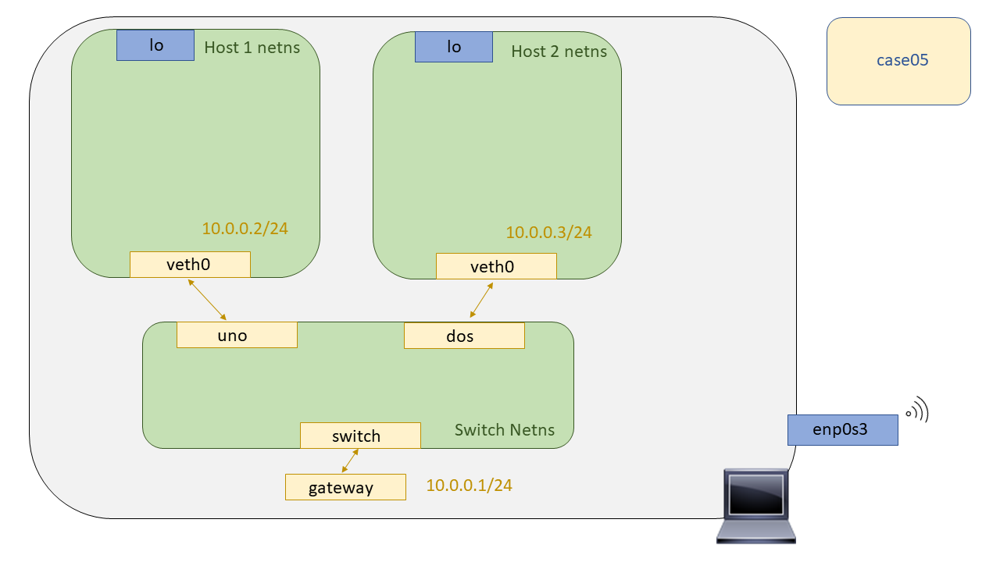
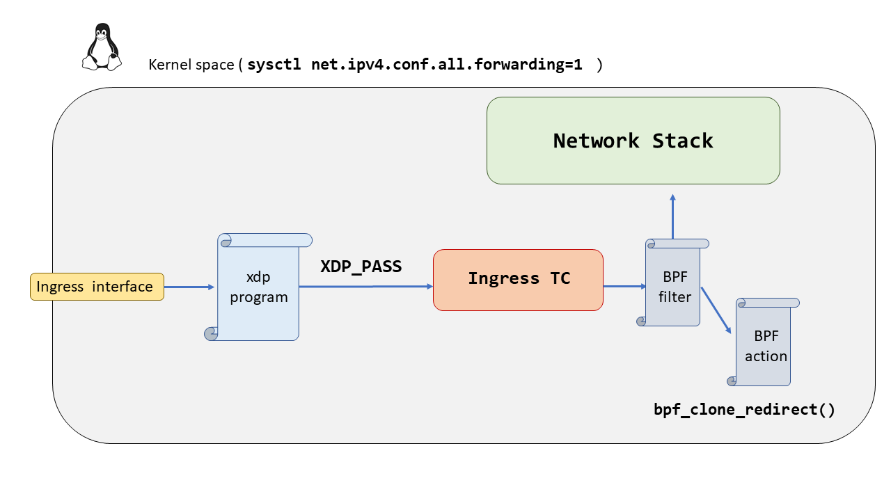

# XDP - Case05: Broadcast

Por último, en este caso de uso exploraremos la capacidad de forwarding de XDP ( :joy: ). Por ello se ha intentado replicar un escenario básico de broadcast con Network Namespaces. Se ha planteado hacer uso de la herramienta [**arping**](http://man7.org/linux/man-pages/man8/arping.8.html) para emular una resolución ARP, generando ARP Request, estos llevan su MAC destino todo a FF:FF:FF:FF:FF:FF y su dominio de difusión englobaría todos aquellos nodos de la red que operen hasta capa 2 ( como por ejemplo un hub, o un switch).


El escenario propuesto para emular ese escenario ha sido el siguiente. Este estaría compuesto de tres Network Namespaces replicando así cada una de ellas un nodo independiente de la red, después, para intercomunicar cada "nodo" de la red, hemos hecho uso de ``veth's``. El supuesto switch será la Network Namespace llamada ``switch`` el cual requerirá de un programa XDP para poder actual como tal, ya que de no ser así sus interfaces tendrán todo el stack de red de Linux por encima de ellas, es decir, el nodo implementará todas las capas del modelo TCP/IP (DoD) ó OSI en su defecto, replicando así la funcionalidad de un hipotético host.



Para realizar el broadcast se indagó los _helpers BPF_ en busca de alguna función que nos ayudará en nuestra necesidad, y encontramos una que a primera vista creíamos que podia sernos de utilidad.

```C
int bpf_clone_redirect(struct sk_buff *skb, u32 ifindex, u64 flags);
```

Pero hubo un pequeño detalle que pasamos por alto y es que requiere que el paquete ya se encuentre en una estructura ``sk_buff`` :joy:, pero, ¿Qué implica que la función requiera de una estructura de datos ``sk_buff``? Antes de contestar a esta cuestión vamos a ver qué es una estructura ``sk_buff``, para qué se utiliza y que nos ofrece.

### ¿Qué es un `sk_buff` ?

Según todo lo leído sobre esta estructura, es probablemente la estructura más importante de todo el Kernel de Linux en cuanto a la parte de Networking se refiere. Esta estructura representa las cabeceras o información de control para los datos que se van a enviar o para aquellos que se acaban de recibir. Esta estructura se encuentra definida en el siguiente archivo de cabecera [`<include/linux/skbuff.h>`](https://github.com/torvalds/linux/blob/master/include/linux/skbuff.h#L687). Esta mega estructura contiene campos de todo tipo, para así tratar de ser una estructura "todo terreno" que tiene una gran versatilidad de usos. 

Por ello, se entiende que XDP no haga uso de esta estructura ya que habría que hacer una reserva de memoria por cada paquete recibido y esto consumiría bastante tiempo viéndolo a gran escala.

Los campos de esta estructura se pueden clasificar en los siguientes campos según su motivación:

* Control de colas
* Control de cabeceras
* Features
* General

Esta estructura es usada por bastantes capas de la pila de protocolos, y muchas veces la misma estructura es reutilizada de una capa hacia otra. Por ejemplo cuando se genera una paquete TCP se añaden las cabeceras de la capa de transporte, y acto seguido se le pasa a la capa de red, IPv4 - IPv6, para hacer lo mismo, añadir sus cabeceras. Este proceso de adición de cabeceras  se lleva a cabo haciendo reservas de memoria en el buffer, llamando a la función `skb_reserve`, una vez que se llama a esta función se pasa el buffer capas a traves de la pila de protocolos.

Y podríamos pensar, ¿Y cuando llega un paquete que ocurre? En primera instancia creía que las cabeceras iban siendo eliminadas como si de una pila se tratase, cada capa que a travesaba del stack de red iba haciendo un 'pop-out' de una cabecera... El funcionamiento que se lleva a cabo con esta estructura para mi sorpresa no fue ese, si no, que en realidad se va moviendo un puntero con el payload y la información de control según en la capa del stack de red en el que se encuentre.

Por ejemplo, si me encuentro en L2, mi puntero de datos apuntaría a las cabeceras de L2. Una vez que estas se han parseado y se pasa el paquete a la L3, el puntero se desplazaría a las cabeceras de L3. De esta manera el procesamiento de los paquetes supone menos ciclos de CPU y se consigue un mejor *performance* ya que no es necesario hacer un realloc con la nueva información "útil" del paquete.


#### Control de colas 

Todas estas estructuras perteneces a un lista doblemente enlazada. Pero la organización de estas es un poco más compleja que de costumbre..

Como ya habíamos dicho se trata de una lista doblemente enlazada como toda lista doblemente enlazada la estructura tiene un puntero que apunta al siguiente elemento de la lista y otro puntero que apunta al elemento anterior de la lista. Pero, una característica de esta estructura es que cada estructura `sk_buff` debe ser capaz de encontrar la cabeza de toda la lista rápidamente. Para implementar este requisito, se inserta una estructura extra del tipo `sk_buff_head` al principio de la lista. La definición de esta estructura `sk_buff_head` es la siguiente:

```C
struct sk_buff_head {
	/* These two members must be first. */
	struct sk_buff	*next;
	struct sk_buff	*prev;

	__u32		qlen;
	spinlock_t	lock;
};
```
El elemento `lock` se utiliza como cerrojo para prevenir accesos simultáneos a la lista, será un atributo crucial para lograr la atomicidad en la operaciones relativas a la lista. En cuanto al elemento `next` y `prev` sirven como elementos para recorrer la lista apuntando estos al primer buffer y al ultimo de ellos. Al contener estos elementos, next y prev, la estructura `sk_buff_head` es completamente compatible en la lista doblemente enlazada.  Por último, el elemento `qlen` es para llevar el numero de elemento que hay en la lista en un momento dado.


Por claridad del dibujo no se ha dibujado el enlace de cada elemento de la lista hacia la cabeza de la misma. Pero recordemos, no es una simple lista enlazada, cada elemento de lista tiene un puntero que apunta al primer elemento de la lista, con su parámetro `list`. Otros campos útiles de la estructura `sk_buff` son los siguientes:


| Campo              | Explicación    |
| ------------------ | -------------- |
| `struct sock *sk`    | Es un puntero a la estructura de datos del hipotético socket, el cual es el dueño del buffer   |
| `unsigned int len` | Nos indica el tamaño del bloque de datos que alberga nuestra estructura de datos, tanto payload util como cabeceras de protocolos |
| `unsigned int mac_len` | Nos indica el tamaño de la MAC |
| `atomic_t users` | Es util cuando varias entidades están haciendo uso de esta estructura en particular, de esta manera nos aseguramos que el acceso a la misma es de uso exclusivo |
| `unsigned int truesize` | Este campo nos indica el tamaño de de los datos más la información de control que lleva la propia estructura en si misma |

Los siguientes campos nos resultan muy familiares ya que con XDP tenemos que replicar su funcionalidad al no poder disponer de ellos. 


Estos cuatro punteros a memoria son de utilidad cuando se tiene que llevar a cabo una reserva de memoria para añadir una nueva cabecera. El puntero `head` siempre apuntará al principio de la posición de memoria reservada en primera instancia, el puntero `data` siempre apuntará al principio del paquete, por lo que si queremos superponer una cabecera sobre otra simplemente tendremos que reservar la memoria suficiente entre ambos punteros.

En cuanto a los punteros, `tail` y `end` son útiles para añadir información de control al final del paquete, como por ejemplo el CRC de Ethernet.

Esta estructura tiene muchísimo partido, por lo que para una mayor documentación de la misma leerse el siguiente [documento](https://people.cs.clemson.edu/~westall/853/notes/skbuff.pdf) donde van documentando cada atributo de la estructura de datos, su finalidad y funciones asociadas para cumplir dicha finalidad.

## Restricciones para hacer Broadcast con XDP

Ahora que ya conocemos un poco mejor a la estructura ``sk_buff`` podremos entender un poco mejor las restricciones que implica que el _helper BPF_ haga uso de esta estructura. Cuando trabajamos con XDP trabajamos con una estructura mucho más simple y menos pesada que el ``sk_buff``, llamada ``xdp_buff``, en ella se nos introduce la información exclusiva para operar con el paquete en la propia interfaz. 

Por ello, no podemos hacer uso del _helper BPF_ ya en caso de querer hacer uso de él deberíamos hacer una reserva para esta estructura y hacer un casting a mano de  ``xdp_buff`` a ``sk_buff``. Haciendo esto estaríamos operando de manera intrusiva con la lógica propia del stack de red del Kernel de Linux, y además estaríamos perdiendo el performance que nos reporta no trabajar con estas estructuras.

Por lo que investigando un poco más sobre BPF para poder valorar las posibles opciones antes de desistir, se vió que el siguiente punto siguiendo el datapath de linux donde se producen "hooks" ( proceso de anclamiento de un bytecode en el Kernel de Linux ) es en el [``TC``](http://man7.org/linux/man-pages/man8/tc.8.html). 

### ¿Qué es el `TC` en Linux?

[``TC``](http://man7.org/linux/man-pages/man8/tc.8.html), ("Traffic Controller"), es un programa de espacio de usuario el cual se utiliza para la creación y asociación de colas con las interfaces de red. Resumiendo su funcionalidad se puede resumir en cuatro puntos:

*    SHAPING 
*    SCHEDULING
*    POLICING
*    DROPPING

El procesamiento del trafico para conseguir estas funcionalidades se lleva a cabo con tres tipos de objetos,  qdiscs, classes y filters.

#### Qdiscs

Es el acrónimo de "queueing discipline", es un concepto básico en el Networking de Linux. En cualquier momento que el Kernel necesita enviar un paquete por una interfaz de red, este es encolado en una cola, estas colas estarán administradas con un ``qdisc``, planificador. El qdisc por defecto es un `pfifo`, es un puro first-in, first-out. 

#### Classes

Las clases sólo existen dentro de un ``qdisc`` (por ejemplo, HTB y CBQ). Las clases son inmensamente flexibles y siempre pueden contener ya sea múltiples clases hijas o un solo ``qdisc`` para niños. No hay ninguna prohibición contra una clase que contenga un disco qdisc clasificado en sí mismo, lo que facilita escenarios de control de tráfico tremendamente complejos.

Cualquier clase también puede tener un número arbitrario de filtros adjuntos, lo que permite la selección de una clase infantil o el uso de un filtro para reclasificar o reducir el tráfico que entra en una clase particular.

#### Filters

Un filtro  es usado para determinar con que clase el paquete debe ser encolado. Para ello el paquete siempre debe ser clasificado con una clase determinada. Varios métodos se pueden utilizar para clasificar los paquetes, pero generalmente se hacen uso de los filtros.

El tipo filtro que en este caso nos interesa es el:

`bpf`    Filter packets using (e)BPF, see [tc-bpf(8)](https://man7.org/linux/man-pages/man8/tc-bpf.8.html) for details.

---

Sabiendo más o menos, como opera el [``TC``](http://man7.org/linux/man-pages/man8/tc.8.html) se propone la siguiente solución para llevar a cabo el forwarding:




De esta forma el el TC ya tendríamos el manejo de la estructura ``sk_buff`` y por ende, ya podríamos hacer uso del _helper BPF_ para clonar el paquete y hacer un redirect a cada una de las interfaces que queramos para completar así el Broadcast.


## Compilación

Para compilar el programa XDP se ha dejado un Makefile preparado en este directorio al igual que en el [``case04``](https://github.com/davidcawork/TFG/tree/master/src/use_cases/xdp/case04), por lo que para compilarlo unicamente hay que hacer un:

```bash
make
```
Si tiene dudas sobre el proceso de compilación del programa XDP le recomendamos que vuelva al [``case02``](https://github.com/davidcawork/TFG/tree/master/src/use_cases/xdp/case02) donde se hace referencia al flow dispuesto para la compilación de los programas.


## Puesta en marcha del escenario

Para testear los programas XDP haremos uso de las Network Namespaces. Si usted no sabe lo que son las Network Namespaces, o el concepto de namespace en general, le recomendamos que se lea el [``case01``](https://github.com/davidcawork/TFG/tree/master/src/use_cases/xdp/case01) donde se hace una pequeña introducción a las Network Namespaces, qué son y cómo podemos utilizarlas para emular nuestros escenarios de Red. 

Como ya comentábamos, para que no suponga una barrera de entrada el concepto de las Network Namespaces, se ha dejado escrito un script para levantar el escenario, y para su posterior limpieza. Es importante señalar que el script debe ser lanzado con permisos de root. Para levantar el escenario debemos ejecutar dicho script de la siguiente manera:

```bash
sudo ./runenv.sh -i
```

Para limpiar nuestra máquina del escenario recreado anteriormente podemos correr el mismo script indicándole ahora el parámetro -c (Clean). A unas malas, y si se cree que la limpieza no se ha realizado de manera satisfactoria, podemos hacer un reboot de nuestra máquina consiguiendo así que todos los entes no persistentes(veth, netns..) desaparezcan de nuestro equipo.

```bash
sudo ./runenv.sh -c
```

Una vez levantado el escenario, tendriamos el siguiente escenario montado con Network Namespaces. 


## Carga del programa  XDP

Una vez compilado tanto nuestro programa XDP como nuestros programas BPF que irán al [``TC``](http://man7.org/linux/man-pages/man8/tc.8.html), es hora de cargarlos, por lo que para hacerlo y por mayor comodidad nos abriremos un proceso de bash en la Network Namespace ``switch``, cargaremos el programa XDP y a continuación, cargaremos los programas BPF añadiendo una nueva qdisc con un filtro BPF que derivará en una acción, otro programa BPF con la función de clonar los paquetes y mandarlos a otras interfaces.

```bash

# Nos abrimos un proceso de bash sobre la Network Namespace "switch"
sudo ip netns exec switch bash

# Cargamos el programa XDP_PASS
sudo ./xdp_loader -d switch xdp_pass

# Creamos la nueva qdisc
sudo tc qdisc add dev switch ingress handle ffff:

# Aplicamos a la qdisc creada un filtro BPF que en caso de matchear aplicará una acción (Otro programa BPF que hará nuestro Broadcast)
sudo tc filter add dev switch parent ffff: bpf obj bpf.o sec classifier flowid ffff:1 action bpf obj bpf.o sec action 

```

## Comprobación del funcionamiento

Para comprobar el funcionamiento del sistema de Broadcast se realizará la siguiente prueba, donde desde nuestra Network Namespace por defecto generaremos ARP-Request hacia la IP de una de las veths de las Network Namespace destino. Si nuestro sistema de Broadcast funciona, escuchando en las Network namespace destino ``uno`` y ``dos`` deberíamos ver como los paquetes ARP-Request llegan sin problemas, solo el "Host" al cual iban dirigidos los ARP-Request, pero estos no llegarán de vuelta debido a que el sistema de Broadcast solo se ha montado sobre una interfaz, la interfaz ``swicth``.

```bash

# Generamos el ARP-REQUEST
arping 10.0.0.2/3

# Escuchamos en las Network Namespace destino a la espera de ver ARP-REQUEST.
sudo ip netns exec uno tcpduml -l
sudo ip netns exec dos tcpduml -l
```

## Fuentes

* [Sk_buff](https://people.cs.clemson.edu/~westall/853/notes/skbuff.pdf)
* [TC](http://man7.org/linux/man-pages/man8/tc.8.html)
* [tc-bpf](https://man7.org/linux/man-pages/man8/tc-bpf.8.html)
