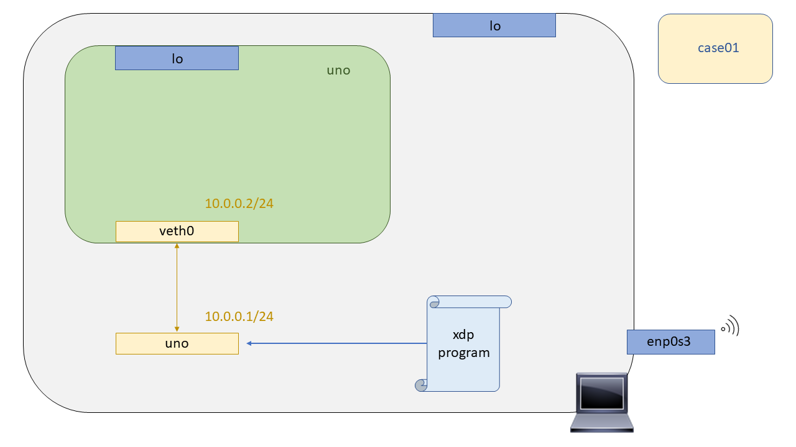

# XDP - Case01: Drop

En este test probaremos que es posible descartar todos los paquetes recibidos haciendo uso de la tecnología XDP. Para la realizar la prueba, primero deberemos compilar nuestro programa XDP, levantar el escenario donde se va a realizar la prueba, anclar el binario a un interfaz del escenario y observar los resultados cuando generamos tráfico que atraviesa dicha interfaz.

## Compilación

Para compilar el programa XDP se ha dejado un Makefile preparado en este directorio, por lo que no es necesario entender todo el proceso de compilación. Más adelante se detallará este proceso pero de momento y dado que es el primer caso de uso, y puede que el primer contacto con esta tecnología, no se quiere saturar al lector. Por lo que exclusivamente hacemos un:

```bash
make
```

Ya tendríamos compilado el programa XDP, podrá observar que en su directorio se han generado varios ficheros con extensiones ``*.ll``, ``*.o``,  varios ejecutables que utilzaremos más adelante para anclar programas xdp en interfaces (``xdp_loader``), y para comprobar los códigos de retorno de nuestros porgramas xdp una vez ya anclados (``xdp_stats``).


## Puesta en marcha del escenario

Para testear los programas XDP haremos uso de las Network Namespaces. Pero, ¿Qué es una Network Namespaces? Una network namespace consiste en una replica lógica de stack de red que por defecto tiene el kernel de Linux, rutas, tablas ARP, Iptables e interfaces de red.

Linux se inicia con un Network namespace por defecto, con su tabla de rutas, con su tabla ARP, con sus Iptables e interfaces de red. Pero también es posible crear más network namespaces no predeterminadas, crear nuevos dispositivos en esos espacios de nombres, o mover un dispositivo existente de un espacio de nombres a otro. De esta manera, cada elemento de la "red" tiene su propia network namespace, es decir, cada elemento tiene su propio stack de red e interfaces. Por lo que a nivel de networking como se diría se pueden ver como elementos independientes.


Debido a que el concepto de las Network namespaces podría ser un barrera de entrada para aquellas personas que nunca han trabajado con ellas y quisieran replicar los test, se decidió escribir un script para levantar el escenario, y para su posterior limpieza. De esta manera nos aseguramos que aunque se haga uso de un concepto un poco "abstracto" del Kernel de Linux, este no sea un impedimento para corroborar el funcionamiento de los casos de uso. Para levantar el escenario tenemos que ejecutar el shellscript indicándole el parámetro ``-i`` (*Install*):

```bash
sudo ./runenv.sh -i
```

Para limpiar nuestra máquina del escenario recreado anteriormente podemos correr el mismo script indicandole ahora el parámetro ``-c``
(*Clean*). A unas malas, y si se cree que la limpieza se no se ha realizado de manera satisfactoria, podemos hacer un reboot de nuestra máquina consiguiendo así que todos los entes no persistentes(veth, netns..) desaparezcan de nuestro equipo. 

```bash
sudo ./runenv.sh -c
```
Por último únicamente indicar que el escenario recreado es el siguiente, compuesto exclusivamente de una Network namespace y un par de veth's para comunicar la Network Namespace creada con la Network namespace por defecto.



## Carga del programa  XDP

Hora de cargar nuestro programa XDP en el Kernel! ¿Cómo lo hacemos? Habría dos maneras de cargar nuestro bytecode en el Kernel, la primera sería hacer uso de la herramienta [``iproute2``](https://wiki.linuxfoundation.org/networking/iproute2) a partir de la versión ``v4.12``. La segunda, y la más utilizada debido a las limitaciones de [``iproute2``](https://wiki.linuxfoundation.org/networking/iproute2) para trabajar con los mapas BPF, es hacer uso de la libreria [``libbpf``](https://github.com/torvalds/linux/tree/master/tools/lib/bpf). En nuestro caso haremos uso de un programa hecho en C haciendo uso de dicha libreria para cargar nuestros programas XDP en el kernel, mapas BPF y demás.

El código de dicho programa se puede encontrar [aquí](https://github.com/davidcawork/TFG/blob/master/src/use_cases/xdp/util/xdp_loader.c), este loader fue desarrollado siguiendo el tutorial de los desarrolladores del kernel de Linux llamado [xdp-tutorial](https://github.com/xdp-project/xdp-tutorial).

Al loader le estamos indicando ``-d`` (device), ``-F`` (Force) para que haga un override en caso de que ya haya un programa XDP anclado a dicha interfaz y por último, le indicamos el ``--progsec`` (program section) utilizados en XDP para englobar distintas funcionalidades ya que en un mismo bytecode puede haber distintos programas XDP. 

```bash
sudo ./xdp_loader -d uno -F --progsec xdp_case01
```

## Comprobación del funcionamiento

Una vez que el programa XDP fue anclado a la interfaz debemos asegurarnos de que funciona según lo esperado. Esto lo haremos generando tráfico desde un estremo de una veth para que atraviese por la interfaz que tiene anclado el programa XDP y observaremsos su comportamiento. En este caso el comportamiento esperado es que haga un drop de los paquetes nada más llegar a la interfaz, en este caso la interfaz ``uno``.


```bash

# Entramos en la Network namespace y hacemos un ping hacia la interfaz con el programa XDP anclado. 
# Si todo va bien,  deberiamos tener conectividad entre el par de veth :)
sudo ip netns exec uno ping 10.0.0.1

# Cargamos el programa XDP para que haga un drop de los paquetes que lleguen a la interfaz 
sudo ip netns exec uno ./xdp_loader -d veth0 -F --progsec xdp_case01

# Si volvemos hacer el ping deberiamos ver como no tenemos conectividad
sudo ip netns exec uno ping 10.0.0.1
```

## Fuentes

* [Namespaces](http://man7.org/linux/man-pages/man7/namespaces.7.html)
* [Network Namespaces](http://man7.org/linux/man-pages/man7/network_namespaces.7.html)
