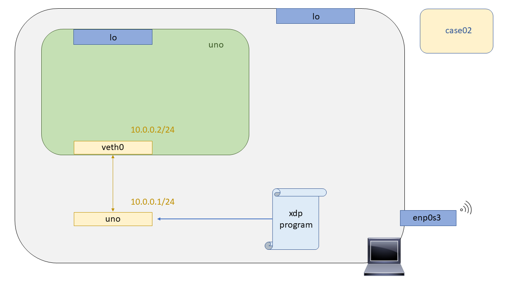

# XDP - Case02: Pass

En este test probaremos que es posible admitir todos los paquetes recibidos haciendo uso de la tecnología XDP. ¿Admitir? Si admitir, ya que, aunque XDP mucha gente lo concibe para hacer un by-pass al stack de red del Kernel de Linux en muchas ocasiones será util trabajar en conjunto para conseguir la funcionlidad deseada. Para la realizar la prueba, al igual que en el [``case01``](https://github.com/davidcawork/TFG/tree/master/src/use_cases/xdp/case01) primero deberemos compilar nuestro programa XDP, acto seguido levantar el escenario donde se va a realizar la prueba, y por último anclar el binario a un interfaz del escenario.

## Compilación

Para compilar el programa XDP se ha dejado un Makefile preparado en este directorio al igual que en el [``case01``](https://github.com/davidcawork/TFG/tree/master/src/use_cases/xdp/case01), por lo que para compilarlo unicamente hay que  hacer un:

```bash
make
```

Ahora bien, ¿Cómo se produce la compilación de nuestros programas XDP? Buena pregunta :smile: ! Como ya se ha podido ver los programas  XDP están escritos en lo que ya llaman un leguaje C restringido, los cuales su nombre de secuencia siempre empieza por "xdp" ya que si no el verificador del Kernel no podrá saber de que tipo de bytecode se trata y lo rechazará.

Este código C restringido, se compilará haciendo uso del compilador de [``clang``](https://clang.llvm.org/) como frontend y del compilador [``LLVM``](http://llvm.org/) como backend, para conseguir un bytecode BPF y almacenarlo en un objeto ELF. Estos últimos serán los que se carguen en el Kernel (``*.o``).


Es curioso el hecho de entender, como pasamos de los hipotéticos programas XDP (C restringido) a bytecode BPF, ya que, cuando se indaga un poco más en XDP, se llega a la conclusión que XDP se podría ver como un framework de BPF para trabajar a nivel de NIC. Hay más factores que lo diferencian de los programas BPF como son las estructuras de datos que manejan, además de los metadatos pero al fin y al cabo, para anclar un programa XDP este debe antes ser "traducido" a un byte code BPF.


## Puesta en marcha del escenario

Para testear los programas XDP haremos uso de las Network Namespaces. Si usted no sabe lo que son las Network Namespaces, o el concepto de namespace en general, le recomendamos que se lea el [``case01``](https://github.com/davidcawork/TFG/tree/master/src/use_cases/xdp/case01) donde se hace una pequeña introducción a las Network Namespaces, qué son y cómo podemos utilizarlas para emular nuestros escenarios de Red. 

Como ya comentabamos, para que no suponga una barrera de entrada el concepto de las Network Namespaces, se ha dejado escrito un script para levantar el escenario, y para su posterior limpieza. Es importante señalar que el script debe ser lanzado con permisos de root. Para levantar el escenario debemos ejecutar dicho script de la siguiente manera:

```bash
sudo ./runenv.sh -i
```

Para limpiar nuestra máquina del escenario recreado anteriormente podemos correr el mismo script indicándole ahora el parámetro -c (Clean). A unas malas, y si se cree que la limpieza no se ha realizado de manera satisfactoria, podemos hacer un reboot de nuestra máquina consiguiendo así que todos los entes no persistentes(veth, netns..) desaparezcan de nuestro equipo.

```bash
sudo ./runenv.sh -c
```

El escenario que vamos a manejar en este caso de uso es el siguiente, compuesto unicamente de una Network namespace y un par de veth's para comunicar la Network namespace creada con la Network namespace por defecto.



## Carga del programa  XDP

> Añadir literatura

```bash
sudo ip netns exec uno ./xdp_loader -d veth0 -F --progsec xdp_case02
```

## Comprobación del funcionamiento

> Añadir literatura

```bash
sudo ip netns exec uno ./xdp_loader -d veth0 -U
ping 10.0.0.2
sudo ip netns exec uno ./xdp_loader -d veth0 -F --progsec xdp_case01
ping 10.0.0.2
```

## Fuentes

* [Namespaces](http://man7.org/linux/man-pages/man7/namespaces.7.html)
* [Network Namespaces](http://man7.org/linux/man-pages/man7/network_namespaces.7.html)
