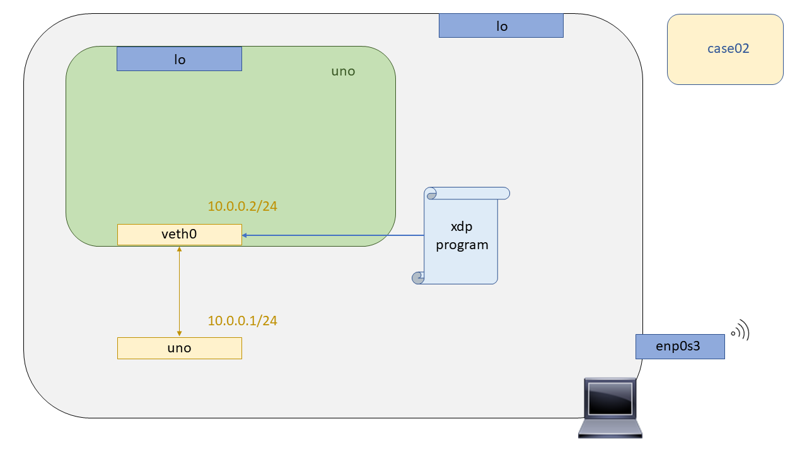

# XDP - Case02: Pass

In this test we will prove that it is possible to support all received packets by using XDP technology. Support? Yes, support, because although XDP is designed by many people to bypass the Linux Kernel network stack, it is often useful to work together to achieve the desired functionality. To perform the test, as in [``case01``](https://github.com/davidcawork/TFG/tree/master/src/use_cases/xdp/case01) we must first compile our XDP program, then raise the stage where the test will be performed, and finally attach the binary to the interface.

## Compilation

To compile the XDP program a Makefile has been prepared in this directory as well as in the [``case01``](https://github.com/davidcawork/TFG/tree/master/src/use_cases/xdp/case01), so to compile it you only have to make a

```bash
make
```

Now, how does the compilation of our XDP programs take place? Good question :smile: ! As you can see the XDP programs are written in what is already called a restricted C language, which always starts with "xdp", otherwise the Kernel checker will not know what kind of bytecode it is and will reject it.

This restricted C code will be compiled using the [``clang``]'(https://clang.llvm.org/) compiler as frontend and the [``LLVM``]'(http://llvm.org/) as backend compiler, to get a BPF bytecode and store it in an ELF object. The latter will be loaded into the Kernel (``*.o``).


It is curious to understand how we go from hypothetical XDP programs (restricted C) to bytecode BPF, since, when we dig a little deeper into XDP, we come to the conclusion that XDP could be seen as a BPF framework to work at the NIC level. There are more factors that differentiate it from BPF programs, such as the data structures that they handle, as well as the metadata, but in the end, in order to hook an XDP program it must first be "translated" into a BPF bytecode.


## Setting up the scenario 

To test the XDP programs we will use the Network Namespaces. If you don't know what the Network Namespaces are, or the concept of namespace in general, we recommend that you read the [``case01``] (https://github.com/davidcawork/TFG/tree/master/src/use_cases/xdp/case01) where a short introduction to the Network Namespaces is given, what they are and how we can use them to emulate our Network scenarios. 

As we commented before, so that the concept of the Network Namespaces does not pose a barrier to entry, a script has been written to raise the stage, and for its subsequent cleaning. It is important to point out that the script must be launched with root permissions. To raise the scenario we must execute the script in the following way:

```bash
sudo ./runenv.sh -i
```

To clean our machine from the previously recreated scenario we can run the same script indicating now the -c (Clean) parameter. To some bad, and if it is believed that the cleaning has not been done in a satisfactory way, we can make a reboot of our machine obtaining this way that all the not persistent entities(veth, netns..) disappear of our computer.


```bash
sudo ./runenv.sh -c
```

The scenario we will handle in this use case is the following, composed only of a Network namespace and a couple of veth's to communicate the Network namespace created with the default Network namespace.



## Loading the XDP program

We already have a stage and the compiled XDP program.. It's time to load it into the Kernel :smile:. If you don't know where the program [``xdp_loader``](https://github.com/davidcawork/TFG/blob/master/src/use_cases/xdp/util/xdp_loader.c) came from, what the library [``libbpf``](https://github.com/torvalds/linux/tree/master/tools/lib/bpf) gives us, or why we don't use the tool [``iproute2``](https://wiki.linuxfoundation.org/networking/iproute2) to load the XDP programs into the Kernel, please go back to [``case01``](https://github.com/davidcawork/TFG/tree/master/src/use_cases/xdp/case01) where we try to tackle all these questions. If you still have additional questions or feel that they are not fully explained, please contact me or my tutors.

As we were saying, it's time to load the program into the Kernel. This time for a change we are going to load the XDP program into the veth end of the Network Namespace. We could have done the same as in the previous case and loaded the XDP program into the veth that is seen from the default Network namepsace, but this way we explore how to execute commands "inside" a Network Namespace.

To execute commands "inside" a Namepsace Network we will use the tool [``iproute2``](https://wiki.linuxfoundation.org/networking/iproute2), more specifically its module called ``netns``. By indicating the ``exec`` parameter and the name of the Network namepsace, we will execute the following command "inside" the Network Namespace indicated previously.


```bash
sudo ip netns exec uno ./xdp_loader -d veth0 -F --progsec xdp_case02
```

Therefore, understanding how the ``netns`` module works and the parameters given to the program [``xdp_loader``](https://github.com/davidcawork/TFG/blob/master/src/use_cases/xdp/util/xdp_loader.c), explained in the use case [``case01``](https://github.com/davidcawork/TFG/tree/master/src/use_cases/xdp/case01), you can intuit that the result of the previous sentence is to load our XDP program in the interface called ``veth0`` contained in the Network Namespace ``uno``.


## Testing

Testing of the operation of the XDP program anchored to the ``veth0`` interface will be done by testing the connectivity between the veth pair. This may be a bit of a simple test, but it works for us, as we just want to verify that our program hooked up to the interface is passing the incoming packets to the network stack. 

**Personal Note**: Ever since I started working with XDP, I saw the Linux network stack as an enemy to be beaten, or "by-passed" :smile_cat: .. Since with XDP we want to be able to define in an exclusive way the datapath that we want to implement with a team that carries the Linux Kernel, this way we get a superior performance since we remove all the redundancy and layers that are not necessary for the processing of our hypothetical datapath. 

However, in the course of my learning with this technology I have seen that sometimes working in a cooperative way with the network stack can bring us many facilities (You will see in the [``case04``](https://github.com/davidcawork/TFG/tree/master/src/use_cases/xdp/case04) ) and many other functionalities already implemented in it. It is not a question of re-inventing the wheel, mainly because the performance that can be gained by doing all the processing exclusively in the NIC itself, in my opinion, does not compensate with the robustness and reliability that such functionality will have in the Linux network stack. 


```bash
# Unload the XDP program from the veth0 interface 
sudo ip netns exec uno ./xdp_loader -d veth0 -U

# We make a ping from outside of the Network Namespace to inside, to the veth0 interface. We should have connectivity.
ping 10.0.0.2

# Now let's load the XDP program to the Network Nmespace interface and then, we'll check again the connectivity. 
sudo ip netns exec uno ./xdp_loader -d veth0 -F --progsec xdp_case01

# We make ping again, and if everything goes well, we should have connectivity.  :)
ping 10.0.0.2
```

## References
* [clang](https://clang.llvm.org/)
* [LLVM](http://llvm.org/)
* [iproute2 - netns](http://man7.org/linux/man-pages/man8/ip-netns.8.html)
* [Network Namespaces](http://man7.org/linux/man-pages/man7/network_namespaces.7.html)

---


# XDP - Case02: Pass

En este test probaremos que es posible admitir todos los paquetes recibidos haciendo uso de la tecnología XDP. ¿Admitir? Si admitir, ya que, aunque XDP mucha gente lo concibe para hacer un by-pass al stack de red del Kernel de Linux en muchas ocasiones será util trabajar en conjunto para conseguir la funcionlidad deseada. Para la realizar la prueba, al igual que en el [``case01``](https://github.com/davidcawork/TFG/tree/master/src/use_cases/xdp/case01) primero deberemos compilar nuestro programa XDP, acto seguido levantar el escenario donde se va a realizar la prueba, y por último anclar el binario a un interfaz del escenario.

## Compilación

Para compilar el programa XDP se ha dejado un Makefile preparado en este directorio al igual que en el [``case01``](https://github.com/davidcawork/TFG/tree/master/src/use_cases/xdp/case01), por lo que para compilarlo unicamente hay que  hacer un:

```bash
make
```

Ahora bien, ¿Cómo se produce la compilación de nuestros programas XDP? Buena pregunta :smile: ! Como ya se ha podido ver los programas  XDP están escritos en lo que ya llaman un leguaje C restringido, los cuales su nombre de secuencia siempre empieza por "xdp" ya que si no el verificador del Kernel no podrá saber de que tipo de bytecode se trata y lo rechazará.

Este código C restringido, se compilará haciendo uso del compilador de [``clang``](https://clang.llvm.org/) como frontend y del compilador [``LLVM``](http://llvm.org/) como backend, para conseguir un bytecode BPF y almacenarlo en un objeto ELF. Estos últimos serán los que se carguen en el Kernel (``*.o``).


Es curioso el hecho de entender, como pasamos de los hipotéticos programas XDP (C restringido) a bytecode BPF, ya que, cuando se indaga un poco más en XDP, se llega a la conclusión que XDP se podría ver como un framework de BPF para trabajar a nivel de NIC. Hay más factores que lo diferencian de los programas BPF como son las estructuras de datos que manejan, además de los metadatos pero al fin y al cabo, para anclar un programa XDP este debe antes ser "traducido" a un byte code BPF.


## Puesta en marcha del escenario

Para testear los programas XDP haremos uso de las Network Namespaces. Si usted no sabe lo que son las Network Namespaces, o el concepto de namespace en general, le recomendamos que se lea el [``case01``](https://github.com/davidcawork/TFG/tree/master/src/use_cases/xdp/case01) donde se hace una pequeña introducción a las Network Namespaces, qué son y cómo podemos utilizarlas para emular nuestros escenarios de Red. 

Como ya comentabamos, para que no suponga una barrera de entrada el concepto de las Network Namespaces, se ha dejado escrito un script para levantar el escenario, y para su posterior limpieza. Es importante señalar que el script debe ser lanzado con permisos de root. Para levantar el escenario debemos ejecutar dicho script de la siguiente manera:

```bash
sudo ./runenv.sh -i
```

Para limpiar nuestra máquina del escenario recreado anteriormente podemos correr el mismo script indicándole ahora el parámetro -c (Clean). A unas malas, y si se cree que la limpieza no se ha realizado de manera satisfactoria, podemos hacer un reboot de nuestra máquina consiguiendo así que todos los entes no persistentes(veth, netns..) desaparezcan de nuestro equipo.

```bash
sudo ./runenv.sh -c
```

El escenario que vamos a manejar en este caso de uso es el siguiente, compuesto unicamente de una Network namespace y un par de veth's para comunicar la Network namespace creada con la Network namespace por defecto.


## Carga del programa  XDP

Ya tenemos escenario y el programa XDP compilado.. Es hora de cargarlo en el Kernel :smile:. Si usted no sabe de dónde ha salido el programa [``xdp_loader``](https://github.com/davidcawork/TFG/blob/master/src/use_cases/xdp/util/xdp_loader.c), qué nos aporta la librería [``libbpf``](https://github.com/torvalds/linux/tree/master/tools/lib/bpf), o por que no hacemos uso de la herramienta [``iproute2``](https://wiki.linuxfoundation.org/networking/iproute2) para cargar los programas XDP en el Kernel, por favor vuelva al [``case01``](https://github.com/davidcawork/TFG/tree/master/src/use_cases/xdp/case01) donde se intenta abordar todas estas dudas. Si aun así tiene alguna duda extra o considera que no se encuentra del todo explicado póngase en contacto conmigo o mis tutores.

Como estábamos diciendo es hora de cargar el programa en el Kernel. Esta vez por variar vamos a cargar el programa XDP en el extremo de la veth que se encuentra en el interior de la Network Namespace. Se podría haber hecho de la misma manera que en el caso de uso anterior y cargar el programa XDP en la veth que se ve desde la Network namepsace por defecto, pero de esta manera exploramos como ejecutar comandos "dentro" de una Network Namespace.

Para ejecutar comandos "dentro" de una Network Namepsace haremos uso de la herramienta [``iproute2``](https://wiki.linuxfoundation.org/networking/iproute2), más concretamente su módulo llamado ``netns``. Indicándole el parámetro ``exec`` y el nombre de la Network namepsace, ejecutaremos el comando que se indique a continuación "dentro" de la Network Namespace indicada previamente.


```bash
sudo ip netns exec uno ./xdp_loader -d veth0 -F --progsec xdp_case02
```

Por lo que, entendiendo como funciona el módulo ``netns`` y los parámetros dados al programa [``xdp_loader``](https://github.com/davidcawork/TFG/blob/master/src/use_cases/xdp/util/xdp_loader.c), explicados en el caso de uso [``case01``](https://github.com/davidcawork/TFG/tree/master/src/use_cases/xdp/case01), se podrá intuir que el resultado de la sentencia anterior es la de cargar nuestro programa XDP en la interfaz llamada ``veth0`` contenida en la Network Namespace ``uno``.

## Comprobación del funcionamiento

La comprobación del funcionamiento del programa XDP anclado a la interfaz ``veth0`` se llevará a cabo testeando la conectividad entre el par de veth's. Puede que sea una prueba un poco simple, pero nos vale, ya que unicamente queremos verificar que nuestro programa anclado en la interfaz está pasando los paquetes que le llegan al stack de red. 

**Nota personal**: Desde que empece a trabajar con XDP, veía al stack de red de Linux como a un enemigo a batir, o "by-passear" :smile_cat: .. Ya que con XDP queremos conseguir definir de manera exclusiva el datapath que se desea implementar con un equipo que porte el Kernel de Linux, de esta manera conseguimos un performance superior ya que nos quitamos de encima toda la redundancia y capas que no nos son necesarias para el procesamiento de nuestro hipotetico datapath. 

Ahora bien, en el transcurso  mi aprendizaje con esta tecnología he visto que en ocasiones trabajar de manera cooperativa con el stack de red puede reportarnos muchas facilidades (Se verá en el [``case04``](https://github.com/davidcawork/TFG/tree/master/src/use_cases/xdp/case04)) y muchas otras funcionalidades ya implementadas en este. No es cuestión de re-inventar la rueda, más que nada por que el performance que se puede llegar a ganar por hacer todo el procesamiento de manera exclusiva en la propia NIC, en mi opinión, no compensa con la robusted y fiabilidad que tendrá dicha funcionalidad en el stack de red de Linux. 


```bash
# Desanclamos el programa/s XDP de la interfaz veth0
sudo ip netns exec uno ./xdp_loader -d veth0 -U

# Hacemos ping desde fuera de la Network Namespace hacia dentro, hacia veth0. Deberiamos tener conectividad.
ping 10.0.0.2

# Ahora vamos anclar el programa XDP en la interfaz de la Network Namespace y comprobar la conectividad de nuevo
sudo ip netns exec uno ./xdp_loader -d veth0 -F --progsec xdp_case01

# Hacemos de nuevo el ping, y si todo ha salido bien deberiamos tener conectividad :)
ping 10.0.0.2
```

## Fuentes
* [clang](https://clang.llvm.org/)
* [LLVM](http://llvm.org/)
* [iproute2 - netns](http://man7.org/linux/man-pages/man8/ip-netns.8.html)
* [Network Namespaces](http://man7.org/linux/man-pages/man7/network_namespaces.7.html)


