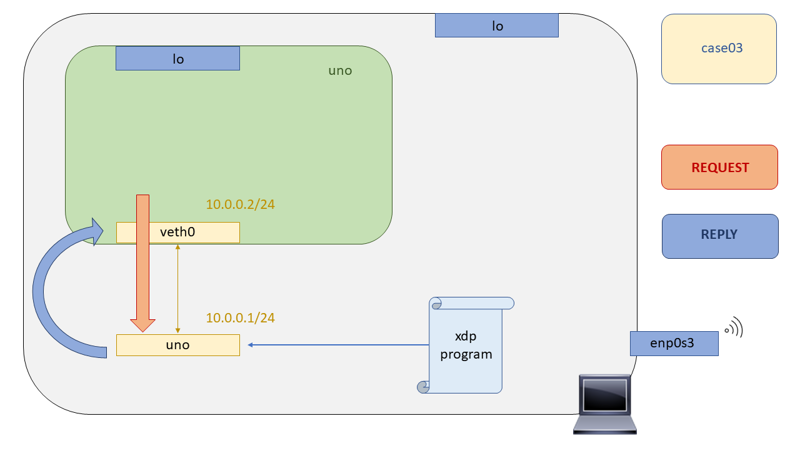

# XDP - Case03: Echo server

En este test nos adentraremos al parseo de paquetes, su filtrado y manejo. En los anteriores caso de uso exclusivamente definíamos un comportamiento de los paquetes haciendo un uso exclusivo de los códigos de retorno XDP, más concretamente ``XDP_DROP`` para tirar los paquetes y ``XDP_PASS`` para admitir los paquetes. Hay más códigos de retorno XDP pero con ellos no podemos lograr desarrollar todas las lógicas posibles, se pueden consultar en el siguiente archivo de cabecera [``bpf.h``](https://github.com/torvalds/linux/blob/master/include/uapi/linux/bpf.h#L3298). En la siguiente tabla se pueden contemplar todos los códigos de retorno XDP.

<div align="center">
  
  <br>

|     **Código de Retorno**    |     **Comportamiento** |
|:-------------:|:-------------:|
| ``XDP_PASS`` | Admitir el paquete, pasarselo al stack de red |
| ``XDP_DROP`` | Tirar el paquete |
| ``XDP_ABORTED``  | Tirar el paquete y generar una xdp:xdp_exception, útiles para depurar. |
| ``XDP_REDIRECT`` | Utilizado cuando se realiza un forwarding del paquete a otra interfaz |
| ``XDP_TX`` | Re-transmitir el paquete por la misma interfaz por la cual se ha recibido el paquete |

<br>

</div>


Ahora bien, ¿Cómo podemos implementar una lógica más avanzada? Filtrando los paquetes y en base al tipo de paquete aplicar un acciones u otras. Para filtrar paquetes tendremos que hacer uso de las estructuras de datos  de los protocolos de red definidas en  el Kernel de Linux, además hacer numerosas comprobaciones de limites de acceso a memoria para que el verificador del Kernel no nos tire el paquete. ¿Qué estructuras de datos están a nuestra disposición para filtrar paquetes?


<div align="center">
  
  <br>

| **Estructura**            | **Archivo de cabecera**       |
|:-------------:|:-------------:|
| ``struct ethhdr``   | ``<linux/if_ether.h>`` |
| ``struct ipv6hdr``  | ``<linux/ipv6.h>``     |
| ``struct iphdr``    | ``<linux/ip.h>``       |
| ``struct icmp6hdr`` | ``<linux/icmpv6.h>``   |
| ``struct icmphdr``  | ``<linux/icmp.h>``    |

<br>

</div>

Sabiendo ahora que estructuras de datos utilizar para ir filtrando los paquetes, en este test, para ponerlo en práctica, filtraremos todos los paquetes de tipo ICMP - ICMPv6 con un código ICMP-ECHO. El resto de apquetes se los pasaremos al stack de red para que el lo maneje. En cuanto a los paquetes filtrados ICMP los contestaremos nosotros mismos en la propia NIC, cambiando el ICMP-ECHO por un ICMP-REPLY, cambiando MACs, y actualizando el checksum. Como en este caso el paquete debe ser reenviado por la misma interfaz por la cual se recibió, haremos uso de código de retorno ``XDP_TX``.

## Limitaciones XDP

Ahora bien, hemos dicho que el acceso al paquete se haría de forma directa en memoria, pero, ¿Cómo sabemos nosotros a que direcci´on apuntar para leer el paquete? Muy buena pregunta, cada vez que un programa XDP es ejecutado este recibirá por argumentos un puntero a una estructura struct xdp md que contiene toda la información asociada al paquete. Esta estructura está definida en el siguiente archivo de cabecera bpf.h. Su definición es la siguiente:

```C
struct xdp_md {
 __u32 data;
 __u32 data_end;
 __u32 data_meta;
 /* Below access go through struct xdp_rxq_info */
 __u32 ingress_ifindex; /* rxq->dev->ifindex */
 __u32 rx_queue_index; /* rxq->queue_index */
};

``` 

Los dos últimos elementos de la estructura son campos de datos que nos indican el ``ifindex`` y ``index de la cola`` por la cual ha sido recibido. Los tres primeros campos de la estructura, son punteros al inicio del paquete, al final del paquete y a los metadatos del mismo.

## Compilación

Para compilar el programa XDP se ha dejado un Makefile preparado en este directorio al igual que en el [``case02``](https://github.com/davidcawork/TFG/tree/master/src/use_cases/xdp/case02), por lo que para compilarlo unicamente hay que hacer un:

```bash
make
```
Si tiene dudas sobre el proceso de compilación del programa XDP le recomendamos que vuelva al [``case02``](https://github.com/davidcawork/TFG/tree/master/src/use_cases/xdp/case02) donde se hace referencia al flow dispuesto para la compilación de los programas.


## Puesta en marcha del escenario

Para testear los programas XDP haremos uso de las Network Namespaces. Por ello, se ha dejado escrito un script para levantar el escenario haciendo uso de las network namespaces, y para su posterior limpieza. Para levantar el escenario hacemos un:

```bash
sudo ./runenv.sh -i
```

Para limpiar nuestra máquina del escenario hacemos un:

```bash
sudo ./runenv.sh -c
```



## Carga del programa  XDP

> Añadir literatura

```bash

sudo ip netns exec uno ./xdp_loader -d veth0 -F --progsec xdp_pass
sudo ./xdp_loader -d uno -F --progsec xdp_case03

```

## Comprobación del funcionamiento

> Añadir literatura

```bash
sudo ip netns exec uno ping 10.0.0.1
sudo ./xdp_stats -d uno
```

## Fuentes
