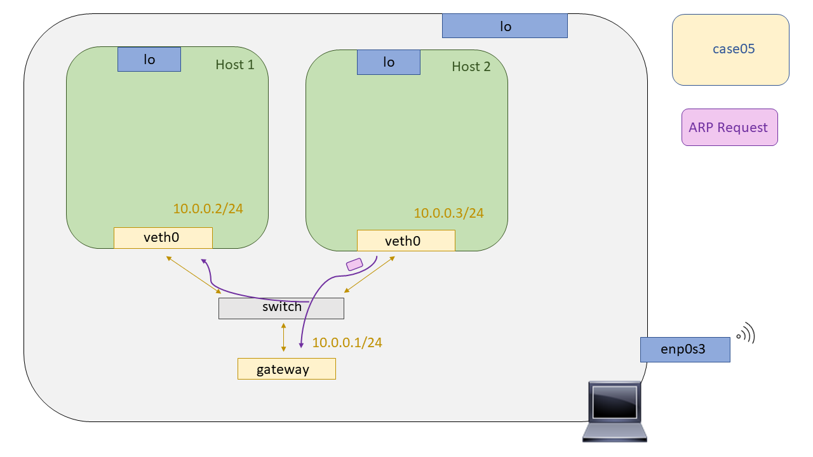
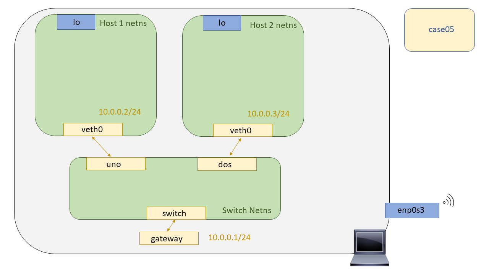
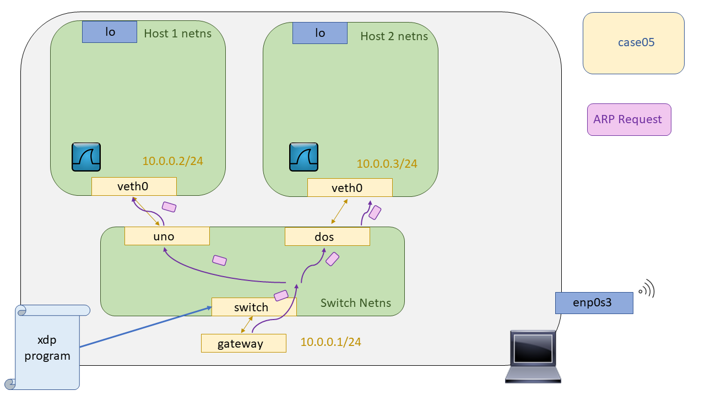

# XDP - Case05: Broadcast

Por último, en este caso de uso exploraremos la capacidad de forwarding de XDP ( :joy: ). Por ello se ha intentado replicar un escenario básico de broadcast con Network Namespaces. Se ha planteado hacer uso de la herramienta [**arping**](http://man7.org/linux/man-pages/man8/arping.8.html) para emular una resolución ARP, generando ARP Request, estos llevan su MAC destino todo a FF's y su dominio de difusión englobaría todos aquellos nodos que operen hasta capa 2 ( hub, switch).



El escenario propuesto para emular ese escenario ha sido el siguiente:



Para realizar el broadcast se indagó los _helpers BPF_ en busca de alguna función que nos ayudará en nuestra necesidad, y encontramos una que a primera vista creíamos que podia sernos de utilidad.

```C
int bpf_clone_redirect(struct sk_buff *skb, u32 ifindex, u64 flags);
```

Pero hubo un pequeño detalle que pasamos por alto y es que requiere que el paquete ya se encuentre en una estructura ``sk_buff`` :joy:, pero, ¿Qué implica que la función requiera de una estructura de datos ``sk_buff``? Antes de contestar a esta cuestión vamos a ver qué es una estructura ``sk_buff``, para qué se utiliza y que nos ofrece.

### ¿Qué es un `sk_buff` ?

Según todo lo leído sobre esta estructura, es probablemente la estructura más importante de todo el Kernel de Linux en cuanto a la parte de Networking se refiere. Esta estructura representa las cabeceras o información de control para los datos que se van a enviar o para aquellos que se acaban de recibir. Esta estructura se encuentra definida en el siguiente archivo de cabecera [`<include/linux/skbuff.h>`](https://github.com/torvalds/linux/blob/master/include/linux/skbuff.h#L687). Esta mega estructura contiene campos de todo tipo, para así tratar de ser una estructura "todo terreno" que tiene una gran versatilidad de usos. 

Por ello, se entiende que XDP no haga uso de esta estructura ya que habría que hacer una reserva de memoria por cada paquete recibido y esto consumiría bastante tiempo viéndolo a gran escala.

Los campos de esta estructura se pueden clasificar en los siguientes campos según su motivación:

* Control de colas
* Control de cabeceras
* Features
* General

Esta estructura es usada por bastantes capas de la pila de protocolos, y muchas veces la misma estructura es reutilizada de una capa hacia otra. Por ejemplo cuando se genera una paquete TCP se añaden las cabeceras de la capa de transporte, y acto seguido se le pasa a la capa de red, IPv4 - IPv6, para hacer lo mismo, añadir sus cabeceras. Este proceso de adición de cabeceras  se lleva a cabo haciendo reservas de memoria en el buffer, llamando a la función `skb_reserve`, una vez que se llama a esta función se pasa el buffer capas a traves de la pila de protocolos.

Y podríamos pensar, ¿Y cuando llega un paquete que ocurre? En primera instancia creía que las cabeceras iban siendo eliminadas como si de una pila se tratase, cada capa que a travesaba del stack de red iba haciendo un 'pop-out' de una cabecera... El funcionamiento que se lleva a cabo con esta estructura para mi sorpresa no fue ese, si no, que en realidad se va moviendo un puntero con el payload y la información de control según en la capa del stack de red en el que se encuentre.

Por ejemplo, si me encuentro en L2, mi puntero de datos apuntaría a las cabeceras de L2. Una vez que estas se han parseado y se pasa el paquete a la L3, el puntero se desplazaría a las cabeceras de L3. De esta manera el procesamiento de los paquetes supone menos ciclos de CPU y se consigue un mejor *performance* ya que no es necesario hacer un realloc con la nueva información "útil" del paquete.


#### Control de colas 

Todas estas estructuras perteneces a un lista doblemente enlazada. Pero la organización de estas es un poco más compleja que de costumbre..

Como ya habíamos dicho se trata de una lista doblemente enlazada como toda lista doblemente enlazada la estructura tiene un puntero que apunta al siguiente elemento de la lista y otro puntero que apunta al elemento anterior de la lista. Pero, una característica de esta estructura es que cada estructura `sk_buff` debe ser capaz de encontrar la cabeza de toda la lista rápidamente. Para implementar este requisito, se inserta una estructura extra del tipo `sk_buff_head` al principio de la lista. La definición de esta estructura `sk_buff_head` es la siguiente:

```C=289
struct sk_buff_head {
	/* These two members must be first. */
	struct sk_buff	*next;
	struct sk_buff	*prev;

	__u32		qlen;
	spinlock_t	lock;
};
```
El elemento `lock` se utiliza como cerrojo para prevenir accesos simultáneos a la lista, será un atributo crucial para lograr la atomicidad en la operaciones relativas a la lista. En cuanto al elemento `next` y `prev` sirven como elementos para recorrer la lista apuntando estos al primer buffer y al ultimo de ellos. 

Al contener estos elementos, next y prev, la estructura `sk_buff_head` es completamente compatible en la lista doblemente enlazada. 

Por último, el elemento `qlen` es para llevar el numero de elemento que hay en la lista en un momento dado.


Por claridad del dibujo no se ha dibujado el enlace de cada elemento de la lista hacia la cabeza de la misma. Pero recordemos, no es una simple lista enlazada, cada elemento de lista tiene un puntero que apunta al primer elemento de la lista, con su parámetro `list`.

Otros campos útiles de la estructura `sk_buff` son los siguientes:


| Campo              | Explicación    |
| ------------------ | -------------- |
| `struct sock *sk`    | Es un puntero a la estructura de datos del hipotético socket, el cual es el dueño del buffer   |
| `unsigned int len` | Nos indica el tamaño del bloque de datos que alberga nuestra estructura de datos, tanto payload util como cabeceras de protocolos |
| `unsigned int mac_len` | Nos indica el tamaño de la MAC |
| `atomic_t users` | Es util cuando varias entidades están haciendo uso de esta estructura en particular, de esta manera nos aseguramos que el acceso a la misma es de uso exclusivo |
| `unsigned int truesize` | Este campo nos indica el tamaño de de los datos más la información de control que lleva la propia estructura en si misma |

Los siguientes campos nos resultan muy familiares ya que con XDP tenemos que replicar su funcionalidad al no poder disponer de ellos. 


Estos cuatro punteros a memoria son de utilidad cuando se tiene que llevar a cabo una reserva de memoria para añadir una nueva cabecera. El puntero `head` siempre apuntará al principio de la posición de memoria reservada en primera instancia, el puntero `data` siempre apuntará al principio del paquete, por lo que si queremos superponer una cabecera sobre otra simplemente tendremos que reservar la memoria suficiente entre ambos punteros.

En cuanto a los punteros, `tail` y `end` son útiles para añadir información de control al final del paquete, como por ejemplo el CRC de Ethernet.

Esta estructura tiene muchísimo partido, por lo que para una mayor documentación de la misma leerse el siguiente [documento](https://people.cs.clemson.edu/~westall/853/notes/skbuff.pdf) donde van documentando cada atributo de la estructura de datos, su finalidad y funciones asociadas para cumplir dicha finalidad.

## Compilación

```bash

make

```


## Puesta en marcha del escenario

Para testear los programas XDP haremos uso de las Network Namespaces. Por ello, se ha dejado escrito un script para levantar el escenario haciendo uso de las network namespaces, y para su posterior limpieza. Para levantar el escenario hacemos un:

```bash

sudo ./runenv.sh -i

```

Para limpiar nuestra máquina del escenario hacemos un:

```bash
sudo ./runenv.sh -c
```




## Carga del programa  XDP

> Añadir literatura

```bash

sudo ip netns exec switch bash

  sudo ./xdp_loader -d switch xdp_pass
  sudo tc qdisc add dev switch ingress handle ffff:
  sudo tc filter add dev switch parent ffff: bpf obj bpf.o sec classifier flowid ffff:1 action bpf obj bpf.o sec action 
```

## Comprobación del funcionamiento

> Añadir literatura

```bash
arping 10.0.0.2/3
sudo ip netns exec uno tcpduml -l
sudo ip netns exec dos tcpduml -l
```

## Fuentes
